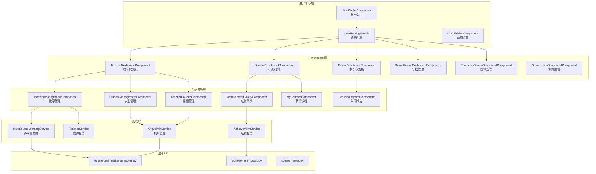
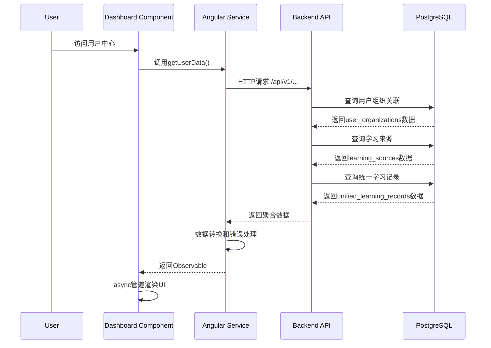
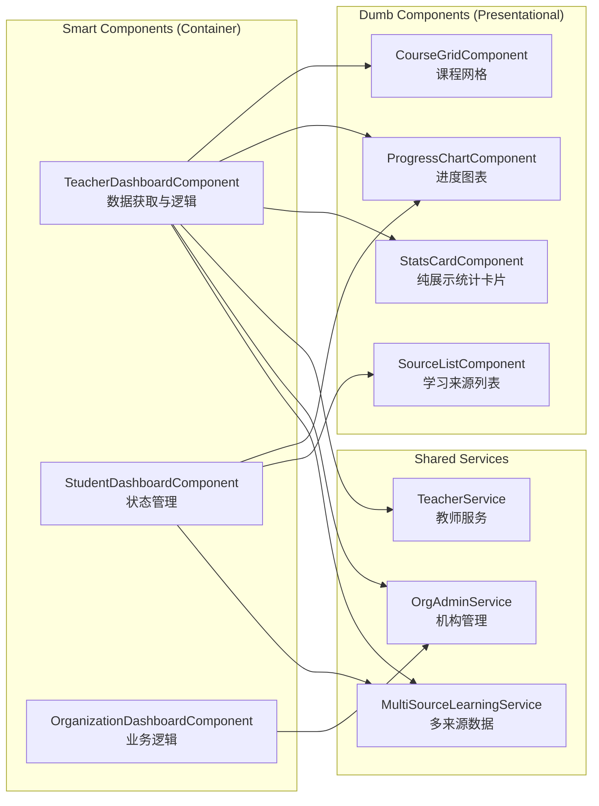

## 产品概述

基于iMato多来源学习系统架构，系统性地集成已开发的教育管理模块到各角色用户中心，实现教师、机构管理员、学校管理员和教育局四个角色的完整Dashboard功能。

## 核心功能

- **教师Dashboard**: 集成MultiSourceLearningService，实现跨机构教学进度展示、学生学情总览、教学管理、学生管理、课程管理
- **机构管理员Dashboard**: 扩展OrganizationDashboardComponent，集成机构概览、课程运营、教师管理、学员管理模块
- **学校管理员Dashboard**: 新建学校场景专属组件，实现年级/班级管理、校本课程管理、教师工作量统计、学生成长档案
- **教育局Dashboard**: 新建区域级数据汇总Dashboard，实现区域概览、学校数据对比、教学质量监控、资源调配建议
- **学生/家长中心**: 集成成就系统、课程管理、学习报告等已开发模块

## 质量要求

- 所有Dashboard使用真实数据而非mock数据
- 遵循smart/dumb组件架构，保持组件SCSS文件在4KB以内
- 禁止使用any类型，保持类型安全
- 单元测试覆盖率达到80%以上
- 响应式设计，适配不同屏幕尺寸

## 技术栈

- **前端框架**: Angular 17 + TypeScript 5.2 + Standalone Components
- **状态管理**: RxJS + Angular Services + Observable数据流
- **样式系统**: SCSS + Tailwind CSS + Material Design
- **后端框架**: FastAPI + SQLAlchemy + Pydantic v2
- **API集成**: 复用educational_institution_routes.py、achievement_routes.py等已有后端API

## 架构设计

### 系统集成架构



### 数据流设计



### 组件通信模式



## 技术决策

### 1. 复用而非重构

- **原则**: 最大化复用已开发功能模块，避免重复造轮子
- **实现**: 
- 成就系统复用 `features/achievement-integration/` 下的完整组件
- 机构管理复用 `admin/organizations/` 下的OrganizationDashboardComponent
- 通过组件组合和包装实现集成，而非重写

### 2. Smart/Dumb组件架构

- **Smart组件**: Dashboard组件负责数据获取、状态管理、业务逻辑
- **Dumb组件**: 共享UI组件（stats-card, progress-chart等）只负责展示
- **通信**: 通过@Input/@Output进行数据传递，保持单向数据流

### 3. Observable数据流

- **原则**: 所有异步操作使用RxJS Observable，配合async管道
- **模式**: 

```typescript
// Dashboard组件
teacherStats$ = this.multiSourceService.getUserOrganizationStats(userId).pipe(
map(stats => this.transformStats(stats)),
catchError(err => {
this.logger.error('获取统计失败', err);
return of(defaultStats);
})
);
```

```html
<!-- 模板中使用async管道 -->
<div class="stats-grid" *ngIf="teacherStats$ | async as stats">
```

### 4. 错误处理与降级策略

- **API错误**: 使用catchError捕获，返回mock数据或默认值
- **网络异常**: 显示错误状态UI，提供重试按钮
- **数据缺失**: 显示空状态提示，引导用户操作

### 5. 性能优化

- **按需加载**: 使用loadComponent懒加载子页面
- **数据缓存**: 对低频变更数据（用户组织列表）使用RxJS shareReplay
- **分页查询**: 大量数据（学生列表、课程列表）使用分页API
- **SCSS优化**: 提取共享样式到单独文件，确保每个组件SCSS < 4KB

### 6. 类型安全

- **严格模式**: TypeScript strict模式开启
- **接口定义**: 所有API响应使用interface定义
- **any类型**: 禁止使用any，使用unknown + 类型守卫

## 目录结构

```
src/app/
├── user/
│   ├── components/
│   │   ├── achievements/              # [MODIFY] 集成真实AchievementService
│   │   │   ├── achievements.component.ts
│   │   │   ├── achievements.component.html
│   │   │   └── achievements.component.scss
│   │   ├── my-courses/                # [MODIFY] 集成Course API
│   │   │   ├── my-courses.component.ts
│   │   │   ├── my-courses.component.html
│   │   │   └── my-courses.component.scss
│   │   ├── teaching-management/       # [MODIFY] 集成TeacherService
│   │   │   ├── teaching-management.component.ts
│   │   │   ├── teaching-management.component.html
│   │   │   └── teaching-management.component.scss
│   │   ├── student-management/        # [MODIFY] 集成OrgAdminService
│   │   │   ├── student-management.component.ts
│   │   │   ├── student-management.component.html
│   │   │   └── student-management.component.scss
│   │   ├── teacher-courses/           # [MODIFY] 集成课程管理
│   │   │   ├── teacher-courses.component.ts
│   │   │   ├── teacher-courses.component.html
│   │   │   └── teacher-courses.component.scss
│   │   └── shared/                    # [NEW] 抽取共享组件
│   │       ├── stats-card/
│   │       ├── progress-chart/
│   │       └── course-grid/
│   ├── teacher/
│   │   └── teacher-dashboard.component.ts  # [MODIFY] 完成Phase 1集成
│   ├── student/
│   │   └── student-dashboard.component.ts  # [MODIFY] 增强多来源展示
│   ├── parent/
│   │   └── parent-dashboard.component.ts   # [MODIFY] 增强多来源展示
│   ├── school-admin/
│   │   └── school-admin-dashboard.component.ts  # [MODIFY] Phase 3实现
│   ├── education-bureau/
│   │   └── education-bureau-dashboard.component.ts  # [MODIFY] Phase 4实现
│   ├── services/
│   │   ├── user-center.service.ts      # [MODIFY] 优化菜单逻辑
│   │   └── teacher.service.ts          # [MODIFY] 完善教师服务
│   └── user-routing.module.ts          # [MODIFY] 路由配置优化

src/app/shared/
├── components/
│   ├── learning-source-progress/       # [EXISTING] 复用
│   ├── stats-card/                     # [NEW] 共享统计卡片
│   └── progress-chart/                 # [NEW] 共享进度图表

src/app/core/services/
├── multi-source-learning.service.ts    # [EXISTING] 已完整实现
├── org-admin.service.ts                # [EXISTING] 已完整实现
├── teacher.service.ts                  # [MODIFY] 完善教师API
└── achievement.service.ts              # [EXISTING] 已完整实现

src/app/features/achievement-integration/
├── components/
│   ├── achievement-gallery/            # [EXISTING] 完整实现
│   ├── achievement-display/            # [EXISTING] 完整实现
│   └── ...
└── services/
    └── achievement.service.ts          # [EXISTING] 完整实现

src/app/admin/organizations/
├── organization-dashboard.component.ts # [EXISTING] 完整实现
├── organization-dashboard.service.ts   # [EXISTING] 完整实现
└── ...
```

## 关键代码结构

### 共享统计卡片组件

```typescript
// shared/components/stats-card/stats-card.component.ts
export interface StatsCardConfig {
  title: string;
  value: number | string;
  icon: string;
  color?: 'primary' | 'accent' | 'warn';
  subtitle?: string;
  trend?: { direction: 'up' | 'down'; value: string };
}

@Component({
  selector: 'app-stats-card',
  standalone: true,
  imports: [CommonModule, MatCardModule, MatIconModule],
  template: `
    <mat-card class="stats-card">
      <mat-card-content>
        <div class="icon-wrapper" [class]="config.color || 'primary'">
          <mat-icon>{{ config.icon }}</mat-icon>
        </div>
        <div class="content">
          <h3 class="value">{{ config.value }}</h3>
          <p class="title">{{ config.title }}</p>
          <p class="subtitle" *ngIf="config.subtitle">{{ config.subtitle }}</p>
          <div class="trend" *ngIf="config.trend">
            <mat-icon>{{ config.trend.direction === 'up' ? 'trending_up' : 'trending_down' }}</mat-icon>
            <span>{{ config.trend.value }}</span>
          </div>
        </div>
      </mat-card-content>
    </mat-card>
  `
})
export class StatsCardComponent {
  @Input() config!: StatsCardConfig;
}
```

### 多来源数据服务接口

```typescript
// models/multi-source-learning.models.ts
export interface UnifiedProgressStats {
  total_courses: number;
  completed_courses: number;
  in_progress_courses: number;
  total_time_minutes: number;
  average_score: number | null;
  source_breakdown: Array<{
    source_type: LearningSourceType;
    source_name: string;
    courses: number;
    completed: number;
    avg_score: number | null;
    total_time: number;
  }>;
}

export interface LearningSource {
  id: number;
  user_id: number;
  org_id: number | null;
  name: string;
  source_type: LearningSourceType;
  status: 'active' | 'inactive' | 'completed' | 'suspended';
  is_primary: boolean;
  role: string;
  source_detail: Record<string, any>;
  start_date: string | null;
  end_date: string | null;
  created_at: string;
  updated_at: string;
}
```

## 质量控制清单

### 代码质量标准

- ✅ **TypeScript严格模式**: 所有文件启用strict，无any类型
- ✅ **SCSS文件大小**: 每个组件SCSS < 4KB，超过则拆分
- ✅ **Smart/Dumb分离**: Dashboard为Smart，共享组件为Dumb
- ✅ **Observable数据流**: 所有异步操作使用Observable + async管道
- ✅ **错误处理**: 所有API调用有catchError，提供降级策略

### 测试覆盖率

- **单元测试**: 每个组件 > 80%覆盖率
- **服务测试**: 每个Service > 90%覆盖率
- **集成测试**: 关键业务流程（登录→Dashboard→数据加载）

### 性能标准

- **首次加载**: Dashboard首次渲染 < 2s
- **数据加载**: API响应时间 < 500ms
- **交互响应**: 用户操作反馈 < 100ms
- **内存占用**: 无内存泄漏，组件销毁时清理订阅

### 可维护性

- **代码注释**: 复杂逻辑添加注释，解释"为什么"
- **统一命名**: 遵循Angular风格指南
- **模块划分**: 功能内聚，低耦合
- **文档**: 关键接口和复杂组件添加JSDoc

## Agent Extensions

### SubAgent

- **code-explorer** (SubAgent)
- **Purpose**: 深度探索现有代码库，分析项目架构、代码模式、命名规范、错误处理策略
- **Expected outcome**: 
    - 提供现有Dashboard组件的代码分析报告
    - 识别可复用的组件和服务
    - 确保新代码与现有架构保持一致性
    - 避免重复开发和架构冲突

### Skill

- **docx** (Skill)
- **Purpose**: 生成详细的实施方案文档，记录每个Phase的技术细节、API接口、组件设计
- **Expected outcome**: 
    - 创建Word文档，包含完整的Phase 1-4实施指南
    - 数据库表结构说明
    - API接口文档
    - 组件接口定义
    - 测试计划和部署步骤

- **pdf** (Skill)
- **Purpose**: 生成系统架构图、数据流图、组件关系图的PDF文档
- **Expected outcome**: 
    - 创建PDF文档，包含架构设计图、ER图、API文档
    - 便于团队评审和知识传递