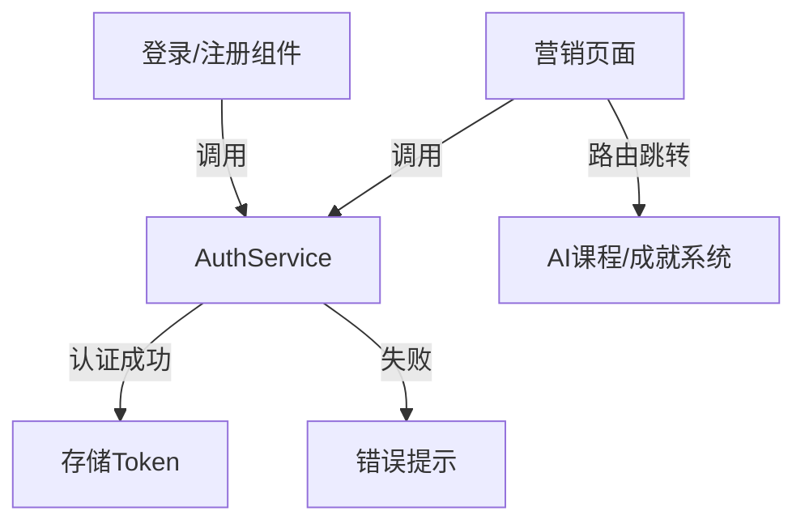

## 产品概述

完善iMato营销页面的内容展示与功能集成，将课程体系、学习路径、实战项目、学员成果四个页面连接到已开发的功能模块，并新增用户注册登录入口。

## 核心功能

- **课程体系页面**：连接AI教育课程播放器，提供真实课程入口
- **学习路径页面**：连接已开发模块，显示开发中的功能
- **实战项目页面**：连接项目模块，标识开发中项目
- **学员成果页面**：已集成成就系统，优化展示效果
- **注册登录功能**：创建登录/注册页面，集成现有AuthService认证服务
- **导航优化**：在营销页面添加注册登录入口

## 技术栈选择

- **前端框架**：Angular 21 + TypeScript（保持与项目一致）
- **样式方案**：SCSS + Tailwind CSS（项目现有方案）
- **状态管理**：RxJS BehaviorSubject（现有AuthService模式）
- **组件架构**：Standalone组件（项目当前实践）

## 实现方案

### 系统架构

采用分层架构设计：

- **表示层**：登录/注册组件 + 营销页面优化
- **业务逻辑层**：复用现有AuthService认证服务
- **路由层**：更新app-routing.module.ts和marketing.module.ts



### 实现策略

1. **创建认证组件**：开发独立的登录和注册页面组件
2. **完善营销内容**：在现有静态页面中添加实际功能链接
3. **模块连接**：识别可连接模块（AI教育课程播放器、成就系统）
4. **路由配置**：添加/auth/login和/auth/register路由
5. **导航集成**：在营销布局组件中添加登录/注册入口

## 关键设计决策

1. **复用优先**：直接使用现有AuthService，不重新实现认证逻辑
2. **渐进增强**：未完成的模块标记"开发中"，后续迭代完善
3. **统一风格**：保持营销页面现有视觉设计一致性
4. **性能优化**：登录/注册组件采用懒加载，减少初始包体积

## 实现细节

### 目录结构

```
src/app/
├── auth/                                    # [NEW] 认证模块
│   ├── login/
│   │   └── login.component.ts              # [NEW] 登录组件
│   ├── register/
│   │   └── register.component.ts           # [NEW] 注册组件
│   └── auth-routing.module.ts              # [NEW] 认证路由
├── marketing/
│   ├── courses/courses-page.component.ts   # [MODIFY] 添加课程链接
│   ├── roadmap/roadmap-page.component.ts   # [MODIFY] 添加路径链接
│   ├── projects/projects-page.component.ts # [MODIFY] 添加项目链接
│   └── marketing-achievements/             # [MODIFY] 优化展示
├── app-routing.module.ts                   # [MODIFY] 添加认证路由
└── core/services/auth.service.ts           # [EXISTING] 复用认证服务
```

### 核心代码结构

```typescript
// 登录组件 - 关键方法
class LoginComponent {
  login(credentials: LoginRequest): void {
    this.authService.signIn(credentials).subscribe({
      next: () => this.router.navigate(['/dashboard']),
      error: (err) => this.errorMessage = err.message
    });
  }
}

// 注册组件 - 关键方法  
class RegisterComponent {
  register(userData: RegisterRequest): void {
    this.authService.signUp(userData).subscribe({
      next: () => this.router.navigate(['/auth/login']),
      error: (err) => this.errorMessage = err.message
    });
  }
}
```

## 性能考虑

- 登录/注册组件采用懒加载，减少主包体积
- 营销页面静态内容使用OnPush变更检测策略
- 认证状态使用RxJS流式更新，避免不必要的DOM刷新

## 使用扩展

### SubAgent

- **code-explorer**
- 目的：探索项目结构，定位可连接的模块和功能
- 预期成果：识别AI教育课程播放器、成就系统等可集成模块的具体路径和API

### Skill

- **skill-creator**
- 目的：创建认证相关的辅助技能，如表单验证、错误处理等
- 预期成果：生成可复用的认证表单验证逻辑和错误处理模式