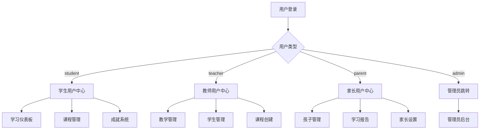

## 产品概述

验证并完善iMato教育平台模拟登录后的用户中心系统，确保4种模拟账号类型（学生、教师、家长、管理员）都有对应的用户中心页面。

## 核心功能

- 验证现有模拟登录功能完整性
- 创建统一用户中心路由架构
- 实现基于用户类型的动态用户中心组件
- 为每种用户类型创建专属功能模块
- 完善用户中心导航系统

## 技术方案

### 技术架构

- **前端框架**: Angular 17+（独立组件模式）
- **状态管理**: RxJS BehaviorSubject（现有AuthService）
- **路由策略**: 惰性加载 + 角色路由守卫
- **UI组件**: Angular Material + 自定义组件

### 系统架构设计



### 核心实现策略

1. **统一入口**: 创建 `/user` 路由作为用户中心入口
2. **动态加载**: 根据 `user.userType` 动态渲染不同组件
3. **模块拆分**: 每种用户类型独立模块，减少bundle大小
4. **组件复用**: 提取公共组件（侧边栏、头部、设置等）

### 目录结构

```
src/app/user/
├── user-routing.module.ts          # [MODIFY] 用户中心路由配置
├── user.module.ts                  # [MODIFY] 用户中心模块
├── user-center.component.ts        # [NEW] 统一用户中心入口组件
├── user-center.component.html      # [NEW] 用户中心布局模板
├── user-center.component.scss      # [NEW] 用户中心样式
├── user.service.ts                 # [NEW] 用户中心数据服务
├── components/                     # [NEW] 公共组件
│   ├── user-sidebar.component.ts   # 用户侧边导航
│   ├── user-header.component.ts    # 用户顶部导航
│   └── user-profile.component.ts   # 用户资料卡片
├── student/                        # [NEW] 学生模块
│   ├── student-dashboard.component.ts
│   ├── student-courses.component.ts
│   └── student-achievements.component.ts
├── teacher/                        # [NEW] 教师模块
│   ├── teacher-dashboard.component.ts
│   ├── teacher-students.component.ts
│   └── teacher-courses.component.ts
└── parent/                         # [NEW] 家长模块
    ├── parent-dashboard.component.ts
    ├── parent-children.component.ts
    └── parent-reports.component.ts
```

### 关键设计决策

1. **不直接跳转admin**: 管理员类型跳转到现有 `/admin` 后台
2. **独立组件**: 每种用户类型独立组件，避免条件渲染复杂度
3. **路由守卫**: 添加 `UserCenterGuard` 防止未授权访问
4. **懒加载**: 用户中心模块使用 `loadChildren` 懒加载
5. **响应式**: 使用CSS Grid + Flexbox，适配移动端