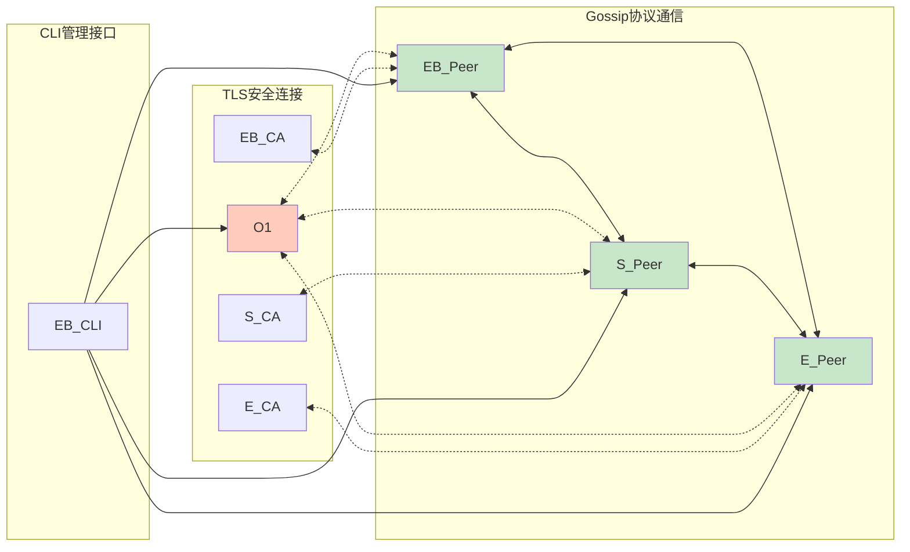
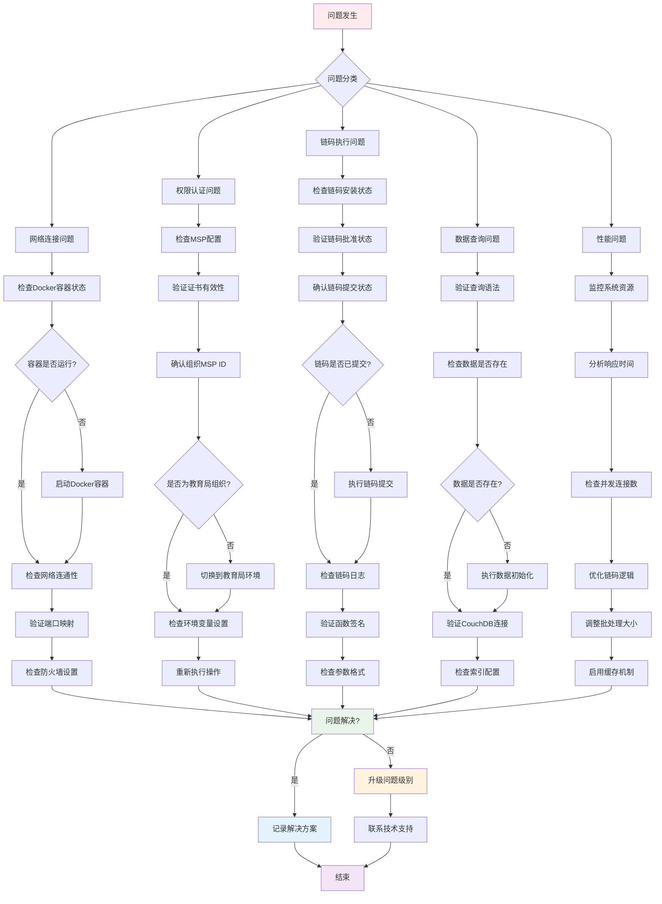

# Hyperledger Fabric 开发者文档

## 目录
1. [网络架构概览](#网络架构概览)
2. [Fabric网络拓扑图](#fabric网络拓扑图)
3. [链码开发API手册](#链码开发api手册)
4. [故障排查流程图](#故障排查流程图)
5. [开发环境搭建](#开发环境搭建)
6. [最佳实践](#最佳实践)

---

## 网络架构概览

本项目采用Hyperledger Fabric 2.x版本构建企业级区块链网络，包含三个组织：教育局、学校和企业。网络采用Raft共识算法，支持私有数据集合和丰富的链码生命周期管理。

### 核心组件
- **Orderer节点**: 提供排序服务，采用Raft共识算法
- **Peer节点**: 每个组织部署一个Peer节点，负责账本维护和链码执行
- **CA节点**: 提供成员服务，管理数字证书
- **CouchDB**: 作为世界状态数据库，支持富查询
- **CLI容器**: 用于网络管理和链码操作

---

## Fabric网络拓扑图

```mermaid
graph TB
    subgraph "网络基础设施"
        Docker[Docker Engine]
        Compose[docker-compose]
    end

    subgraph "排序服务集群 (Raft共识)"
        O1[Orderer1<br/>orderer.example.com:7050]
        O2[Orderer2<br/>orderer2.example.com:8050]
        O3[Orderer3<br/>orderer3.example.com:9050]
    end

    subgraph "教育局组织 (Education Bureau)"
        EB_CA[Fabric CA<br/>ca.education.imatu.com:7054]
        EB_Peer[Peer0<br/>peer0.education.imatu.com:7051]
        EB_CouchDB[(CouchDB<br/>couchdb0:5984)]
        EB_CLI[CLI<br/>cli:7051]
    end

    subgraph "学校组织 (School)"
        S_CA[Fabric CA<br/>ca.school.imatu.com:8054]
        S_Peer[Peer0<br/>peer0.school.imatu.com:8051]
        S_CouchDB[(CouchDB<br/>couchdb1:6984)]
    end

    subgraph "企业组织 (Enterprise)"
        E_CA[Fabric CA<br/>ca.enterprise.imatu.com:9054]
        E_Peer[Peer0<br/>peer0.enterprise.imatu.com:9051]
        E_CouchDB[(CouchDB<br/>couchdb2:7984)]
    end

    subgraph "创世区块和通道配置"
        Genesis[创世区块<br/>genesis.block]
        ChannelTX[通道配置<br/>channel.tx]
        AnchorTX[锚节点配置<br/>*.anchors.tx]
    end

    Docker --> Compose
    Compose --> O1
    Compose --> O2
    Compose --> O3
    Compose --> EB_CA
    Compose --> EB_Peer
    Compose --> EB_CouchDB
    Compose --> EB_CLI
    Compose --> S_CA
    Compose --> S_Peer
    Compose --> S_CouchDB
    Compose --> E_CA
    Compose --> E_Peer
    Compose --> E_CouchDB
    
    EB_Peer --> EB_CouchDB
    S_Peer --> S_CouchDB
    E_Peer --> E_CouchDB
    
    Genesis --> O1
    Genesis --> O2
    Genesis --> O3
    ChannelTX --> EB_Peer
    ChannelTX --> S_Peer
    ChannelTX --> E_Peer
    AnchorTX --> EB_Peer
    AnchorTX --> S_Peer
    AnchorTX --> E_Peer

    style Docker fill:#e1f5fe
    style O1 fill:#fff3e0
    style EB_Peer fill:#e8f5e8
    style S_Peer fill:#e8f5e8
    style E_Peer fill:#e8f5e8
    style Genesis fill:#fce4ec
```



### 网络连接关系



---

## 链码开发API手册

### 链码结构概述

```go
// 链码主结构
type IntegralChaincode struct {
    contractapi.Contract
}
```

### 核心API接口

#### 1. 账本初始化接口

```go
// InitLedger 初始化账本
func (ic *IntegralChaincode) InitLedger(ctx contractapi.TransactionContextInterface) error
```

**功能**: 初始化积分系统账本，创建默认积分规则

**参数**: 无

**返回值**: 
- `nil` - 成功
- `error` - 初始化失败

**使用示例**:
```bash
peer chaincode invoke \
  -C imatu-channel \
  -n integral_cc \
  -c '{"function":"InitLedger","Args":[]}'
```

#### 2. 积分发行接口

```go
// IssueIntegral 发行积分给学生
func (ic *IntegralChaincode) IssueIntegral(
    ctx contractapi.TransactionContextInterface, 
    studentID string, 
    amount int
) error
```

**功能**: 教育局组织向指定学生发行积分

**权限要求**: 仅教育局组织(`EducationBureauMSP`)可调用

**参数**:
- `studentID` (string): 学生唯一标识符
- `amount` (int): 发行积分数量，必须大于0

**返回值**:
- `nil` - 发行成功
- `error` - 发行失败（权限不足、参数错误等）

**使用示例**:
```bash
# 教育局环境设置
export CORE_PEER_LOCALMSPID=EducationBureauMSP
export CORE_PEER_TLS_ROOTCERT_FILE=/path/to/tls/ca.crt

# 发行积分
peer chaincode invoke \
  -C imatu-channel \
  -n integral_cc \
  -c '{"function":"IssueIntegral","Args":["student_001","500"]}'
```

#### 3. 查询学生余额接口

```go
// GetStudentBalance 查询学生积分余额
func (ic *IntegralChaincode) GetStudentBalance(
    ctx contractapi.TransactionContextInterface, 
    studentID string
) (*StudentBalance, error)
```

**功能**: 查询指定学生的积分余额信息

**参数**:
- `studentID` (string): 学生唯一标识符

**返回值**:
- `*StudentBalance` - 学生余额对象
- `error` - 查询失败

**返回结构**:
```go
type StudentBalance struct {
    StudentID   string `json:"student_id"`
    TotalAmount int    `json:"total_amount"`
    UpdatedAt   int64  `json:"updated_at"`
}
```

**使用示例**:
```bash
peer chaincode query \
  -C imatu-channel \
  -n integral_cc \
  -c '{"function":"GetStudentBalance","Args":["student_001"]}'
```

#### 4. 查询积分发行记录接口

```go
// GetIntegralRecords 查询积分发行记录
func (ic *IntegralChaincode) GetIntegralRecords(
    ctx contractapi.TransactionContextInterface, 
    studentID string
) ([]*Integral, error)
```

**功能**: 查询指定学生的所有积分发行记录

**参数**:
- `studentID` (string): 学生唯一标识符

**返回值**:
- `[]*Integral` - 积分记录数组
- `error` - 查询失败

**返回结构**:
```go
type Integral struct {
    ID        string `json:"id"`
    StudentID string `json:"student_id"`
    Amount    int    `json:"amount"`
    Issuer    string `json:"issuer"`
    Timestamp int64  `json:"timestamp"`
}
```

#### 5. 查询交易流水接口

```go
// GetTransactionHistory 查询交易历史
func (ic *IntegralChaincode) GetTransactionHistory(
    ctx contractapi.TransactionContextInterface, 
    studentID string
) ([]*IntegralTransaction, error)
```

**功能**: 查询指定学生的完整交易流水

**参数**:
- `studentID` (string): 学生唯一标识符

**返回值**:
- `[]*IntegralTransaction` - 交易流水数组
- `error` - 查询失败

**返回结构**:
```go
type IntegralTransaction struct {
    ID          string `json:"id"`
    StudentID   string `json:"student_id"`
    Amount      int    `json:"amount"`
    Balance     int    `json:"balance"`
    SourceType  string `json:"source_type"`
    Description string `json:"description"`
    Timestamp   int64  `json:"timestamp"`
}
```

### 权限控制API

#### 权限验证函数

```go
// CheckEducationBureauPermission 验证教育局权限
func CheckEducationBureauPermission(ctx contractapi.TransactionContextInterface) error
```

**功能**: 验证调用者是否属于教育局组织

**返回值**:
- `nil` - 权限验证通过
- `error` - 权限不足，返回详细错误信息

### 数据模型

#### 学生余额模型

```go
type StudentBalance struct {
    StudentID   string `json:"student_id"`   // 学生ID
    TotalAmount int    `json:"total_amount"` // 总积分余额
    UpdatedAt   int64  `json:"updated_at"`   // 最后更新时间
}
```

#### 积分发行记录模型

```go
type Integral struct {
    ID        string `json:"id"`         // 记录ID
    StudentID string `json:"student_id"` // 学生ID
    Amount    int    `json:"amount"`     // 积分数量
    Issuer    string `json:"issuer"`     // 发行人MSP ID
    Timestamp int64  `json:"timestamp"`  // 时间戳
}
```

#### 交易流水模型

```go
type IntegralTransaction struct {
    ID          string `json:"id"`           // 交易ID
    StudentID   string `json:"student_id"`   // 学生ID
    Amount      int    `json:"amount"`       // 交易金额
    Balance     int    `json:"balance"`      // 交易后余额
    SourceType  string `json:"source_type"`  // 来源类型
    Description string `json:"description"`  // 描述信息
    Timestamp   int64  `json:"timestamp"`    // 时间戳
}
```

### 错误处理

#### 标准错误码

| 错误类型 | 错误信息 | HTTP状态码 |
|---------|---------|-----------|
| 权限不足 | "权限不足: 仅教育局组织可执行此操作" | 403 |
| 参数错误 | "学生ID不能为空" | 400 |
| 参数错误 | "积分数量必须大于0" | 400 |
| 数据不存在 | "未找到学生余额记录" | 404 |
| 系统错误 | "内部服务器错误" | 500 |

### 链码生命周期管理

#### 部署命令序列

```bash
# 1. 打包链码
peer lifecycle chaincode package integral_cc.tar.gz \
  --path ../chaincode \
  --lang golang \
  --label integral_cc_1.0

# 2. 安装到各组织Peer
peer lifecycle chaincode install integral_cc.tar.gz

# 3. 各组织批准链码定义
peer lifecycle chaincode approveformyorg \
  --channelID imatu-channel \
  --name integral_cc \
  --version 1.0 \
  --package-id $PACKAGE_ID \
  --sequence 1

# 4. 验证提交准备状态
peer lifecycle chaincode checkcommitreadiness \
  --channelID imatu-channel \
  --name integral_cc \
  --version 1.0 \
  --sequence 1

# 5. 提交链码定义
peer lifecycle chaincode commit \
  --channelID imatu-channel \
  --name integral_cc \
  --version 1.0 \
  --sequence 1
```

---

## 故障排查流程图



### 常见问题及解决方案

#### 1. Docker容器相关问题

**问题**: 容器无法启动
```bash
# 检查容器状态
docker ps -a

# 查看容器日志
docker logs <container_name>

# 重启容器
docker-compose restart
```

**问题**: 端口冲突
```bash
# 检查端口占用
netstat -an | grep :7051

# 修改docker-compose.yml端口映射
ports:
  - "7051:7051"  # 主机端口:容器端口
```

#### 2. 网络连接问题

**问题**: Peer节点无法连接Orderer
```bash
# 检查网络连通性
ping orderer.example.com

# 验证TLS证书
openssl s_client -connect orderer.example.com:7050

# 检查环境变量
echo $CORE_PEER_ADDRESS
echo $ORDERER_CA
```

#### 3. 权限认证问题

**问题**: 权限不足错误
```bash
# 验证当前MSP ID
peer chaincode query \
  -C imatu-channel \
  -n integral_cc \
  -c '{"function":"GetCallerMSPID","Args":[]}'

# 切换到教育局环境
export CORE_PEER_LOCALMSPID=EducationBureauMSP
export CORE_PEER_MSPCONFIGPATH=/path/to/education/msp
```

#### 4. 链码部署问题

**问题**: 链码安装失败
```bash
# 检查链码包
peer lifecycle chaincode queryinstalled

# 重新打包链码
peer lifecycle chaincode package integral_cc.tar.gz \
  --path ./chaincode \
  --lang golang \
  --label integral_cc_1.0
```

**问题**: 链码批准失败
```bash
# 检查批准状态
peer lifecycle chaincode checkcommitreadiness \
  --channelID imatu-channel \
  --name integral_cc \
  --version 1.0 \
  --sequence 1 \
  --output json

# 重新批准
peer lifecycle chaincode approveformyorg \
  --channelID imatu-channel \
  --name integral_cc \
  --version 1.0 \
  --package-id $PACKAGE_ID \
  --sequence 1
```

#### 5. 数据查询问题

**问题**: CouchDB查询失败
```bash
# 检查CouchDB连接
curl http://localhost:5984/

# 验证数据库存在
curl http://localhost:5984/imatu-channel_integral_cc

# 检查索引配置
curl http://localhost:5984/imatu-channel_integral_cc/_index
```

---

## 开发环境搭建

### 系统要求

- **操作系统**: Windows 10/11, Linux, macOS
- **Docker**: 20.10+
- **Docker Compose**: 1.29+
- **Go**: 1.18+
- **Node.js**: 16+ (可选，用于SDK开发)

### 环境变量配置

```bash
# Fabric工具路径
export PATH=$PATH:$GOPATH/bin
export FABRIC_CFG_PATH=/path/to/config

# 网络配置
export CORE_PEER_LOCALMSPID=EducationBureauMSP
export CORE_PEER_ADDRESS=peer0.education.imatu.com:7051
export CORE_PEER_TLS_ENABLED=true
export ORDERER_CA=/path/to/orderer/tls/ca.crt
```

### 快速启动脚本

```powershell
# PowerShell脚本 (Windows)
.\blockchain\fabric-network\setup-demo-network.ps1
```

```bash
# Bash脚本 (Linux/macOS)
cd blockchain/fabric-network
chmod +x setup-demo-network.sh
./setup-demo-network.sh
```

---

## 最佳实践

### 1. 链码开发规范

- 使用原子化函数设计
- 实现完善的错误处理
- 添加详细的日志记录
- 遵循命名约定
- 编写单元测试

### 2. 安全建议

- 严格验证输入参数
- 实施最小权限原则
- 定期轮换证书
- 启用TLS加密
- 审计关键操作

### 3. 性能优化

- 合理设计数据模型
- 使用复合键提高查询效率
- 实施批量操作
- 配置适当的超时时间
- 监控资源使用情况

### 4. 监控和日志

- 集成Prometheus监控
- 配置集中式日志收集
- 设置告警阈值
- 定期分析性能指标
- 维护运行状态报告

---

**文档版本**: v1.0  
**最后更新**: 2026年3月1日  
**适用版本**: Hyperledger Fabric 2.4+
