# Fabric技术架构详解

## 系统架构图

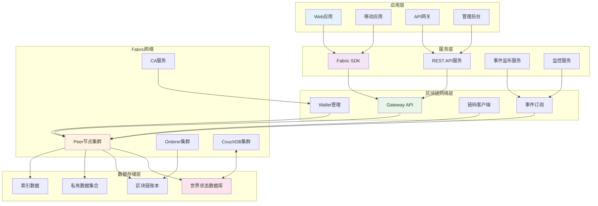
```mermaid
graph TB
    subgraph "应用层"
        A1[Web应用]
        A2[移动应用]
        A3[API网关]
        A4[管理后台]
    end

    subgraph "服务层"
        S1[Fabric SDK]
        S2[REST API服务]
        S3[事件监听服务]
        S4[监控服务]
    end

    subgraph "区块链网络层"
        B1[Gateway API]
        B2[Wallet管理]
        B3[链码客户端]
        B4[事件订阅]
    end

    subgraph "Fabric网络"
        F1[Peer节点集群]
        F2[Orderer集群]
        F3[CA服务]
        F4[CouchDB集群]
    end

    subgraph "数据存储层"
        D1[世界状态数据库]
        D2[区块链账本]
        D3[私有数据集合]
        D4[索引数据]
    end

    A1 --> S1
    A2 --> S1
    A3 --> S2
    A4 --> S2
    
    S1 --> B1
    S2 --> B1
    S3 --> B4
    S4 --> B4
    
    B1 --> F1
    B2 --> F1
    B3 --> F1
    B4 --> F1
    
    F1 --> D1
    F1 --> D2
    F1 --> D3
    F1 --> D4
    
    F2 --> D2
    F3 --> B2
    F4 <--> D1

    style A1 fill:#e3f2fd
    style S1 fill:#f3e5f5
    style B1 fill:#e8f5e8
    style F1 fill:#fff3e0
    style D1 fill:#fce4ec
```

## 部署架构图

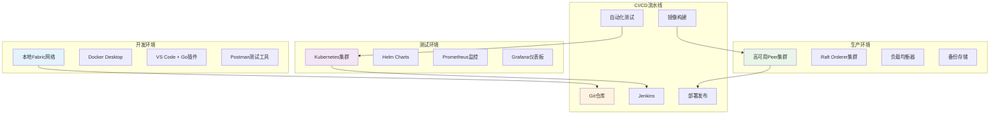
```mermaid
graph TB
    subgraph "开发环境"
        DEV1[本地Fabric网络]
        DEV2[Docker Desktop]
        DEV3[VS Code + Go插件]
        DEV4[Postman测试工具]
    end

    subgraph "测试环境"
        TEST1[Kubernetes集群]
        TEST2[Helm Charts]
        TEST3[Prometheus监控]
        TEST4[Grafana仪表板]
    end

    subgraph "生产环境"
        PROD1[高可用Peer集群]
        PROD2[Raft Orderer集群]
        PROD3[负载均衡器]
        PROD4[备份存储]
    end

    subgraph "CI/CD流水线"
        CI1[Git仓库]
        CI2[Jenkins]
        CI3[自动化测试]
        CI4[镜像构建]
        CI5[部署发布]
    end

    DEV1 --> CI1
    TEST1 --> CI2
    PROD1 --> CI5
    
    CI3 --> TEST1
    CI4 --> PROD1

    style DEV1 fill:#e3f2fd
    style TEST1 fill:#f3e5f5
    style PROD1 fill:#e8f5e8
    style CI1 fill:#fff3e0
```

## 数据流向图

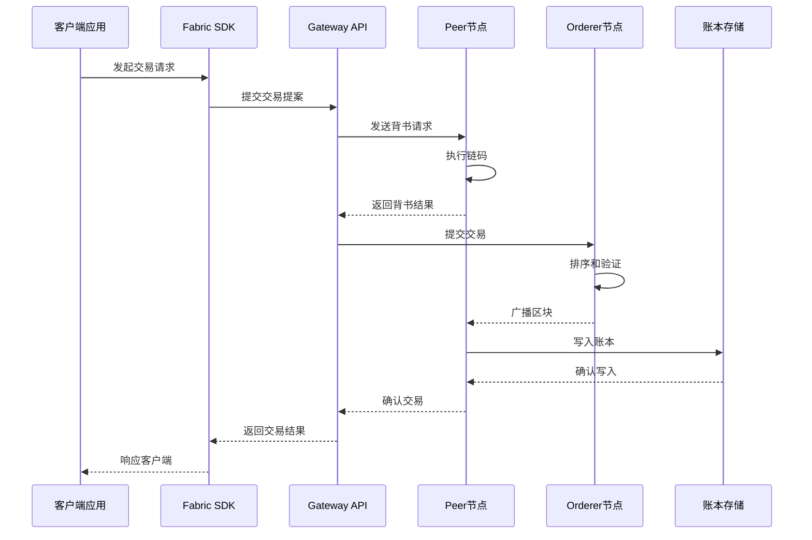
```mermaid
sequenceDiagram
    participant Client as 客户端应用
    participant SDK as Fabric SDK
    participant Gateway as Gateway API
    participant Peer as Peer节点
    participant Orderer as Orderer节点
    participant Ledger as 账本存储

    Client->>SDK: 发起交易请求
    SDK->>Gateway: 提交交易提案
    Gateway->>Peer: 发送背书请求
    Peer->>Peer: 执行链码
    Peer-->>Gateway: 返回背书结果
    Gateway->>Orderer: 提交交易
    Orderer->>Orderer: 排序和验证
    Orderer-->>Peer: 广播区块
    Peer->>Ledger: 写入账本
    Ledger-->>Peer: 确认写入
    Peer-->>Gateway: 确认交易
    Gateway-->>SDK: 返回交易结果
    SDK-->>Client: 响应客户端
```

## 链码调用流程图

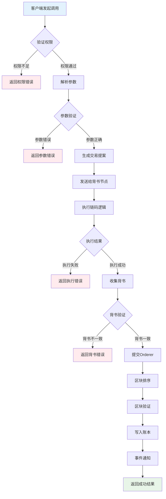
```mermaid
flowchart TD
    A[客户端发起调用] --> B{验证权限}
    B -->|权限不足| C[返回权限错误]
    B -->|权限通过| D[解析参数]
    D --> E{参数验证}
    E -->|参数错误| F[返回参数错误]
    E -->|参数正确| G[生成交易提案]
    G --> H[发送给背书节点]
    H --> I[执行链码逻辑]
    I --> J{执行结果}
    J -->|执行失败| K[返回执行错误]
    J -->|执行成功| L[收集背书]
    L --> M{背书验证}
    M -->|背书不一致| N[返回背书错误]
    M -->|背书一致| O[提交Orderer]
    O --> P[区块排序]
    P --> Q[区块验证]
    Q --> R[写入账本]
    R --> S[事件通知]
    S --> T[返回成功结果]

    style A fill:#e3f2fd
    style C fill:#ffebee
    style F fill:#ffebee
    style K fill:#ffebee
    style N fill:#ffebee
    style T fill:#e8f5e8
```

## 安全架构图

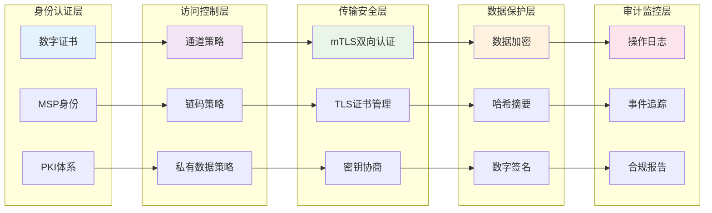
```mermaid
graph LR
    subgraph "身份认证层"
        AUTH1[数字证书]
        AUTH2[MSP身份]
        AUTH3[PKI体系]
    end

    subgraph "访问控制层"
        ACL1[通道策略]
        ACL2[链码策略]
        ACL3[私有数据策略]
    end

    subgraph "传输安全层"
        TLS1[mTLS双向认证]
        TLS2[TLS证书管理]
        TLS3[密钥协商]
    end

    subgraph "数据保护层"
        DATA1[数据加密]
        DATA2[哈希摘要]
        DATA3[数字签名]
    end

    subgraph "审计监控层"
        AUDIT1[操作日志]
        AUDIT2[事件追踪]
        AUDIT3[合规报告]
    end

    AUTH1 --> ACL1
    AUTH2 --> ACL2
    AUTH3 --> ACL3
    
    ACL1 --> TLS1
    ACL2 --> TLS2
    ACL3 --> TLS3
    
    TLS1 --> DATA1
    TLS2 --> DATA2
    TLS3 --> DATA3
    
    DATA1 --> AUDIT1
    DATA2 --> AUDIT2
    DATA3 --> AUDIT3

    style AUTH1 fill:#e3f2fd
    style ACL1 fill:#f3e5f5
    style TLS1 fill:#e8f5e8
    style DATA1 fill:#fff3e0
    style AUDIT1 fill:#fce4ec
```

## 监控告警架构

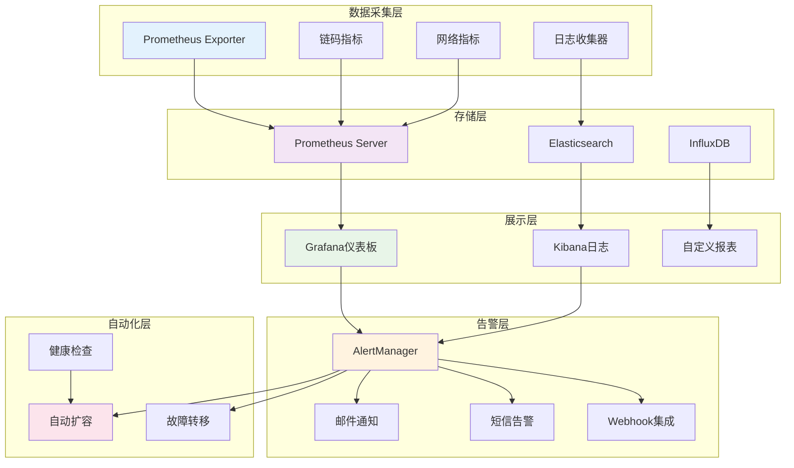
```mermaid
graph TB
    subgraph "数据采集层"
        COLLECT1[Prometheus Exporter]
        COLLECT2[日志收集器]
        COLLECT3[链码指标]
        COLLECT4[网络指标]
    end

    subgraph "存储层"
        STORE1[Prometheus Server]
        STORE2[Elasticsearch]
        STORE3[InfluxDB]
    end

    subgraph "展示层"
        DASH1[Grafana仪表板]
        DASH2[Kibana日志]
        DASH3[自定义报表]
    end

    subgraph "告警层"
        ALERT1[AlertManager]
        ALERT2[邮件通知]
        ALERT3[短信告警]
        ALERT4[Webhook集成]
    end

    subgraph "自动化层"
        AUTO1[自动扩容]
        AUTO2[故障转移]
        AUTO3[健康检查]
    end

    COLLECT1 --> STORE1
    COLLECT2 --> STORE2
    COLLECT3 --> STORE1
    COLLECT4 --> STORE1
    
    STORE1 --> DASH1
    STORE2 --> DASH2
    STORE3 --> DASH3
    
    DASH1 --> ALERT1
    DASH2 --> ALERT1
    
    ALERT1 --> ALERT2
    ALERT1 --> ALERT3
    ALERT1 --> ALERT4
    
    ALERT1 --> AUTO1
    ALERT1 --> AUTO2
    AUTO3 --> AUTO1

    style COLLECT1 fill:#e3f2fd
    style STORE1 fill:#f3e5f5
    style DASH1 fill:#e8f5e8
    style ALERT1 fill:#fff3e0
    style AUTO1 fill:#fce4ec
```

## 备份恢复架构

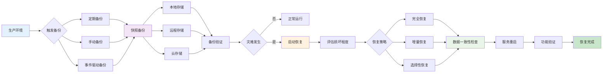
```mermaid
flowchart LR
    A[生产环境] --> B{触发备份}
    B --> C[定期备份]
    B --> D[手动备份]
    B --> E[事件驱动备份]
    
    C --> F[快照备份]
    D --> F
    E --> F
    
    F --> G[本地存储]
    F --> H[远程存储]
    F --> I[云存储]
    
    G --> J[备份验证]
    H --> J
    I --> J
    
    J --> K{灾难发生}
    K -->|否| L[正常运行]
    K -->|是| M[启动恢复]
    
    M --> N[评估损坏程度]
    N --> O{恢复策略}
    O --> P[完全恢复]
    O --> Q[增量恢复]
    O --> R[选择性恢复]
    
    P --> S[数据一致性检查]
    Q --> S
    R --> S
    
    S --> T[服务重启]
    T --> U[功能验证]
    U --> V[恢复完成]

    style A fill:#e3f2fd
    style F fill:#f3e5f5
    style M fill:#fff3e0
    style S fill:#e8f5e8
    style V fill:#c8e6c9
```

## 微服务集成架构

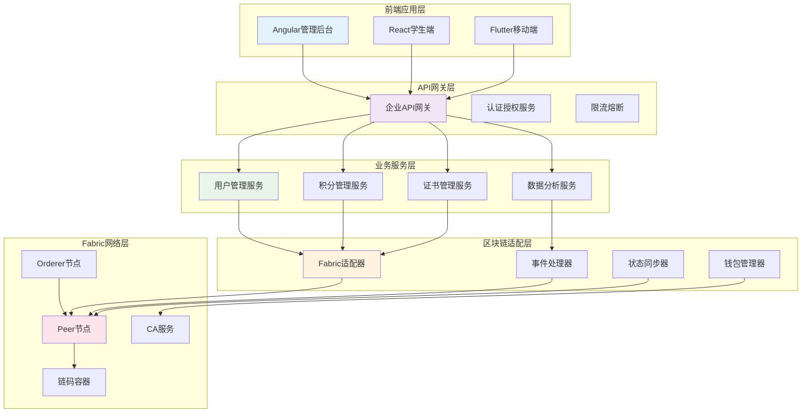
```mermaid
graph TB
    subgraph "前端应用层"
        FE1[Angular管理后台]
        FE2[React学生端]
        FE3[Flutter移动端]
    end

    subgraph "API网关层"
        GW1[企业API网关]
        GW2[认证授权服务]
        GW3[限流熔断]
    end

    subgraph "业务服务层"
        BS1[用户管理服务]
        BS2[积分管理服务]
        BS3[证书管理服务]
        BS4[数据分析服务]
    end

    subgraph "区块链适配层"
        BC1[Fabric适配器]
        BC2[事件处理器]
        BC3[状态同步器]
        BC4[钱包管理器]
    end

    subgraph "Fabric网络层"
        FN1[Peer节点]
        FN2[Orderer节点]
        FN3[CA服务]
        FN4[链码容器]
    end

    FE1 --> GW1
    FE2 --> GW1
    FE3 --> GW1
    
    GW1 --> BS1
    GW1 --> BS2
    GW1 --> BS3
    GW1 --> BS4
    
    BS1 --> BC1
    BS2 --> BC1
    BS3 --> BC1
    BS4 --> BC2
    
    BC1 --> FN1
    BC2 --> FN1
    BC3 --> FN1
    BC4 --> FN3
    
    FN1 --> FN4
    FN2 --> FN1

    style FE1 fill:#e3f2fd
    style GW1 fill:#f3e5f5
    style BS1 fill:#e8f5e8
    style BC1 fill:#fff3e0
    style FN1 fill:#fce4ec
```

## 高可用架构

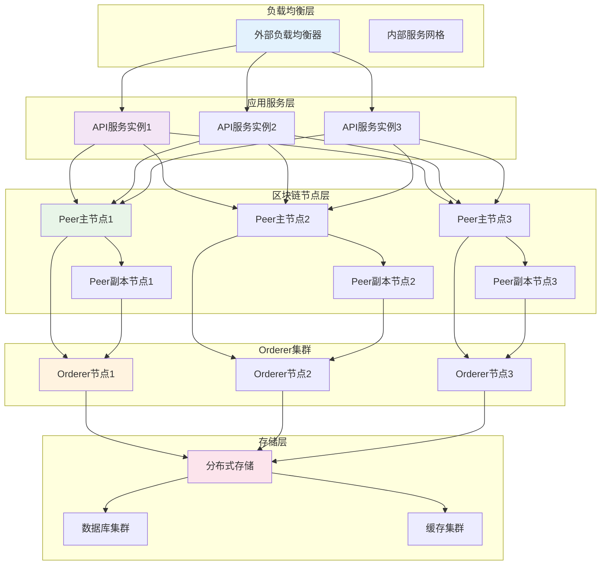
```mermaid
graph TB
    subgraph "负载均衡层"
        LB1[外部负载均衡器]
        LB2[内部服务网格]
    end

    subgraph "应用服务层"
        APP1[API服务实例1]
        APP2[API服务实例2]
        APP3[API服务实例3]
    end

    subgraph "区块链节点层"
        BC1[Peer主节点1]
        BC2[Peer主节点2]
        BC3[Peer主节点3]
        BC4[Peer副本节点1]
        BC5[Peer副本节点2]
        BC6[Peer副本节点3]
    end

    subgraph "Orderer集群"
        ORD1[Orderer节点1]
        ORD2[Orderer节点2]
        ORD3[Orderer节点3]
    end

    subgraph "存储层"
        ST1[分布式存储]
        ST2[数据库集群]
        ST3[缓存集群]
    end

    LB1 --> APP1
    LB1 --> APP2
    LB1 --> APP3
    
    APP1 --> BC1
    APP1 --> BC2
    APP1 --> BC3
    APP2 --> BC1
    APP2 --> BC2
    APP2 --> BC3
    APP3 --> BC1
    APP3 --> BC2
    APP3 --> BC3
    
    BC1 --> BC4
    BC2 --> BC5
    BC3 --> BC6
    
    BC1 --> ORD1
    BC2 --> ORD2
    BC3 --> ORD3
    BC4 --> ORD1
    BC5 --> ORD2
    BC6 --> ORD3
    
    ORD1 --> ST1
    ORD2 --> ST1
    ORD3 --> ST1
    
    ST1 --> ST2
    ST1 --> ST3

    style LB1 fill:#e3f2fd
    style APP1 fill:#f3e5f5
    style BC1 fill:#e8f5e8
    style ORD1 fill:#fff3e0
    style ST1 fill:#fce4ec
```

## 灾难恢复流程图

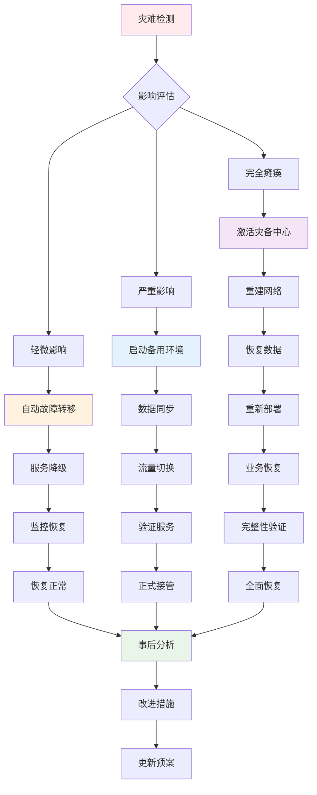
```mermaid
flowchart TD
    A[灾难检测] --> B{影响评估}
    B --> C[轻微影响]
    B --> D[严重影响]
    B --> E[完全瘫痪]
    
    C --> F[自动故障转移]
    F --> G[服务降级]
    G --> H[监控恢复]
    H --> I[恢复正常]
    
    D --> J[启动备用环境]
    J --> K[数据同步]
    K --> L[流量切换]
    L --> M[验证服务]
    M --> N[正式接管]
    
    E --> O[激活灾备中心]
    O --> P[重建网络]
    P --> Q[恢复数据]
    Q --> R[重新部署]
    R --> S[业务恢复]
    S --> T[完整性验证]
    T --> U[全面恢复]
    
    I --> V[事后分析]
    N --> V
    U --> V
    V --> W[改进措施]
    W --> X[更新预案]

    style A fill:#ffebee
    style F fill:#fff3e0
    style J fill:#e3f2fd
    style O fill:#f3e5f5
    style V fill:#e8f5e8
```

## 性能优化架构

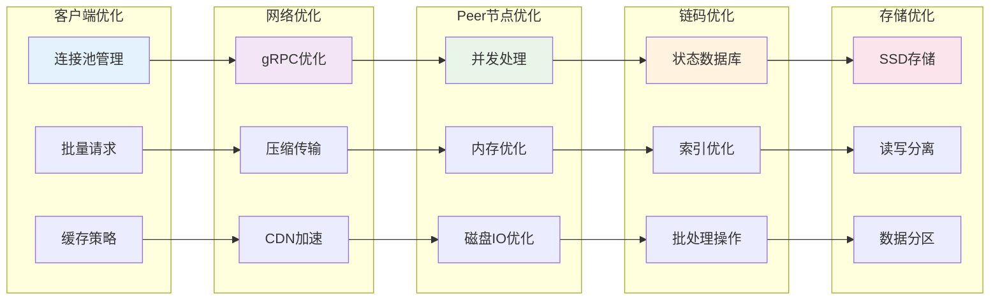
```mermaid
graph LR
    subgraph "客户端优化"
        CLIENT1[连接池管理]
        CLIENT2[批量请求]
        CLIENT3[缓存策略]
    end

    subgraph "网络优化"
        NET1[gRPC优化]
        NET2[压缩传输]
        NET3[CDN加速]
    end

    subgraph "Peer节点优化"
        PEER1[并发处理]
        PEER2[内存优化]
        PEER3[磁盘IO优化]
    end

    subgraph "链码优化"
        CHAIN1[状态数据库]
        CHAIN2[索引优化]
        CHAIN3[批处理操作]
    end

    subgraph "存储优化"
        STORAGE1[SSD存储]
        STORAGE2[读写分离]
        STORAGE3[数据分区]
    end

    CLIENT1 --> NET1
    CLIENT2 --> NET2
    CLIENT3 --> NET3
    
    NET1 --> PEER1
    NET2 --> PEER2
    NET3 --> PEER3
    
    PEER1 --> CHAIN1
    PEER2 --> CHAIN2
    PEER3 --> CHAIN3
    
    CHAIN1 --> STORAGE1
    CHAIN2 --> STORAGE2
    CHAIN3 --> STORAGE3

    style CLIENT1 fill:#e3f2fd
    style NET1 fill:#f3e5f5
    style PEER1 fill:#e8f5e8
    style CHAIN1 fill:#fff3e0
    style STORAGE1 fill:#fce4ec
```
