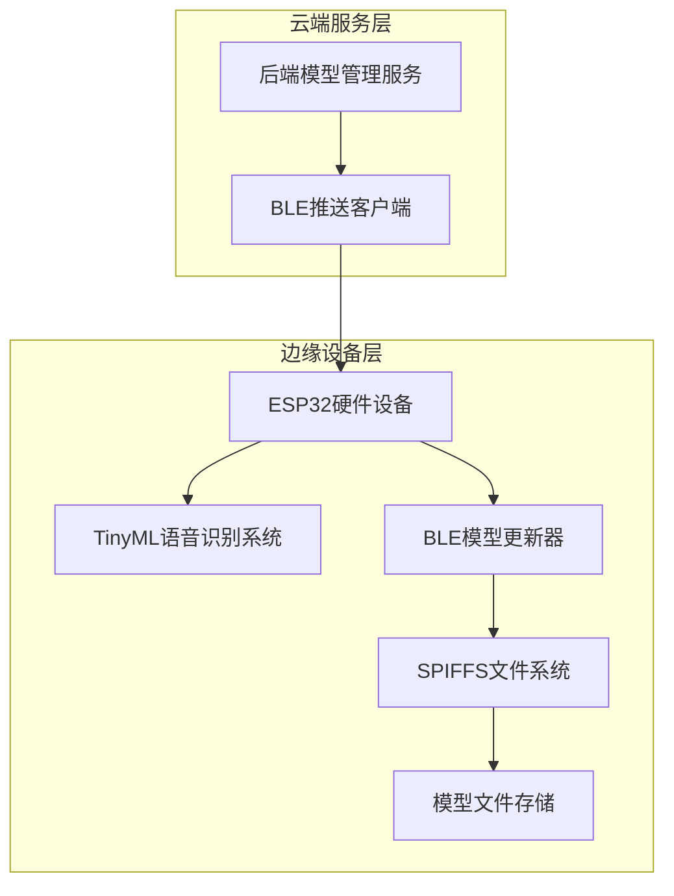
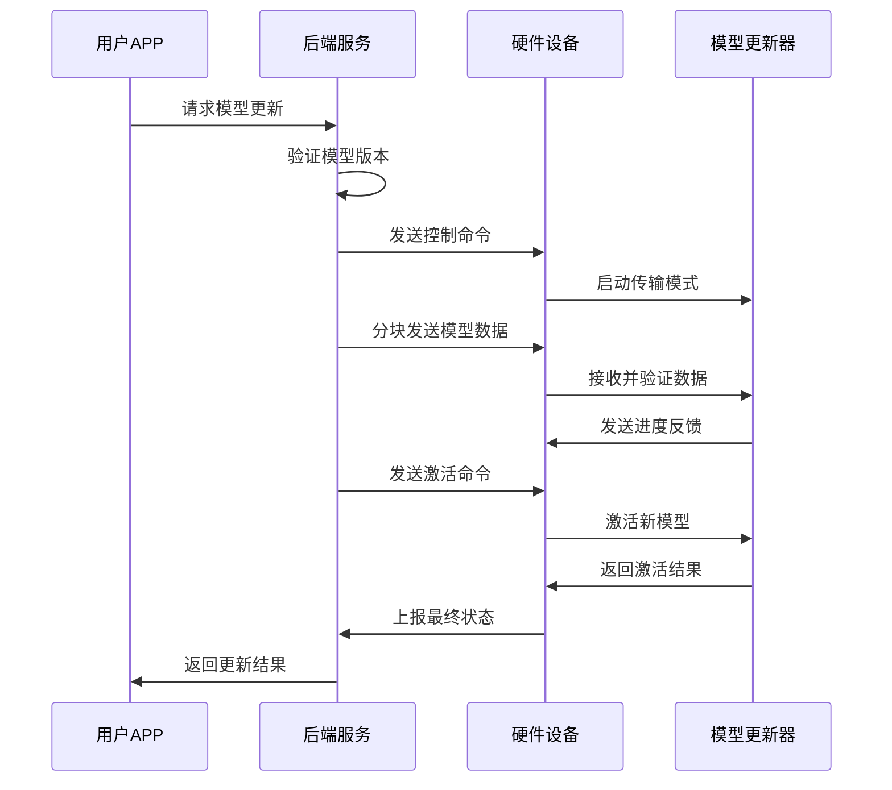
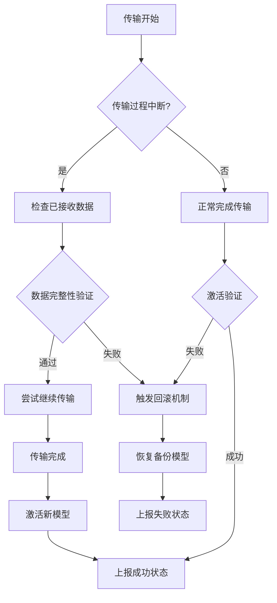

# AI模型热更新架构设计方案

## 📋 方案概述

**设计时间**: 2026年3月1日  
**功能目标**: 实现通过BLE推送新权重的AI模型热更新功能  
**适用场景**: TinyML边缘设备的模型在线升级  

## 🏗️ 系统架构设计

### 1. 整体架构图



### 2. 核心组件说明

#### 2.1 后端模型管理服务 (Backend)
- **位置**: `backend/services/model_update_service.py`
- **功能**: 
  - 模型版本管理
  - 模型文件分发
  - 更新策略控制
  - 状态监控和日志记录

#### 2.2 BLE推送客户端 (Mobile Client)
- **位置**: `mobile/BLEModelPusher/`
- **功能**:
  - BLE连接管理
  - 模型文件传输协议
  - 传输进度监控
  - 错误处理和重试机制

#### 2.3 硬件端BLE更新器 (Hardware)
- **位置**: `hardware/tinyml-voice-recognition/src/BLEModelUpdater.*`
- **功能**:
  - BLE通信协议实现
  - 模型文件接收和验证
  - 安全的模型切换机制
  - 状态反馈和错误恢复

## 🔄 通信协议规范

### 1. 控制命令协议 (JSON格式)

```json
{
  "command": "START_TRANSFER",
  "model_name": "voice_recognition_v2",
  "version": "2.1.0",
  "size": 102400,
  "checksum": "sha256_hash_value"
}
```

### 2. 状态反馈协议

```json
{
  "status": "TRANSFER_PROGRESS",
  "message": "传输进度",
  "progress": 75,
  "received_bytes": 76800,
  "expected_bytes": 102400,
  "timestamp": 1234567890
}
```

### 3. BLE特征定义

| 特征UUID | 类型 | 用途 |
|----------|------|------|
| beb5483e-36e1-4688-b7f5-ea07361b26a8 | 可写/通知 | 模型数据传输 |
| beb5483e-36e1-4688-b7f5-ea07361b26a9 | 可读/通知 | 状态信息查询 |

## 🔧 技术实现要点

### 1. 安全机制
- **文件完整性校验**: SHA256哈希验证
- **版本控制**: 语义化版本号管理
- **回滚机制**: 失败时自动恢复到上一版本
- **传输加密**: BLE层面的数据保护

### 2. 性能优化
- **分块传输**: 512字节数据块传输
- **压缩算法**: LZ4/GZIP模型压缩
- **增量更新**: 差分更新减少传输量
- **内存管理**: 避免内存碎片化

### 3. 容错处理
- **超时机制**: 30秒传输超时
- **重试策略**: 3次自动重试
- **错误恢复**: 断点续传支持
- **状态监控**: 实时状态反馈

## 📊 数据流设计

### 1. 模型更新流程



### 2. 错误处理流程



## 🎯 验收标准

### 功能性要求
- [ ] 支持完整的BLE模型传输协议
- [ ] 实现安全的模型版本管理
- [ ] 提供可靠的错误恢复机制
- [ ] 支持实时传输状态监控

### 性能要求
- [ ] 单次传输最大支持1MB模型文件
- [ ] 平均传输速度≥10KB/s
- [ ] 传输成功率≥95%
- [ ] 模型切换时间≤5秒

### 兼容性要求
- [ ] 支持Android/iOS移动设备
- [ ] 兼容主流ESP32开发板
- [ ] 支持TensorFlow Lite模型格式
- [ ] 符合BLE 4.0+标准

## 📈 性能指标基线

| 指标 | 目标值 | 测量方法 |
|------|--------|----------|
| 传输成功率 | ≥95% | 100次传输测试 |
| 平均传输时间 | ≤120秒 | 500KB文件传输 |
| 内存占用峰值 | ≤200KB | 运行时监控 |
| 功耗增加 | ≤15% | 传输期间对比 |

## ⚠️ 风险评估与缓解

### 高风险项
1. **传输中断**: BLE信号不稳定
   - 缓解: 实现断点续传机制
   
2. **存储空间不足**: 设备Flash容量限制
   - 缓解: 压缩算法 + 增量更新
   
3. **模型兼容性**: 新旧模型接口不匹配
   - 缓解: 严格的版本控制和接口验证

### 中风险项
1. **电池消耗**: 传输过程耗电较大
   - 缓解: 优化传输算法，降低功耗
   
2. **并发冲突**: 多个更新请求同时到达
   - 缓解: 队列管理和锁机制

## 📅 实施计划

### 阶段一: 基础框架搭建 (2天)
- [ ] 后端模型管理API开发
- [ ] BLE通信协议定义
- [ ] 硬件端基础功能验证

### 阶段二: 核心功能实现 (3天)
- [ ] 模型文件传输功能
- [ ] 完整的状态监控系统
- [ ] 错误处理和恢复机制

### 阶段三: 优化和完善 (2天)
- [ ] 性能调优和压力测试
- [ ] 用户界面和体验优化
- [ ] 文档完善和技术验证

### 阶段四: 测试验证 (2天)
- [ ] 功能完整性测试
- [ ] 性能基准测试
- [ ] 稳定性长期测试

---

**设计负责人**: 系统架构师  
**审核人**: 技术委员会  
**预计完成时间**: 2026年3月10日