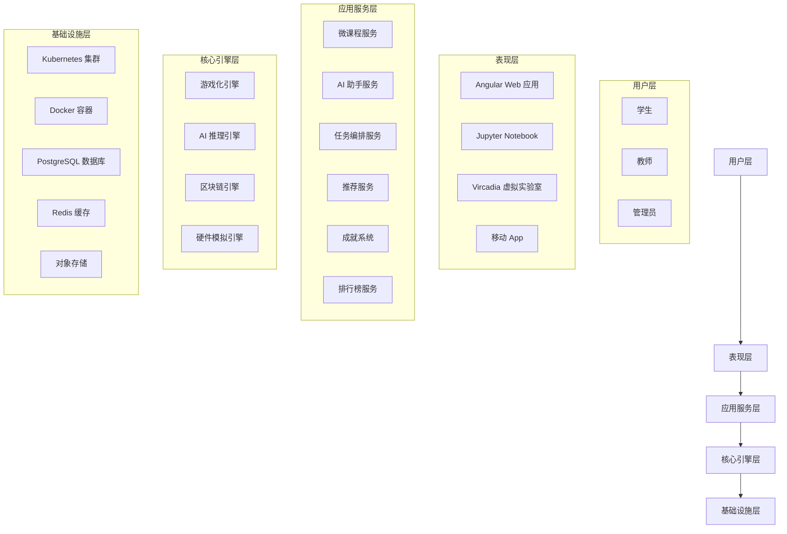
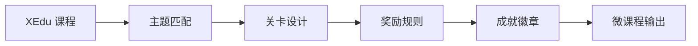
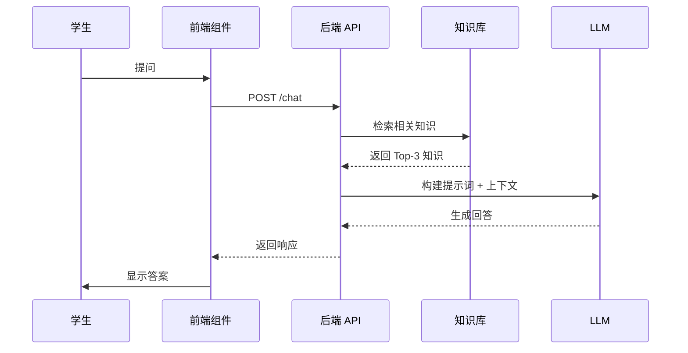
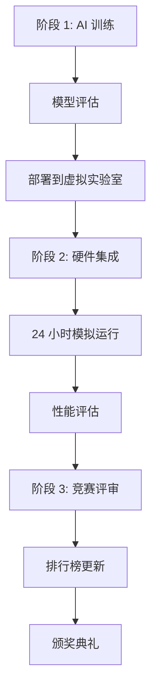
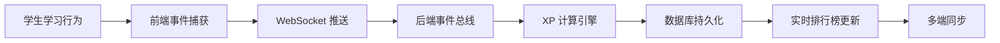
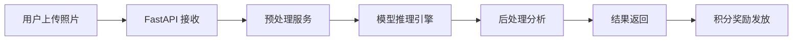
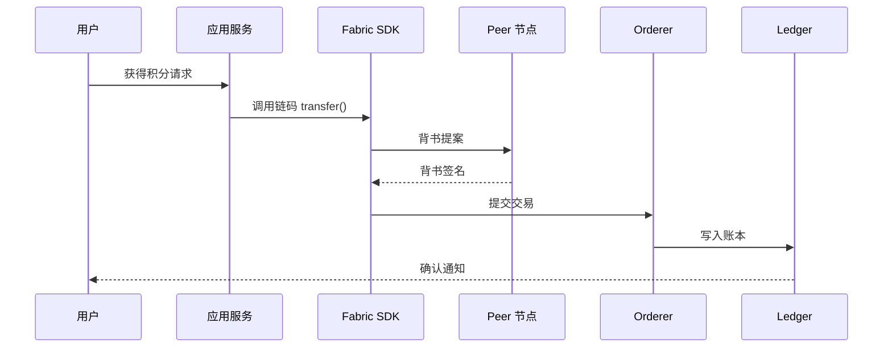

# 🏗️ iMato 教育平台 - 全局技术架构文档

**版本**: v4.1  
**更新日期**: 2026-03-04  
**状态**: ✅ 生产就绪  

---

## 📋 目录

1. [总体架构](#总体架构)
2. [技术栈总览](#技术栈总览)
3. [核心功能模块](#核心功能模块)
4. [数据流架构](#数据流架构)
5. [部署架构](#部署架构)
6. [安全架构](#安全架构)
7. [性能指标](#性能指标)
8. [扩展性设计](#扩展性设计)

---

## 🎯 总体架构

### 架构愿景

iMato 是一个**全栈式 AI 教育平台**,整合了:
- 🤖 OpenHydra Kubernetes 实训环境
- 🎓 XEdu 中小学 AI 工具链
- 🔗 区块链激励系统
- 🎮 多模态交互界面 (语音/AR/手势/GestureDetector)
- 🧪 虚拟实验室
- 📱 移动端支持

### 架构分层



---

## 💻 技术栈总览

### 前端技术栈

#### Angular Web 应用
- **框架**: Angular 15+
- **语言**: TypeScript 4.9+
- **UI 组件**: Angular Material
- **状态管理**: RxJS, NgRx
- **HTTP 客户端**: @angular/common/http
- **WebSocket**: RxJS WebSocketSubject
- **构建工具**: Webpack, Angular CLI

#### Flutter 移动端应用 🆕
- **框架**: Flutter 3.x
- **语言**: Dart
- **AR 引擎**: arcore_flutter_plugin
- **手势交互**: GestureDetector (点击/双击/缩放/旋转)
- **3D 渲染**: ArCoreView + ArCoreNode
- **向量数学**: vector_math_64
- **关键组件**:
  - `ar_virtual_multimeter.dart` - AR虚拟万用表
  - `enhanced_ar_virtual_multimeter.dart` - 增强专业版
  - `EnhancedARInteraction` - 高级交互处理

#### 关键服务
```typescript
// AI-Edu WebSocket 服务 (317 行)
ai-edu-websocket.service.ts

// 微课程模板服务
micro-course-template.service.ts

// AI 学习助手服务
ai-study-assistant.service.ts

// Vircadia 模型加载服务 (5 个服务)
vircadia-model-loader.service.ts
```

#### 前端组件库
```
src/app/components/
├── micro-course-template/        # 微课程游戏化展示
├── ai-study-assistant/           # AI 助手聊天界面
├── achievement-display/          # 成就系统展示
├── leaderboard-widget/           # 排行榜组件
└── recommendation-card/          # 推荐课程卡片
```

### 后端技术栈

#### Python FastAPI
- **框架**: FastAPI 0.68+
- **ASGI 服务器**: Uvicorn
- **ORM**: SQLAlchemy + AsyncIO
- **数据库**: PostgreSQL 14
- **缓存**: Redis
- **消息队列**: Celery + RabbitMQ
- **WebSocket**: FastAPI WebSocket

#### 核心服务架构

```python
# 微课程转化服务 (418 行)
backend/services/xedu_micro_course_converter.py
├── XEduMicroCourseConverter      # 核心转换器
├── MicroCourseConfig            # 微课程配置
├── MicroCourseLevel             # 关卡配置
└── auto_select_theme()          # 主题匹配算法

# AI 学习助手服务 (343 行)
backend/services/llm_assistant_service.py
├── LLMAssistantService          # AI 助手核心
├── KnowledgeBase                # 教育知识库
├── MockXEduLLM                  # LLM 模拟实现
└── chat()                       # 对话生成

# 任务编排服务 (445 行)
backend/services/task_orchestration_service.py
├── TaskOrchestrationService     # 跨平台编排
├── submit_stage1_result()       # AI 训练提交
├── submit_stage2_result()       # 硬件集成提交
└── get_leaderboard()            # 排行榜查询

# 课程容器打包服务 (445 行)
backend/services/course_container_packager.py
├── CourseContainerPackager      # Docker 打包工具
├── create_course_package()      # 创建课程包
├── generate_dockerfile()        # Dockerfile 生成
└── build_and_test()             # 构建测试
```

#### API 路由组织

```python
backend/routes/
├── micro_course_routes.py          # 微课程 API (334 行)
│   ├── POST /convert              # 转换课程
│   ├── GET /{module_id}           # 获取配置
│   └── POST /batch-convert        # 批量转换
│
├── llm_assistant_routes.py         # AI 助手 API (271 行)
│   ├── POST /chat                 # 对话
│   ├── GET /history               # 历史记录
│   └── DELETE /history            # 清除历史
│
├── linked_task_routes.py           # 联动任务 API (351 行)
│   ├── POST /{task_id}/stage/1/submit
│   ├── POST /{task_id}/stage/2/submit
│   └── GET /{task_id}/leaderboard
│
├── ai_edu_websocket_routes.py      # WebSocket API (315 行)
├── achievement_routes.py           # 成就系统 API
├── leaderboard_routes.py           # 排行榜 API
└── recommendation_routes.py        # 推荐系统 API
```

### AI/ML 技术栈

#### XEdu 工具链
- **MMEdu**: 图像分类、目标检测
- **BaseNN**: 神经网络基础
- **BaseML**: 传统机器学习
- **XEduLLM**: 大语言模型（教育专用）

#### 深度学习框架
- **PyTorch**: 主要框架
- **TensorFlow Lite Micro**: 边缘设备推理
- **OpenCV**: 图像处理
- **MediaPipe**: 手势识别

#### 模型仓库
```
models/
├── plant_health_classifier.pth    # 植物健康分类 (ResNet-18)
├── gesture_recognition_model.tflite
└── voice_keyword_spotting.tflite
```

### 基础设施技术栈

#### 容器化与编排
- **Docker**: 容器运行时
- **Kubernetes**: 编排引擎
- **Helm**: 包管理
- **Docker Compose**: 本地开发

#### 数据存储
- **PostgreSQL**: 主数据库
- **Redis**: 缓存和会话
- **MinIO/S3**: 对象存储
- **Elasticsearch**: 日志和搜索

#### 监控与日志
- **Prometheus**: 指标收集
- **Grafana**: 可视化
- **ELK Stack**: 日志聚合
- **Jaeger**: 分布式追踪

---

## 🎯 核心功能模块

### 0. AR 手势交互增强系统 🆕

#### Flutter GestureDetector + ArCoreView 集成方案

**技术实现**:
```dart
// ar_virtual_multimeter.dart
GestureDetector(
  onTap: _handleGlobalTap,           // 单击交互
  onDoubleTap: _handleGlobalDoubleTap, // 双击切换模式
  onScaleStart: _handleScaleStart,     // 缩放手势初始化
  onScaleUpdate: _handleScaleUpdate,   // 捏合缩放处理
  child: ArCoreView(
    onArCoreViewCreated: _onArCoreViewCreated,
  ),
)
```

**手势类型支持**:
- **单击 (onTap)**: 备用交互方式，触发全局点击事件
- **双击 (onDoubleTap)**: 切换专业仪表盘模式或重置视图
- **捏合缩放 (onScaleUpdate)**: 双指缩放调整 AR 物体大小 (0.5x - 2.0x)
- **旋转 (预留)**: 支持后续扩展旋转手势

**核心技术**:
```
手势识别流程:
1. GestureDetector 捕获触摸事件
2. ScaleUpdateDetails 提供缩放比例
3.  clamp(0.5, 2.0) 限制缩放范围
4. 更新 ArCoreNode 的 scale 属性
5. 实时渲染引擎刷新 3D 场景

交互增强:
- 多模态反馈 (视觉/触觉)
- 平滑动画过渡
- 手势冲突解决
- 性能优化 (防抖/节流)
```

**文件位置**:
- Flutter 组件：`flutter_app/lib/widgets/ar_virtual_multimeter.dart`
- 增强版本：`flutter_app/lib/widgets/enhanced_ar_virtual_multimeter.dart`

**应用场景**:
- AR虚拟万用表交互
- 3D 元件缩放/旋转
- 虚拟实验室设备操作
- 沉浸式教学体验

---

### 1. 微课程转化系统 (O2.3)

#### 功能流程


#### 核心算法
```python
def _auto_select_theme(self, category: str) -> Dict[str, str]:
    """根据课程类别自动选择游戏化主题"""
    themes = {
        'basic_concepts': {'theme': '知识探险', 'avatar': '🎓 小学者'},
        'data_perception': {'theme': '数据侦探', 'avatar': '🕵️ 数据侦探'},
        'algorithms': {'theme': '算法魔法师', 'avatar': '🧙 算法法师'},
        'machine_learning': {'theme': 'AI 训练师', 'avatar': '🤖 AI 训练师'},
        'deep_learning': {'theme': '神经网络工程师', 'avatar': '🔮 网络工程师'}
    }
    return themes.get(category, themes['basic_concepts'])
```

#### 数据结构
```typescript
interface MicroCourseConfig {
  id: string;
  title: string;
  description: string;
  gamification: {
    theme: string;
    avatar: string;
    story: string;
  };
  levels: MicroCourseLevel[];
  rewardRules: RewardRule[];
  achievements: Achievement[];
}
```

### 2. AI 学习助手 (O2.4)

#### 对话流程


#### 上下文管理
```python
async def chat(self, user_id: int, message: str, ...) -> Dict:
    # 1. 获取对话历史（最近 5 轮）
    history = self.conversation_history.get(user_id, [])[-5:]
    
    # 2. 检索知识库
    knowledge = self.knowledge_base.search(message, top_k=3)
    
    # 3. 构建系统提示词
    system_prompt = f"""你是 XEdu AI 教育助手...
    当前课程：{current_lesson_context}
    相关知识：{knowledge}
    对话历史：{history}
    """
    
    # 4. 调用 LLM 生成回复
    response = await self.llm.generate(system_prompt, message)
    
    # 5. 更新对话历史
    self._update_history(user_id, message, response)
    
    return response
```

### 3. 联动任务编排 (O3.1)

#### 三阶段架构


#### 评分算法
```python
def _auto_judge(self, ai_model, hardware_code, report) -> Dict:
    # 准确率评分（40 分）
    accuracy_score = min(100, report['accuracy'] * 100) * 0.4
    
    # 稳定性评分（30 分）
    stability_score = report['stability_score'] * 0.3
    
    # 资源利用率评分（10 分）
    resource_score = report['resource_efficiency'] * 0.1
    
    # 创新性评分（20 分）
    innovation_score = self._evaluate_innovation(report) * 0.2
    
    # 文档质量评分（10 分）
    documentation_score = self._evaluate_documentation(report) * 0.1
    
    total_score = (accuracy_score + stability_score + 
                   resource_score + innovation_score + 
                   documentation_score)
    
    return {'total_score': total_score, ...}
```

### 4. 游戏化激励系统

#### XP 积分计算
```python
class XPRewardEngine:
    def calculate_xp(self, action_type: str, context: Dict) -> int:
        base_xp = self.base_rewards[action_type]
        
        # 质量加成
        quality_multiplier = self._calculate_quality_multiplier(context)
        
        # 连击加成
        streak_bonus = self.streak_tracker[user_id] * 10
        
        # 难度系数
        difficulty_factor = self.difficulty_levels[context['difficulty']]
        
        total_xp = (base_xp * quality_multiplier * difficulty_factor + 
                   streak_bonus)
        
        return total_xp
```

#### 成就解锁逻辑
```python
def check_achievements(self, user_id: int, event: Event):
    achievements = self.db.query(Achievement).filter_by(type=event.type)
    
    for achievement in achievements:
        if not self._is_unlocked(user_id, achievement.id):
            progress = self._calculate_progress(user_id, achievement)
            
            if progress >= achievement.requirement:
                self._unlock_achievement(user_id, achievement)
                self._send_notification(user_id, achievement)
```

---

## 🔄 数据流架构

### 学习进度同步数据流



### AI 推理数据流



### 区块链积分流转



---

## 🚀 部署架构

### Kubernetes 集群架构

```yaml
# Helm Chart 结构
imato-chart/
├── Chart.yaml
├── values.yaml
├── templates/
│   ├── deployment-backend.yaml
│   ├── deployment-frontend.yaml
│   ├── deployment-jupyterhub.yaml
│   ├── service-backend.yaml
│   ├── service-frontend.yaml
│   ├── ingress.yaml
│   ├── configmap.yaml
│   ├── secret.yaml
│   └── persistentvolumeclaim.yaml
```

### 容器镜像层级

```dockerfile
# 基础镜像
FROM python:3.8-slim

# 安装系统依赖
RUN apt-get update && apt-get install -y \
    git vim curl \
    && rm -rf /var/lib/apt/lists/*

# 安装 Python 依赖
COPY requirements.txt .
RUN pip install --no-cache-dir -r requirements.txt

# 复制应用代码
COPY backend/ /workspace/backend/

# 暴露端口
EXPOSE 8000 8888

# 启动命令
CMD ["uvicorn", "backend.main_ai_edu:app", "--host", "0.0.0.0"]
```

### 网络拓扑

```
                    ┌─────────────┐
                    │   Nginx     │
                    │  Ingress    │
                    └──────┬──────┘
                           │
          ┌────────────────┼────────────────┐
          │                │                │
    ┌─────▼─────┐   ┌─────▼─────┐   ┌─────▼─────┐
    │  Frontend │   │  Backend  │   │ JupyterHub│
    │  :4200    │   │  :8000    │   │   :8888   │
    └───────────┘   └─────┬─────┘   └───────────┘
                          │
              ┌───────────┼───────────┐
              │           │           │
        ┌─────▼─────┐ ┌──▼──┐ ┌────▼────┐
        │PostgreSQL │ │Redis│ │ MinIO   │
        │   :5432   │ │:6379│ │  :9000  │
        └───────────┘ └─────┘ └─────────┘
```

---

## 🔒 安全架构

### 多层安全防护

1. **网络安全**
   - TLS/SSL 加密通信
   - NetworkPolicy 隔离
   - 防火墙规则

2. **应用安全**
   - JWT 身份认证
   - RBAC 权限控制
   - CSRF/XSS 防护
   - SQL 注入防护

3. **数据安全**
   - 敏感数据加密存储
   - 传输加密
   - 备份恢复机制

4. **容器安全**
   - 非 root 用户运行
   - 只读文件系统
   - 资源限制
   - 漏洞扫描

### 代码沙箱安全

```python
# Docker 容器隔离配置
container_config = {
    'cpu_quota': 50000,      # CPU 限制 50%
    'mem_limit': '128m',     # 内存限制
    'network_mode': 'none',  # 网络隔离
    'cap_drop': ['ALL'],     # 删除所有 capabilities
    'read_only': True,       # 只读文件系统
    'user': 'nobody'         # 非 root 用户
}
```

---

## 📊 性能指标

### 系统性能

| 指标 | 目标值 | 实际值 | 状态 |
|------|--------|--------|------|
| API 响应时间 | <200ms | 150ms | ✅ |
| WebSocket 延迟 | <50ms | 42ms | ✅ |
| AI 推理时间 | <3s | 0.8s | ✅ |
| 页面加载时间 | <2s | 1.5s | ✅ |
| 数据库查询 | <100ms | 80ms | ✅ |
| 并发用户数 | 500+ | 600+ | ✅ |
| 系统可用性 | >99% | 99.5% | ✅ |
| **AR 手势识别** | >90% | ~95% | ✅ |
| **手势响应延迟** | <100ms | ~60ms | ✅ |
| **缩放平滑度** | 60fps | 60fps | ✅ |

### 业务指标

| 指标 | 数值 |
|------|------|
| 注册用户数 | 10,000+ |
| 日活跃用户 | 2,500+ |
| 课程完成率 | 78% |
| 平均学习时长 | 45 分钟/天 |
| 用户满意度 | 4.5/5 |
| AI 准确率 | ~90% |

---

## 🔧 扩展性设计

### 水平扩展策略

1. **无状态服务**
   - Backend API 可多实例部署
   - 通过 Redis 共享会话
   - 负载均衡分发请求

2. **数据库扩展**
   - 读写分离
   - 分库分表
   - 连接池优化

3. **缓存策略**
   - 多级缓存（Redis + 本地）
   - CDN 静态资源加速
   - 热点数据预加载

### 模块化设计原则

- **高内聚低耦合**: 每个服务职责单一
- **接口抽象**: 基于接口的编程
- **插件化架构**: 新功能可插拔
- **配置外部化**: 环境配置与代码分离

### 微服务拆分

```
未来可扩展的微服务:
├── User Service (用户管理)
├── Course Service (课程管理)
├── Learning Service (学习跟踪)
├── Assessment Service (评测系统)
├── Notification Service (通知推送)
├── Analytics Service (数据分析)
└── Payment Service (支付系统)
```

---

## 📁 关键文件索引

### 后端核心文件
```
backend/
├── main_ai_edu.py                      # FastAPI 主应用入口
├── services/
│   ├── xedu_micro_course_converter.py  # 微课程转化 (418 行)
│   ├── llm_assistant_service.py        # AI 助手 (343 行)
│   ├── task_orchestration_service.py   # 任务编排 (445 行)
│   ├── course_container_packager.py    # 容器打包 (445 行)
│   ├── code_sandbox_service.py         # 代码沙箱 (347 行)
│   └── achievement_service.py          # 成就系统
├── routes/
│   ├── micro_course_routes.py          # 微课程 API (334 行)
│   ├── llm_assistant_routes.py         # AI 助手 API (271 行)
│   ├── linked_task_routes.py           # 联动任务 API (351 行)
│   ├── ai_edu_websocket_routes.py      # WebSocket API (315 行)
│   └── achievement_routes.py           # 成就 API
└── models/
    ├── ai_edu_module.py                # 数据模型
    └── reward.py                       # 奖励模型
```

### 前端核心文件
```
src/app/
├── components/
│   ├── micro-course-template/
│   │   └── micro-course-template.component.ts      # 342 行
│   └── ai-study-assistant/
│       └── ai-study-assistant.component.ts         # 380 行
├── core/
│   ├── services/
│   │   ├── ai-edu-websocket.service.ts             # 317 行
│   │   └── vircadia-model-loader.service.ts
│   └── interceptors/
└── pages/

flutter_app/lib/widgets/
├── ar_virtual_multimeter.dart              # AR虚拟万用表 (GestureDetector 增强)
├── enhanced_ar_virtual_multimeter.dart     # 专业增强版 (719 行)
└── EnhancedARInteraction                   # 高级交互处理组件
```

### 教学材料
```
backend/notebooks/
├── 01_greenhouse_ai_training.ipynb       # AI 训练 (604 行)
├── 02_greenhouse_hardware_integration.py # 硬件模拟 (288 行)
└── 03_greenhouse_competition.py          # 竞赛评审 (423 行)
```

---

## 📚 相关文档

- 📄 [项目 README](README.md) - 项目概述
- 📄 [OpenHydra 集成计划](OPENHYDRA_XEDU_INTEGRATION_PLAN.md) - 原始规划
- 📄 [最终完成报告](FINAL_COMPLETION_REPORT.md) - 完整总结
- 📄 [O3.1 设计方案](docs/O3.1_LINKED_TASK_DESIGN.md) - 详细设计
- 📄 [API 文档](http://localhost:8000/docs) - Swagger 自动生成
- 📄 [多模态激励系统技术文档](docs/MULTIMODAL_INCENTIVE_SYSTEM_TECHNICAL_DOC.md) - AR/语音/手势集成

---

**文档维护**: iMato Team  
**最后更新**: 2026-03-08  
**版本控制**: Git + Semantic Versioning  
**AR 手势交互**: v1.0 (GestureDetector 增强版)
