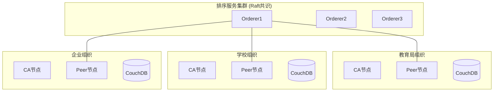

# 区块链技术文档

## 概述

iMatu平台采用Hyperledger Fabric构建企业级区块链网络，主要用于技能认证、积分管理和去中心化身份验证等场景。

## 网络架构

### 整体架构图


### 核心组件
- **Orderer节点**: Raft共识算法，提供排序服务
- **Peer节点**: 每组织一个节点，负责账本维护
- **CA节点**: 成员服务管理，数字证书颁发
- **CouchDB**: 世界状态存储，支持复杂查询
- **链码**: 智能合约实现业务逻辑

## 链码开发

### 积分管理系统链码

#### 核心功能
```go
// 积分发行
func (s *SmartContract) IssuePoints(ctx contractapi.TransactionContextInterface, userId string, amount int, reason string) error

// 积分转移
func (s *SmartContract) TransferPoints(ctx contractapi.TransactionContextInterface, from string, to string, amount int) error

// 查询余额
func (s *SmartContract) GetBalance(ctx contractapi.TransactionContextInterface, userId string) (int, error)

// 查询交易历史
func (s *SmartContract) GetTransactionHistory(ctx contractapi.TransactionContextInterface, userId string) ([]Transaction, error)
```

#### 数据结构
```go
type PointBalance struct {
    UserId  string `json:"userId"`
    Balance int    `json:"balance"`
    History []Transaction `json:"history"`
}

type Transaction struct {
    TxId      string    `json:"txId"`
    From      string    `json:"from"`
    To        string    `json:"to"` 
    Amount    int       `json:"amount"`
    Timestamp time.Time `json:"timestamp"`
    Reason    string    `json:"reason"`
}
```

### 部署流程

#### 1. 网络启动
```bash
# 启动测试网络
cd blockchain/fabric-network
./network.sh up createChannel -c mychannel -ca

# 部署链码
./network.sh deployCC -ccn integral -ccp ../chaincode/integral/ -ccl go
```

#### 2. 链码生命周期
```bash
# 打包链码
peer lifecycle chaincode package integral.tar.gz --path ../chaincode/integral/ --lang golang --label integral_1.0

# 安装链码
peer lifecycle chaincode install integral.tar.gz

# 批准链码定义
peer lifecycle chaincode approveformyorg -o localhost:7050 --ordererTLSHostnameOverride orderer.example.com --channelID mychannel --name integral --version 1.0 --package-id $PACKAGE_ID --sequence 1

# 提交链码
peer lifecycle chaincode commit -o localhost:7050 --ordererTLSHostnameOverride orderer.example.com --channelID mychannel --name integral --peerAddresses localhost:7051 --tlsRootCertFiles organizations/peerOrganizations/org1.example.com/peers/peer0.org1.example.com/tls/ca.crt --peerAddresses localhost:9051 --tlsRootCertFiles organizations/peerOrganizations/org2.example.com/peers/peer0.org2.example.com/tls/ca.crt --version 1.0 --sequence 1
```

## API接口

### 区块链网关API

#### 用户积分操作
```
POST /api/blockchain/points/issue
{
  "userId": "user123",
  "amount": 100,
  "reason": "完成课程"
}

POST /api/blockchain/points/transfer
{
  "from": "user123",
  "to": "user456", 
  "amount": 50
}

GET /api/blockchain/points/balance/{userId}
```

#### 证书验证
```
POST /api/blockchain/certificates/verify
{
  "certificateId": "cert_001",
  "publicKey": "-----BEGIN PUBLIC KEY-----..."
}
```

## 安全机制

### 身份认证
- **PKI体系**: 基于X.509证书的公钥基础设施
- **MSP管理**: 成员服务提供者管理组织身份
- **通道隔离**: 不同业务使用独立通道

### 权限控制
- **读写策略**: 基于签名策略的访问控制
- **私有数据**: 敏感信息存储在私有数据集合
- **背书策略**: 交易验证的组织要求

## 性能优化

### 网络配置优化
```yaml
# docker-compose配置优化
peer:
  environment:
    - CORE_PEER_GOSSIP_ORGLEADER=false
    - CORE_PEER_GOSSIP_USELEADERELECTION=true
    - CORE_LEDGER_STATE_COUCHDBCONFIG_MAXRETRIESONSTARTUP=20
```

### 链码优化
- 批量操作减少交易次数
- 合理设计复合键提高查询效率
- 使用私有数据保护敏感信息

## 监控告警

### 系统监控指标
- 区块生成时间
- 交易吞吐量
- 节点健康状态
- 内存CPU使用率

### 日志配置
```yaml
logging:
  level: info
  cauthdsl: warning
  gossip: warning  
  grpc: error
  ledger: info
  msp: warning
  policies: warning
```

## 故障排查

### 常见问题及解决方案

#### 1. 网络连接问题
```bash
# 检查容器状态
docker ps | grep hyperledger

# 查看网络连通性
docker exec cli peer channel list
```

#### 2. 链码部署失败
```bash
# 检查链码日志
docker logs dev-peer0.org1.example.com-integral-1.0

# 验证链码安装
peer lifecycle chaincode queryinstalled
```

#### 3. 交易执行错误
```bash
# 查看区块信息
peer channel getinfo -c mychannel

# 检查世界状态
peer chaincode query -C mychannel -n integral -c '{"Args":["GetBalance","user123"]}'
```

## 开发环境

### 本地搭建步骤
1. 安装Docker和Docker Compose
2. 下载Fabric Samples和Binaries
3. 启动测试网络
4. 部署示例链码

### 开发工具
- **VS Code**: 链码开发IDE
- **Postman**: API测试工具
- **Docker Desktop**: 容器管理
- **Fabric Explorer**: 区块链浏览器

## 最佳实践

### 链码开发规范
- 使用明确的函数命名
- 实现适当的错误处理
- 添加详细的注释说明
- 遵循Go语言编码规范

### 网络管理建议
- 定期备份创世区块
- 监控节点资源使用
- 及时更新安全补丁
- 建立灾备恢复方案

## 未来规划

### 短期目标 (3个月)
- 支持更多认证类型
- 优化查询性能
- 完善监控告警

### 长期发展 (1年)
- 跨链互操作性
- 零知识证明集成
- 多签钱包支持

---
*iMatu区块链技术文档 | 版本 v1.0 | 最后更新 2026年3月*