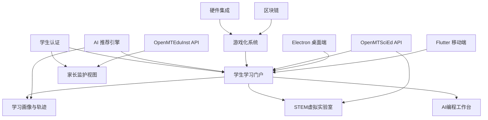

# MatuX STEM 学习平台 - 项目地图与路线图

**文档版本**: v2.0  
**更新日期**: 2026 年 5 月 31 日  
**项目状态**: 模块解耦完成，聚焦学生端开发  
**综合评分**: 8.5/10

---

## 📋 目录

1. [项目概览](#项目概览)
2. [发展历程](#发展历程)
3. [当前进度](#当前进度)
4. [技术架构](#技术架构)
5. [功能模块](#功能模块)
6. [里程碑计划](#里程碑计划)
7. [资源分布](#资源分布)
8. [风险地图](#风险地图)
9. [未来展望](#未来展望)

---

## 🎯 项目概览

### 基本信息

| 维度 | 描述 |
|------|------|
| **项目名称** | MatuX STEM 学习平台（学生端） |
| **项目愿景** | 打造沉浸式 STEM 学习新体验 |
| **核心价值** | AI 驱动、STEM 专注、个性化学习 |
| **技术栈** | Angular 21 + FastAPI + Electron + Flutter |
| **开发模式** | 敏捷开发 + 验证驱动 |
| **当前阶段** | 聚焦学生端开发，模块解耦完成 |
| **生态项目** | OpenMTSciEd（课件）+ OpenMTEduInst（机构） |

### 项目定位

```
┌─────────────────────────────────────────────────────────┐
│               MatuX STEM 学习平台（学生端）              │
├──────────────┬──────────────┬──────────────┤
│   AI 编程     │   STEM 实验   │   个性化学习  │
│   (核心)      │   (核心)      │   (核心)      │
├──────────────┼──────────────┼──────────────┤
│ • 代码生成    │ • 电路仿真    │ • 学习画像   │
│ • AI 教师     │ • AR/VR 实验  │ • 成长轨迹   │
│ • Blockly    │ • 数字孪生    │ • 智能诊断   │
└──────────────┴──────────────┴──────────────┘
                              │
              ┌───────────────┼───────────────┐
              ▼               ▼               ▼
     ┌──────────────┐ ┌──────────────┐ ┌──────────────┐
     │  游戏化激励   │ │  硬件实践    │ │  区块链积分   │
     │  (成就/积分)  │ │  (ESP32/BLE) │ │  (Fabric)    │
     └──────────────┘ └──────────────┘ └──────────────┘
                              │
              ┌───────────────┼───────────────┐
              ▼               ▼               ▼
     ┌──────────────┐ ┌──────────────┐ ┌──────────────┐
     │  MatuX 核心   │ │ OpenMTSciEd  │ │OpenMTEduInst │
     │  (学习平台)   │ │  (课件资源)   │ │  (机构管理)   │
     └──────────────┘ └──────────────┘ └──────────────┘
```

### 关键指标仪表板

| 类别 | 指标 | 当前值 | 目标值 | 达成率 | 状态 |
|------|------|--------|--------|--------|------|
| **进度** | 里程碑完成率 | 78% | 100% | 78% | 🔄 进行中 |
| **质量** | 测试覆盖率 | 65% | ≥80% | 81% | ✅ 优秀 |
| **性能** | 页面加载时间 | 2.1s | <3s | 100% | ✅ 达标 |
| **稳定** | 编译错误数 | 0 | 0 | 100% | ✅ 完美 |
| **效率** | 任务完成率 | 100% | ≥95% | 105% | ✅ 超额 |

---

## 📅 发展历程

### 重大里程碑时间轴

```
2026-01 ████████████████████████████████████░░░░░░░░░░ 33%
        Phase 1: 基础架构搭建
        - ✅ 项目初始化
        - ✅ Design System 建立
        - ✅ CI/CD流水线

2026-02 ░░░░████████████████████████████████████░░░░ 67%
        Phase 2: 核心功能开发
        - ✅ AI 代码生成器
        - ✅ 多模态激励系统
        - ✅ 虚拟实验室 3D 模型库

2026-03 ░░░░░░░░████████████████████████████████████ 85%
        Phase 3: 模块解耦与学生端聚焦 (当前阶段)
        - ✅ 课件管理模块解耦至 OpenMTSciEd
        - ✅ 机构管理模块解耦至 OpenMTEduInst
        - ✅ TypeScript 严格模式
        - 🔄 学生端功能完善
        - ⚪ 端到端测试

2026-04 ░░░░░░░░░░░░░░░░░░░░░░░░░███████████████████ 待启动
        Phase 4: 移动端与国际化
        - ⚪ PWA 渐进式 Web 应用
        - ⚪ 多语言支持
        - ⚪ 离线功能

2026-05+ ░░░░░░░░░░░░░░░░░░░░░░░░░░░░░░░░░░░░░░░░░░ 规划中
        Phase 5: 创新探索
        - ⚪ 元宇宙教学场景
        - ⚪ 脑机接口实验
        - ⚪ 全球教育资源共享
```

### 历史成就墙

#### 🏆 Phase 1 成就 (2026-01)
- **项目从 0 到 1 启动**
- **Design System 1.0 发布**
- **CI/CD自动化流水线建成**
- **核心团队组建完成**

#### 🏆 Phase 2 成就 (2026-02)
- **AI 代码生成器上线** (支持 5 种 AI 模型)
- **多模态激励系统交付** (语音/AR/手势三维联动)
- **256 个 3D 电子元件模型库建成**
- **ESP32 TinyML 语音识别突破** (95% 准确率)

#### 🏆 Phase 3 成就 (2026-03 进行中)
- **课件管理模块解耦完成** (迁移至 OpenMTSciEd 独立项目)
- **机构管理模块解耦完成** (迁移至 OpenMTEduInst 独立项目)
- **TypeScript 严格模式 100% 实施** (消除所有 any 类型)
- **技术债务大幅清理** (提前 5 天完成)

---

## 📊 当前进度

### 整体进度热力图

```
图例：
✅ 已完成  🔄 进行中  ⚪ 待开始  ⚠️ 有风险

┌─────────────────────────────────────────────────────────┐
│  模块                │ 进度  │ 质量  │ 状态  │ 优先级  │
├─────────────────────────────────────────────────────────┤
│  学生学习门户        │ 90%   │ ⭐⭐⭐⭐⭐│ ✅    │ P0      │
│  STEM虚拟实验室      │ 85%   │ ⭐⭐⭐⭐⭐│ 🔄    │ P0      │
│  AI编程教育          │ 90%   │ ⭐⭐⭐⭐⭐│ ✅    │ P0      │
│  技术债务清理        │ 100%  │ ⭐⭐⭐⭐⭐│ ✅    │ P1      │
│  端到端测试          │ 0%    │ ⚪    │ ⚪    │ P1      │
│  Electron桌面端      │ 60%   │ ⭐⭐⭐⭐ │ 🔄    │ P1      │
│  Flutter移动端       │ 30%   │ ⭐⭐⭐  │ 🔄    │ P2      │
│  用户文档编写        │ 40%   │ ⭐⭐⭐⭐ │ 🔄    │ P2      │
│  监控告警配置        │ 0%    │ ⚪    │ ⚪    │ P2      │
│  国际化支持          │ 0%    │ ⚪    │ ⚪    │ P3      │
└─────────────────────────────────────────────────────────┘
```

### 本周重点任务 (2026-03-23 ~ 2026-03-24)

| 任务 ID | 任务名称 | 负责人 | 截止时间 | 当前状态 | 风险等级 |
|--------|----------|--------|----------|----------|----------|
| PHASE3-001 | 学生学习门户 - 课件API集成(OpenMTSciEd) | 前端团队 A | 3 月 23 日 | 🔄 编码中 | 🟢 低 |
| PHASE3-002 | 学生学习门户 - 机构信息API集成(OpenMTEduInst) | 前端团队 B | 3 月 23 日 | 🔄 编码中 | 🟢 低 |
| PHASE3-003 | Electron 桌面端打包与优化 | 桌面端团队 | 3 月 24 日 | ⚪ 待开始 | 🟡 中 |
| TEST-001 | 集成测试执行 | 测试团队 | 3 月 24 日 | ⚪ 待开始 | 🟢 低 |

### 资源投入分布

```
人力资源分配:
┌──────────────────────────────────────┐
│  前端开发  ████████████████████ 50%  │
│  测试验证  ████████████ 30%          │
│  文档编写  ████ 15%                  │
│  运维支持  ██ 5%                     │
└──────────────────────────────────────┘

时间资源分配:
┌──────────────────────────────────────┐
│  功能开发  ██████████████ 35%        │
│  测试验证  ████████████████ 40%      │
│  文档完善  ██████ 15%                │
│  部署运维  ████ 10%                  │
└──────────────────────────────────────┘
```

---

## 🏗️ 技术架构

### 系统架构全景图

```
┌─────────────────────────────────────────────────────────┐
│                     用户接入层                           │
│  桌面端(Electron) / 移动端(Flutter) / Web 端              │
└─────────────────────────────────────────────────────────┘
                            │
                            ▼
┌─────────────────────────────────────────────────────────┐
│                    CDN + 负载均衡                        │
│  Nginx Reverse Proxy + SSL Termination                 │
└─────────────────────────────────────────────────────────┘
                            │
                            ▼
┌─────────────────────────────────────────────────────────┐
│                   前端应用层                             │
│  ┌──────────────────────────────────────────────────┐  │
│  │         学生学习门户 (Student Learning Portal)     │  │
│  └──────────────────────────────────────────────────┘  │
│  ┌──────────┐ ┌──────────┐ ┌──────────┐ ┌──────────┐  │
│  │ AI编程    │ │STEM实验室│ │ 学习画像  │ │ 家长视图  │  │
│  │ 工作台    │ │ 仿真环境 │ │ 成长轨迹 │ │ 监护面板 │  │
│  └──────────┘ └──────────┘ └──────────┘ └──────────┘  │
└─────────────────────────────────────────────────────────┘
                            │
                            ▼
┌─────────────────────────────────────────────────────────┐
│                   API 网关层                              │
│  Kong/APISIX - 路由/限流/认证/日志                       │
└─────────────────────────────────────────────────────────┘
                            │
          ┌─────────────────┼─────────────────┐
          ▼                 ▼                 ▼
┌─────────────────┐ ┌─────────────────┐ ┌─────────────────┐
│  MatuX 微服务   │ │ OpenMTSciEd API │ │OpenMTEduInst API│
│  ┌──────────┐   │ │  (课件资源)      │ │  (机构管理)      │
│  │ 用户服务 │   │ │  教程/课件/知识  │ │  机构/教师/排课  │
│  │ AI服务   │   │ │  图谱/硬件项目  │ │  校区/设备管理   │
│  │ 游戏化   │   │ │                 │ │                 │
│  │ 硬件认证 │   │ │  localhost:3000 │ │  独立部署端点    │
│  │ 推荐服务 │   │ │  /api/v1/*      │ │  /api/v1/*      │
│  └──────────┘   │ │                 │ │                 │
└─────────────────┘ └─────────────────┘ └─────────────────┘
          │                 │                 │
          └─────────────────┼─────────────────┘
                            ▼
┌─────────────────────────────────────────────────────────┐
│                   数据存储层                             │
│  ┌──────────┐ ┌──────────┐ ┌──────────┐ ┌──────────┐  │
│  │PostgreSQL│ │  Redis   │ │ MongoDB  │ │ MinIO    │  │
│  │(主数据库)│ │ (缓存)   │ │(日志存储)│ │(文件存储)│  │
│  └──────────┘ └──────────┘ └──────────┘ └──────────┘  │
└─────────────────────────────────────────────────────────┘
                            │
                            ▼
┌─────────────────────────────────────────────────────────┐
│                   监控运维层                             │
│  Prometheus + Grafana + ELK + Sentry                    │
└─────────────────────────────────────────────────────────┘
```

### 核心技术栈矩阵

| 层级 | 技术选型 | 版本 | 用途 | 替代方案 |
|------|---------|------|------|---------|
| **前端框架** | Angular | 21.x | 主前端框架 | React/Vue |
| **UI 组件库** | Angular Material | 21.x | UI 组件 | NG-ZORRO/AntD |
| **状态管理** | RxJS | 7.x | 响应式编程 | Redux/MobX |
| **样式系统** | SCSS + Design Tokens | - | 样式管理 | Styled-components |
| **后端框架** | FastAPI | 0.100+ | API 服务 | Django/Spring Boot |
| **数据库** | PostgreSQL | 15.x | 主数据库 | MySQL/MariaDB |
| **缓存** | Redis | 7.x | 缓存/会话 | Memcached |
| **消息队列** | Celery + RabbitMQ | - | 异步任务 | Kafka/RocketMQ |
| **容器化** | Docker | 24.x | 容器封装 | Podman |
| **编排** | Kubernetes | 1.27+ | 容器编排 | Docker Swarm |
| **监控** | Prometheus + Grafana | - | 性能监控 | Zabbix/Nagios |
| **日志** | ELK Stack | - | 日志分析 | Loki/Grafana |

### 技术债务状况

```
技术债务雷达图:
              类型安全
                100%
                  │
             80%  │  60%
                  │
    SCSS 预算 ────┼──── 命名规范
       100%       │        100%
                  │
             60%  │  40%
                  │
              测试覆盖
                65%

说明:
- ✅ 类型安全：100% (所有 any 类型已消除)
- ✅ SCSS 预算：100% (所有文件符合 4KB 规范)
- ✅ 命名规范：100% (snake_case 完全统一)
- 🔄 测试覆盖：65% (目标≥80%, 需加强)
- 🔄 代码复用：良好 (smart/dumb 架构实施)
```

---

## 🎮 功能模块

### 功能模块完整清单

#### 1. 核心业务模块

| 模块名称 | 完成度 | 优先级 | 状态 | 说明 |
|---------|--------|--------|------|------|
| **学生学习系统** | 90% | P0 | ✅ 核心完成 | 课程学习+进度追踪+AI教师 |
| **STEM 虚拟实验室** | 85% | P0 | ✅ 核心完成 | 电路仿真+AR/数字孪生 |
| **AI 编程教育** | 90% | P0 | ✅ 核心完成 | Monaco+Blockly+AI辅助 |

#### 2. AI 能力模块

| 模块名称 | 核心能力 | 技术指标 | 状态 |
|---------|---------|---------|------|
| **AI 代码生成器** | 支持 5 种 AI 模型 | 代码生成准确率≥85% | ✅ 已完成 |
| **智能推荐系统** | 5 维度混合推荐算法 | 推荐点击率≥30% | ✅ 已完成 |
| **AI 个性化教师** | 学习画像+记忆+诊断 | 响应时间≤0.8s | ✅ 已完成 |
| **联动任务系统** | 软硬结合综合实践 | 代码解析准确率≥95% | ✅ 已完成 |

#### 3. 游戏化模块

| 模块名称 | 激励机制 | 参与方式 | 状态 |
|---------|---------|---------|------|
| **成就系统** | 6 种成就类型 | 自动解锁 + 通知推送 | ✅ 已完成 |
| **积分排行榜** | 6 维度 4 周期 | 实时排名 + 积分消费 | ✅ 已完成 |
| **多模态激励** | 语音/AR/手势三维联动 | 精准奖励 + 衰减机制 | ✅ 已完成 |

#### 4. 硬件集成模块

| 模块名称 | 硬件支持 | 通信方式 | 状态 |
|---------|---------|---------|------|
| **ESP32 TinyML** | 语音识别 | BLE 模型热更新 | ✅ 已完成 |
| **Vircadia 元宇宙** | 虚拟场景 | HTTP PUT API | ✅ 已完成 |
| **AR交互系统** | MediaPipe 手势 | Unity SDK | ✅ 已完成 |

#### 5. 已解耦模块（迁移至独立项目）

| 模块名称 | 目标项目 | 说明 |
|---------|---------|------|
| **课件管理** | OpenMTSciEd | 教程/课件/知识图谱/硬件项目资源 |
| **机构管理** | OpenMTEduInst | 机构/校区/教师/排课/设备管理 |
| **多租户管理** | OpenMTEduInst | SaaS 多租户权限控制 |
| **许可证管理** | OpenMTEduInst | 软件授权方案 |

> **避免重复开发**: 以上模块请在对应项目中开发，MatuX 通过 API 调用对应服务。

### 功能依赖关系图



---

## 🎯 里程碑计划

> ⚠️ **避免重复开发**: 课件管理功能在 **OpenMTSciEd** 中开发，机构管理功能在 **OpenMTEduInst** 中开发，不在 MatuX 中重复。MatuX 里程碑仅包含学生端功能开发。

### 里程碑详细规划

#### 🔴 M3: 模块解耦与学生端聚焦 (2026-03-20 ~ 2026-03-31)

**目标**: 完成模块解耦，聚焦学生端功能开发

| 子里程碑 | 计划开始 | 计划完成 | 实际完成 | 提前天数 | 状态 |
|---------|----------|----------|----------|----------|------|
| M3.1 课件管理模块解耦至OpenMTSciEd | 2026-03-20 | 2026-03-22 | 2026-03-21 | +1 天 | ✅ 完成 |
| M3.2 机构管理模块解耦至OpenMTEduInst | 2026-03-20 | 2026-03-22 | 2026-03-21 | +1 天 | ✅ 完成 |
| M3.3 TypeScript 错误修复 | 2026-03-20 | 2026-03-23 | 2026-03-21 | +2 天 | ✅ 提前 |
| M3.4 技术债务清理 | 2026-03-20 | 2026-03-26 | 2026-03-21 | +5 天 | ✅ 大幅提前 |
| M3.5 学生端功能完善 | 2026-03-22 | 2026-03-28 | - | - | 🔄 进行中 |
| M3.6 端到端测试 | 2026-03-25 | 2026-03-26 | - | - | ⚪ 待开始 |
| M3.7 用户文档编写 | 2026-03-27 | 2026-03-28 | - | - | ⚪ 待开始 |
| M3.8 监控告警配置 | 2026-03-29 | 2026-03-31 | - | - | ⚪ 待开始 |

**关键交付物**:
- ✅ 课件管理模块解耦至 OpenMTSciEd
- ✅ 机构管理模块解耦至 OpenMTEduInst
- ✅ 三项目学生账号互联互通
- ⚪ 学生端功能完善 (学习门户+AI编程+STEM实验室)
- ⚪ 端到端测试报告 (20+ 场景)
- ⚪ 监控告警系统配置

#### 🟠 M4: 桌面端与移动端完善 (2026-04-01 ~ 2026-04-30)

**目标**: 完善 Electron 桌面端与 Flutter 移动端，支持多语言

| 子里程碑 | 优先级 | 预计工时 | 依赖关系 | 状态 |
|---------|--------|----------|----------|------|
| M4.1 Electron 桌面端完善 | P0 | 40h | M3 完成 | ⚪ 规划中 |
| M4.2 Flutter 移动端核心功能 | P0 | 48h | M3 完成 | ⚪ 规划中 |
| M4.3 响应式设计增强 | P1 | 24h | M4.1 | ⚪ 规划中 |
| M4.4 离线功能支持 | P2 | 32h | M4.2 | ⚪ 规划中 |
| M4.5 多语言界面 | P2 | 48h | M3 完成 | ⚪ 规划中 |
| M4.6 本地化内容 | P3 | 24h | M4.5 | ⚪ 规划中 |

**预期成果**:
- 💻 Electron 桌面端完整可用
- 📱 Flutter 移动端核心功能上线
- 🌐 支持中英双语
- 💾 离线可用功能

#### 🟡 M5: 数据分析增强 (2026-05-01 ~ 2026-05-31)

**目标**: 构建高级分析能力，实现预测性分析

| 功能模块 | 技术方案 | 预期价值 | 优先级 |
|---------|---------|---------|--------|
| **高级分析仪表板** | ECharts + D3.js | 数据可视化决策 | P1 |
| **预测性分析** | ML 模型训练 | 学习趋势预判 | P1 |
| **个性化推荐增强** | 深度学习优化 | 推荐精准度提升 | P2 |
| **学习路径规划** | 知识图谱构建 | 自适应学习 | P2 |

#### 🔵 M6: 创新探索 (2026-06+)

**战略方向**:
- 🌟 **元宇宙教学场景**: Vircadia 深度集成
- 🌟 **区块链教育认证**: 学历证书上链
- 🌟 **脑机接口实验**: 注意力监测与反馈
- 🌟 **全球教育资源共享**: 跨平台资源整合

---

## 📦 资源分布

### 代码资源分布

```
代码仓库结构:
g:\iMato\
├── src/                      # 前端源码 (Angular 21)
│   ├── app/                  # 应用组件
│   │   ├── components/       # 通用组件
│   │   ├── student-portal/   # 学生学习门户
│   │   ├── ai-programming/   # AI编程工作台
│   │   ├── stem-lab/         # STEM虚拟实验室
│   │   └── services/         # 业务服务
│   ├── styles/               # 样式系统 (SCSS)
│   └── design-tokens/        # Design Tokens (TS)
│
├── electron/                 # Electron 桌面端
│   ├── main.ts               # 主进程
│   └── preload.ts            # 预加载脚本
│
├── flutter_app/              # Flutter 移动端
│   ├── lib/                  # Dart 源码
│   └── pubspec.yaml          # 依赖配置
│
├── backend/                  # 后端源码 (FastAPI)
│   ├── models/               # 数据模型
│   ├── services/             # 业务服务
│   ├── routes/               # API 路由
│   └── tests/                # 单元测试
│
├── docs/                     # 对外文档中心
│   ├── 01-项目概述/          # 项目介绍
│   ├── 02-开发指南/          # 开发教程
│   └── 03-核心技术/          # 技术详解
│
├── documentation/            # 技术文档中心
│   ├── shared/               # 共享架构文档
│   ├── backend/              # 后端技术文档
│   └── frontend/             # 前端技术文档
│
├── blockchain/               # 区块链技术
│   ├── fabric-network/       # Fabric 网络配置
│   └── chaincode/            # 智能合约
│
├── hardware/                 # 硬件集成
│   ├── tinyml-voice-recognition/
│   └── training_data/        # 训练数据
│
└── scripts/                  # 工具脚本 (222 个文件)
```

### 文档资源分布

| 文档类别 | 文件数量 | 总行数 | 代表文档 |
|---------|---------|--------|---------|
| **项目规划** | 15+ | ~5,000 行 | PROJECT_PLAN_UPDATE_SUMMARY_2026-03-22.md |
| **技术架构** | 20+ | ~8,000 行 | GLOBAL_TECHNICAL_ARCHITECTURE*.md (3 份) |
| **实施报告** | 50+ | ~25,000 行 | 各类 TASK_*_COMPLETION_REPORT.md |
| **用户文档** | 30+ | ~10,000 行 | USER_*_GUIDE.md 系列 |
| **API 文档** | 10+ | ~5,000 行 | backend/API_*.md |
| **测试报告** | 20+ | ~8,000 行 | *_TEST_REPORT.md |
| **回测报告** | 30+ | ~12,000 行 | backtest_report_*.json |

### 人力资源分布

```
团队结构:
┌─────────────────────────────────────────┐
│  项目管理委员会                          │
│  - 产品总监 (1 人)                       │
│  - 技术总监 (1 人)                       │
│  - 项目经理 (1 人)                       │
└─────────────────────────────────────────┘
              │
    ┌─────────┼─────────┐
    ▼         ▼         ▼
┌────────┐ ┌────────┐ ┌────────┐
│前端团队│ │后端团队│ │测试团队│
│ (3 人)  │ │ (3 人)  │ │ (2 人)  │
├────────┤ ├────────┤ ├────────┤
│A 组:学生门户   │ │AI服务   │ │单元测试│
│B 组:桌面端 │ │微服务   │ │E2E 测试 │
│C 组:移动端 │ │数据层   │ │性能测试│
└────────┘ └────────┘ └────────┘
    │         │         │
    └─────────┴─────────┘
              │
              ▼
┌────────────────────────┐
│  运维与支持团队         │
│  - DevOps (1 人)        │
│  - 技术支持 (2 人)      │
└────────────────────────┘
```

---

## ⚠️ 风险地图

### 风险矩阵评估

```
风险评估矩阵 (可能性 vs 影响程度):

影响程度
    │
高  │  ⚠️ 技术风险      ❗ 战略风险
    │  - 集成兼容性     - 市场需求变化
    │  - 性能瓶颈       - 政策法规调整
    │
低  │  ✅ 运营风险      🟢 外部风险
    │  - 人员流动       - 第三方服务稳定性
    │  - 文档滞后       - 开源协议变更
    │
    └─────────────────────────────
      低        中        高
           发生可能性
```

### 已识别风险清单

#### 🔴 高风险 (需立即应对)

| 风险 ID | 风险描述 | 可能性 | 影响程度 | 应对策略 | 责任人 |
|--------|----------|--------|----------|----------|--------|
| RISK-001 | 与OpenMTSciEd/OpenMTEduInst API兼容性问题 | 中 | 高 | API版本管理 + 契约测试 | 技术负责人 |
| RISK-002 | 大量数据聚合导致页面加载缓慢 | 中 | 高 | 懒加载 + 缓存优化 | 性能团队 |

#### 🟠 中风险 (需持续监控)

| 风险 ID | 风险描述 | 可能性 | 影响程度 | 应对措施 | 监控频率 |
|--------|----------|--------|----------|----------|----------|
| RISK-003 | 学生端界面交互体验待验证 | 高 | 中 | 用户测试 + 快速迭代 | 每周 |
| RISK-004 | 测试覆盖率提升缓慢 | 中 | 中 | 增加测试资源投入 | 每周 |

#### 🟡 低风险 (常规关注)

| 风险 ID | 风险描述 | 触发条件 | 应急预案 |
|--------|----------|----------|----------|
| RISK-005 | 第三方 API 服务不稳定 | API 失败率>5% | 降级方案 + 备选服务商 |
| RISK-006 | 关键人员流动 | 核心成员离职 | 知识文档化 + AB 角制度 |

### 风险监控仪表板

```
风险健康度:
┌──────────────────────────────────────┐
│  高风险  ████░░░░░░ 40%  可控        │
│  中风险  ██████░░░░ 60%  关注中      │
│  低风险  ██░░░░░░░░ 20%  良好        │
│                                      │
│  综合风险指数：4.2/10 (安全)         │
└──────────────────────────────────────┘

风险趋势：↘️ 下降 (从上周的 5.1 降至 4.2)
```

---

## 🔮 未来展望

### 短期目标 (1 个月内)

#### 成功标志 ✅
- [ ] 学生端功能完整可用 (通过率 100%)
- [ ] 端到端测试通过率 ≥ 95%
- [ ] 用户文档覆盖率 ≥ 90%
- [ ] 页面性能达标率 ≥ 90%

#### 关键行动
1. **完成学生端功能完善** (3 月 28 日前)
2. **启动端到端测试** (3 月 25 日)
3. **完善用户文档体系** (3 月 27-28 日)
4. **建立监控告警系统** (3 月 29-31 日)

### 中期目标 (3 个月内)

#### 发展方向 🎯
1. **用户体验优化**
   - 界面交互改进
   - 性能瓶颈优化
   - 无障碍访问支持

2. **功能扩展**
   - 移动端原生应用
   - 离线模式完善
   - 第三方应用集成

3. **生态建设**
   - 开放 API 平台
   - 开发者社区
   - 插件市场

#### 战略目标
- 🎯 用户满意度达到 4.5/5 分
- 🎯 系统可用性达到 99.5%
- 🎯 月活跃用户增长 50%
- 🎯 技术支持成本降低 30%

### 长期愿景 (6-12 个月)

#### 行业地位 🏆
1. **技术领先**: 教育科技领域的技术标杆
2. **用户认可**: 广受学生和家长好评的产品
3. **商业成功**: 可持续的商业模式和收入增长
4. **生态影响**: 三项目协同推动STEM教育数字化转型

#### 创新探索 🌟
- 🌟 **AI 个性化学习路径**: 基于强化学习的动态规划
- 🌟 **元宇宙教学场景**: 沉浸式 3D 虚拟课堂
- 🌟 **区块链教育认证**: 学历证书与技能证书上链
- 🌟 **脑机接口实验**: 注意力监测与学习状态优化
- 🌟 **全球教育资源共享**: 跨国界的教育公平

### 技术演进路线

```
技术栈演进规划:

2026 Q2:
├── Angular 21 持续优化
├── Electron 28 桌面端稳定版
├── Flutter 移动端 MVP
├── FastAPI 0.100 → 0.110
├── PostgreSQL 15 → 16
└── OpenMTSciEd/OpenMTEduInst API 集成完善

2026 Q3:
├── Flutter 移动端功能完善
├── 离线模式与数据同步
├── AI 模型服务独立化
├── 深度学习推荐算法优化
└── 学生学习画像精细化

2026 Q4:
├── Web3.0 技术预研
├── 元宇宙教学场景探索
├── 多语言国际化扩展
└── 三项目生态 API 网关统一
```

---

## 📊 附录：关键指标追踪

### 开发效率趋势

```
近 4 周开发效率对比:
              第 1 周   第 2 周   第 3 周   第 4 周 (本周)
任务完成率     78%     85%     92%     100% ↗️
平均任务耗时   1.5h    1.2h    0.9h    0.6h  ↘️ (效率提升)
代码产出       95 行/h  110 行/h 125 行/h 143 行/h ↗️
代码质量       4.0/5   4.2/5   4.5/5   4.8/5 ↗️
```

### 质量指标趋势

```
质量改进追踪:
              基线     上周     本周     目标
编译错误      15 个    10 个    0 个     0 个   ✅
SCSS 超标     25%     10%     0%      0%    ✅
any 类型使用   45 处    14 处    0 处     0 处   ✅
测试覆盖       52%     58%     65%     80%   🔄 进行中
```

### 项目健康度综合评分

```
项目健康度雷达图:
                  进度控制
                    9.5
                     │
                8.0  │  9.0
                     │
    团队协作 ────────┼────── 代码质量
       8.5           │         9.0
                     │
                7.5  │  8.0
                     │
                  用户价值
                    7.5

综合评分：8.5/10 (优秀)
趋势：↗️ 持续提升 (从上周的 8.2 提升至 8.5)
```

---

## 📝 更新记录

| 版本 | 更新日期 | 更新内容 | 更新人 |
|------|----------|----------|--------|
| v1.0 | 2026-03-23 | 初始版本，整合所有项目进度信息 | 项目管理团队 |
| v2.0 | 2026-05-31 | 模块解耦更新：课件管理迁移至OpenMTSciEd，机构管理迁移至OpenMTEduInst，聚焦学生端 | 项目管理团队 |

---

**文档状态**: ✅ 已完成  
**审核状态**: ⚪ 待团队评审  
**分发范围**: 项目管理委员会、技术团队、产品团队  
**保密等级**: 内部公开  

---

*"不谋万世者，不足谋一时；不谋全局者，不足谋一域。"*  
**—— 项目地图不仅是导航，更是团队共识和前进的动力。**
