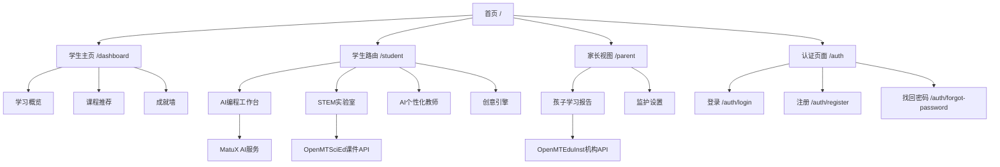

# MatuX STEM 学习平台 - 网站地图

## 🌐 前端页面结构

### 主应用路由 (src/app/)

```
/
├── /auth                   # 认证相关页面
│   ├── /auth/login         # 登录页
│   ├── /auth/register      # 注册页
│   └── /auth/forgot-password # 忘记密码
├── /dashboard              # 学生学习主页 (学生学习门户)
│   └── StudentDashboardModule
├── /admin                  # 系统管理 (仅开发者)
│   ├── /admin/settings     # 全局设置
│   └── /admin/dashboard    # 系统状态
├── /student                # 学生学习路由
│   ├── /student/courses    # 课程浏览与学习
│   ├── /student/ai-programming # AI编程工作台
│   ├── /student/stem-lab   # STEM虚拟实验室
│   ├── /student/ai-teacher # AI个性化教师
│   ├── /student/creativity # 创意引擎
│   └── /student/reports    # 学习报告
├── /parent                 # 家长监护视图
│   ├── /parent/dashboard   # 家长仪表板
│   └── /parent/reports     # 孩子学习报告
├── /profile                # 个人中心
│   ├── /profile/learning-portrait # 学习画像
│   ├── /profile/growth     # 成长轨迹
│   ├── /profile/achievements # 成就系统
│   └── /profile/settings   # 设置
│
├── ~~[已解耦] 以下路由已迁移至 OpenMTEduInst~~
│   ├── ~~[已解耦] /teacher              # 教师角色Dashboard → OpenMTEduInst~~
│   ├── ~~[已解耦] /org-admin            # 机构管理员Dashboard → OpenMTEduInst~~
│   ├── ~~[已解耦] /school-admin         # 学校管理员Dashboard → OpenMTEduInst~~
│   └── ~~[已解耦] /education-bureau     # 教育局Dashboard → OpenMTEduInst~~
│
└── ~~[已解耦] 以下路由已迁移至 OpenMTSciEd~~
    └── ~~[已解耦] /courses              # 统一课程库 → OpenMTSciEd~~
```

### 独立演示页面 (docs/)

| 页面名称 | 文件路径 | 描述 |
|---------|---------|------|
| 认证系统演示 | `docs/auth-demo.html` | 展示登录、注册、权限验证等功能 |
| 交互式认证演示 | `docs/auth-interactive-demo.html` | 可操作的认证流程演示 |
| 仪表板演示 | `docs/dashboard-demo.html` | 管理面板功能展示 |
| 简易仪表板 | `docs/simple-dashboard.html` | 基础仪表板界面 |
| 样式游乐场 | `docs/playground.html` | Design System 组件演示 |
| 简易游乐场 | `docs/simple-playground.html` | 精简版组件演示 |

### Flutter移动应用 (flutter_app/)

```
/lib/
├── main.dart               # 应用入口
├── screens/
│   ├── login_screen.dart   # 登录界面
│   ├── dashboard_screen.dart # 移动端仪表板
│   └── profile_screen.dart # 用户个人中心
└── widgets/
    ├── custom_button.dart  # 自定义按钮组件
    └── loading_indicator.dart # 加载指示器
```

## 🔌 后端API端点

### 认证服务 (/api/v1/auth)
```
POST   /auth/token          # 获取访问令牌
POST   /auth/register       # 用户注册
GET    /auth/me            # 获取当前用户信息
PUT    /auth/profile        # 更新个人信息
POST   /auth/password-reset # 重置密码
```

### AI服务 (/api/v1/ai)
```
POST   /ai/generate-code    # AI代码生成
POST   /ai/explain-code     # 代码解释
POST   /ai/refactor-code    # 代码重构
GET    /ai/models          # 可用AI模型列表
```

### 推荐系统 (/api/v1/recommendations)
```
GET    /recommendations/courses # 课程推荐
GET    /recommendations/content # 内容推荐
GET    /recommendations/users   # 用户推荐
POST   /recommendations/feedback # 推荐反馈
```

### 支付系统 (/api/v1/payments)
```
POST   /payments/create     # 创建支付订单
GET    /payments/{id}       # 查询支付状态
POST   /payments/refund     # 申请退款
GET    /payments/history    # 支付历史记录
```

### 订阅系统 (/api/v1/subscriptions)
```
GET    /subscriptions/plans # 订阅计划列表
POST   /subscriptions       # 创建订阅
GET    /subscriptions/me    # 我的订阅信息
PUT    /subscriptions/{id}  # 更新订阅
DELETE /subscriptions/{id}  # 取消订阅
```

### 硬件认证 (/api/v1/hardware)
```
POST   /hardware/register   # 设备注册
POST   /hardware/authenticate # 设备认证
GET    /hardware/{device_id}/status # 设备状态
PUT    /hardware/{device_id} # 更新设备信息
DELETE /hardware/{device_id} # 删除设备
```

### 许可证管理 (/api/v1/licenses) ⚠️ 已解耦至 OpenMTEduInst
```
⚠️ 此 API 已解耦至 OpenMTEduInst 项目，保留兼容存根
GET    /licenses            # 许可证列表
POST   /licenses            # 创建许可证
GET    /licenses/{id}       # 许可证详情
PUT    /licenses/{id}       # 更新许可证
DELETE /licenses/{id}       # 删除许可证
```

### 用户许可证 (/api/v1/user-licenses) ⚠️ 已解耦至 OpenMTEduInst
```
⚠️ 此 API 已解耦至 OpenMTEduInst 项目，保留兼容存根
GET    /user-licenses       # 用户许可证列表
POST   /user-licenses       # 分配用户许可证
GET    /user-licenses/{id}  # 用户许可证详情
PUT    /user-licenses/{id}  # 更新用户许可证
DELETE /user-licenses/{id}  # 撤销用户许可证
```

### 课程管理 (/courses)
```
GET    /courses             # 课程列表
POST   /courses             # 创建课程
GET    /courses/{id}        # 课程详情
PUT    /courses/{id}        # 更新课程
DELETE /courses/{id}        # 删除课程
```

### 租户配置 (/tenant-config) ⚠️ 已解耦至 OpenMTEduInst
```
⚠️ 此 API 已解耦至 OpenMTEduInst 项目，保留兼容存根
GET    /tenant-config/{org_id} # 组织配置信息
PUT    /tenant-config/{org_id} # 更新组织配置
GET    /tenant-config/{org_id}/resources # 资源使用情况
```

### 教育机构管理 (/educational-institutions) ⚠️ 已解耦至 OpenMTEduInst
```
⚠️ 此 API 已解耦至 OpenMTEduInst 项目，保留兼容存根
GET    /educational-institutions # 机构列表
POST   /educational-institutions # 创建机构
GET    /educational-institutions/{id} # 机构详情
PUT    /educational-institutions/{id} # 更新机构
DELETE /educational-institutions/{id} # 删除机构
```

### 多角色Dashboard API ⚠️ 已解耦至 OpenMTEduInst

> 以下 Dashboard API 已全部解耦至 OpenMTEduInst 项目，MatuX 仅保留学生相关功能。

#### ~~教师Dashboard API (/api/v1/teacher) → OpenMTEduInst~~
#### ~~机构管理员Dashboard API (/api/v1/org-admin) → OpenMTEduInst~~
#### ~~学校管理员Dashboard API (/api/v1/school-admin) → OpenMTEduInst~~
#### ~~教育局Dashboard API (/api/v1/education-bureau) → OpenMTEduInst~~

### 统一课件库API ⚠️ 已解耦至 OpenMTSciEd

> 课件管理功能已解耦至 OpenMTSciEd 项目 (localhost:3000/api/v1)，MatuX 通过 API 调用获取课件资源。

#### ~~统一课件库API (/api/v1/courses) → OpenMTSciEd~~

### 外部项目 API 端点

#### OpenMTSciEd 课件资源 API (localhost:3000/api/v1)
```
GET    /api/v1/tutorials          # 教程列表
GET    /api/v1/tutorials/{id}     # 教程详情
GET    /api/v1/coursewares        # 课件列表
GET    /api/v1/coursewares/{id}   # 课件详情
GET    /api/v1/knowledge-graph    # 知识图谱查询
GET    /api/v1/hardware-projects  # 硬件项目资源
```

#### OpenMTEduInst 机构管理 API
```
GET    /api/v1/institutions       # 机构列表
GET    /api/v1/institutions/{id}  # 机构详情
GET    /api/v1/teachers           # 教师列表
GET    /api/v1/schedules          # 排课信息
GET    /api/v1/devices            # 设备管理
```

## 📊 系统监控端点

```
GET    /                    # 根路径健康检查
GET    /health              # 健康状态检查
GET    /docs                # Swagger API文档
GET    /redoc               # ReDoc API文档
GET    /metrics             # 系统指标监控
```

## 🔧 开发工具页面

| 工具名称 | 路径 | 用途 |
|---------|------|------|
| API文档 | `/docs` | Swagger UI交互式API文档 |
| API文档 | `/redoc` | ReDoc静态API文档 |
| 数据库管理 | `/admin/` | Django Admin界面 |
| 性能监控 | `/metrics` | Prometheus指标 |
| 日志查看 | `/logs` | 应用日志浏览 |

## 🎨 设计系统资源

### SCSS样式库
```
src/styles/
├── design-tokens/          # Design Tokens
│   ├── _colors.scss       # 颜色系统
│   ├── _fonts.scss        # 字体系统
│   ├── _spacing.scss      # 间距系统
│   └── _index.scss        # 入口文件
├── components/            # 组件样式
│   ├── _buttons.scss     # 按钮组件
│   ├── _forms.scss       # 表单组件
│   └── _cards.scss       # 卡片组件
├── layout.scss           # 布局系统
├── typography.scss       # 排版系统
└── main.scss            # 主样式入口
```

### TypeScript Tokens
```
src/design-tokens/
├── colors.ts             # 颜色变量
├── fonts.ts              # 字体变量
├── spacing.ts            # 间距变量
├── border-radius.ts      # 圆角变量
└── index.ts              # 导出入口
```

## 📱 移动端资源

### Android资源
```
android/
├── app/src/main/res/
│   ├── drawable/         # 图标资源
│   ├── layout/           # 布局文件
│   └── values/           # 字符串、颜色等
└── assets/              # 静态资源
```

### iOS资源
```
ios/
├── Runner/
│   ├── Assets.xcassets/  # 图像资源
│   └── Base.lproj/       # 故事板
└── Flutter/             # Flutter框架
```

## 📁 静态资源目录

```
public/
├── images/               # 图片资源
├── icons/                # 图标文件
├── fonts/                # 字体文件
└── downloads/            # 下载资源
```

## 🔗 外部链接整合

### 第三方服务
- **支付网关**: 支付宝、微信支付、银联
- **云服务**: AWS/Azure/GCP
- **CDN服务**: 阿里云CDN、腾讯云CDN
- **监控服务**: Prometheus + Grafana
- **日志服务**: ELK Stack

### 社交媒体集成
- **微信登录**: OAuth2集成
- **QQ登录**: OAuth2集成
- **微博分享**: SDK集成

## 🗺️ 导航关系图



---
*MatuX STEM 学习平台网站地图 | 版本 v2.0 | 最后更新：2026年5月*
