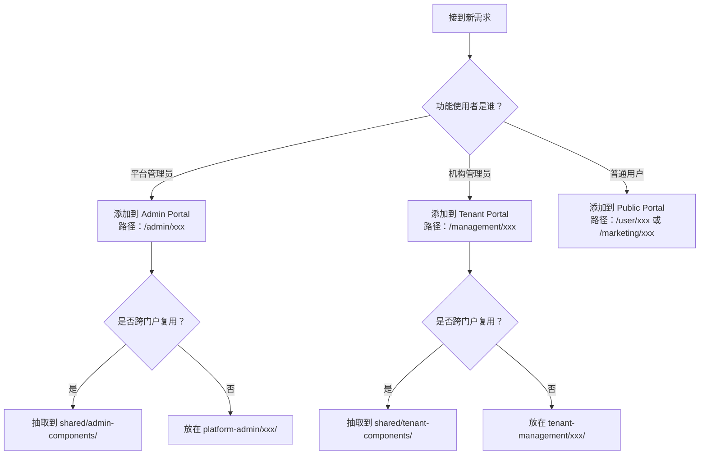

# Admin vs Management 使用指南

## 📋 快速对照表

### 核心区别一览

| 维度 | Platform Admin (`/admin/*`) | Tenant Management (`/management/*`) |
|-----|----------------------------|-------------------------------------|
| **定位** | 行政管理后台 | 自主运营后台 |
| **用户群体** | 平台超级管理员、运营人员 | 机构管理员、学校管理员、教师 |
| **数据范围** | 全平台所有数据 | 仅本机构数据 |
| **典型场景** | 审批机构入驻、分配许可证 | 管理教师学生、排课、财务 |
| **认证要求** | RoleGuard (requiredRoles: ['super_admin', 'admin']) | RoleGuard (requiredModule: 'tenant-management') |
| **UI 主题色** | 深蓝色 `#1976d2` | 绿色 `#4caf50` |
| **URL 前缀** | `/admin/` | `/management/` |

---

## 🎯 使用场景判断

### 你应该访问哪个后台？

```mermaid
graph TD
    A[用户登录] --> B{你的角色是什么？}
    
    B -->|超级管理员/平台管理员 | C[访问 /admin/dashboard<br/>平台行政管理后台]
    B -->|机构管理员 | D[访问 /management/organization/:id/dashboard<br/>机构运营后台]
    B -->|学校管理员 | E[访问 /management/school/:id/dashboard<br/>学校运营后台]
    B -->|教育局管理员 | F[访问 /management/education-bureau/:regionId/dashboard<br/>监管后台]
    B -->|教师/学生 | G[访问 /user/dashboard<br/>用户中心]
    
    C --> H{需要查看什么？}
    H -->|审批机构 | I[/admin/institutions]
    H -->|管理许可证 | J[/admin/licenses]
    H -->|查看全平台数据 | K[/admin/analytics]
    
    D --> L{需要管理什么？}
    L -->|财务 | M[/management/organization/:id/finance]
    L -->|教室 | N[/management/organization/:id/classrooms]
    L -->|教师 | O[/management/organization/:id/teachers]
    L -->|学生 | P[/management/organization/:id/students]
```

---

## 🔍 常见误区与正解

### ❌ 误区 1: "Admin 和 Management 都是管理后台，应该差不多"

**正解**: 
- **Admin** = **行政管理** (平台方审批监管机构)
- **Management** = **自主运营** (机构内部管理自己的人财物)

**举例说明**:
```typescript
// Admin 视角：查看所有机构列表（用于审批）
GET /api/v1/admin/institutions
Response: [
  {
    id: 1,
    name: "某某培训机构",
    is_approved: false,  // ⭐ 待审批状态
    license_status: "pending"
  }
]

// Management 视角：查看本机构信息（用于运营）
GET /api/v1/tenant/my-org
Response: {
  id: 1,
  name: "某某培训机构",
  subscription_plan: "云托管版",
  seats_used: 45,  // ⭐ 已用席位
  seats_total: 100,
  expiry_date: "2027-12-31"
}
```

---

### ❌ 误区 2: "机构管理员应该能访问 Admin 后台查看许可证"

**正解**: 
- 机构管理员**不能**访问 `/admin/*`
- 只能查看**本机构的许可证使用情况**,路径是 `/management/organization/:id/settings`
- 只有平台管理员才能创建和分配许可证

**权限对比**:
| 操作 | super_admin | admin | org_admin |
|-----|:-----------:|:-----:|:---------:|
| 创建许可证套餐 | ✅ | ❌ | ❌ |
| 分配许可证给机构 | ✅ | ✅ | ❌ |
| 查看本机构许可证用量 | ✅ | ⚠️ | ✅ |
| 续期许可证 | ✅ | ✅ | ✅ (申请) |

---

### ❌ 误区 3: "organizations 组件在 admin 和 management 中重复了"

**正解**: 
- **旧设计确实重复了** (这是重构的原因)
- **新设计已区分**:
  - `admin/institutions/` → InstitutionListComponent (行政视角)
  - `management/organization-portal/` → OrganizationDashboardComponent (运营视角)
- **组件已下沉到 shared 目录复用**,但职责清晰

**代码结构对比**:
```diff
// 旧结构 (❌ 混淆)
src/app/
├── admin/organizations/
│   ├── organization-list.component.ts  # 命名混淆
│   └── organization-dashboard.component.ts
└── management/organization-portal/
    ├── organization-list.component.ts  # 重复！
    └── organization-dashboard.component.ts  # 重复！

// 新结构 (✅ 清晰)
src/app/
├── platform-admin/institutions/
│   ├── institution-list.component.ts  # ✅ 语义清晰
│   └── institution-detail.component.ts
└── tenant-management/organization-portal/
    ├── org-finance.component.ts
    └── org-classroom.component.ts
```

---

### ❌ 误区 4: "超级管理员可以访问所有页面，所以不需要区分"

**正解**: 
- 虽然 super_admin **技术上**可以访问所有页面
- 但**业务逻辑**上仍需区分：
  - 审批机构时 → 使用 Admin Portal
  - 查看某个机构运营情况 → 切换到 Tenant Portal (模拟机构管理员视角)

**实际案例**:
```typescript
// 超级管理员工作流程

// 1. 在 Admin Portal 审批机构入驻
await this.http.post('/api/v1/admin/institutions/123/approve');

// 2. 切换到该机构的 Tenant Portal 查看运营情况
this.router.navigate(['/management/organization', 123, 'dashboard']);

// 3. 发现异常数据，返回 Admin Portal 处理
this.router.navigate(['/admin/analytics']);
```

---

## 🛠️ 开发者快速上手

### 新增功能时的判断流程



### 路由配置示例

#### 场景 1: 新增"平台数据大屏"功能
```typescript
// ✅ 正确：这是平台管理员看的数据
{
  path: 'analytics-dashboard',
  loadComponent: () => import('./platform-admin/analytics-dashboard.component').then(m => m.AnalyticsDashboardComponent),
  canActivate: [RoleGuard],
  data: { 
    requiredRoles: ['super_admin', 'admin'],
    requiredModule: 'platform-admin'
  }
}
```

#### 场景 2: 新增"教师绩效考核"功能
```typescript
// ✅ 正确：这是机构内部管理功能
{
  path: 'teacher-performance',
  loadComponent: () => import('./tenant-management/teacher-performance.component').then(m => m.TeacherPerformanceComponent),
  canActivate: [RoleGuard],
  data: { 
    requiredRoles: ['org_admin', 'school_admin'],
    requiredModule: 'tenant-management'
  }
}
```

#### 场景 3: 新增"全局 API 密钥管理"功能
```typescript
// ✅ 正确：这是平台级配置
{
  path: 'api-keys',
  loadComponent: () => import('./platform-admin/api-key-management.component').then(m => m.ApiKeyManagementComponent),
  canActivate: [RoleGuard],
  data: { 
    requiredRoles: ['super_admin'],  // ⭐ 仅限超管
    requiredPermissions: ['api_key.manage']
  }
}
```

---

## 🔐 权限检查清单

### 前端路由守卫配置

```typescript
// ✅ 正确配置示例
{
  path: 'institutions',
  component: InstitutionListComponent,
  canActivate: [RoleGuard],
  data: {
    requiredRoles: ['super_admin', 'admin'],  // ⭐ 明确角色
    requiredModule: 'platform-admin',         // ⭐ 明确模块
    requiredPermissions: ['institution.read'] // ⭐ 可选：细化权限
  }
}

// ❌ 错误配置示例
{
  path: 'institutions',
  component: InstitutionListComponent,
  canActivate: [AdminAuthGuard]  // ❌ 已废弃的守卫
  // ❌ 缺少 data 配置
}
```

### 后端 API 权限验证

```python
# ✅ 正确：使用依赖注入验证角色
@router.get("/admin/institutions")
async def list_institutions(
    current_user: User = Depends(require_role(['super_admin', 'admin'])),
    db: AsyncSession = Depends(get_db)
):
    # 自动验证角色，无需手动检查
    pass

# ❌ 错误：手动检查容易遗漏
@router.get("/admin/institutions")
async def list_institutions(request: Request, db: AsyncSession):
    user = await get_current_user(request)
    if user.role not in ['super_admin', 'admin']:  # ❌ 容易忘记检查
        raise HTTPException(403)
    pass
```

---

## 📊 数据隔离最佳实践

### 租户数据自动过滤

```python
# ✅ 推荐：使用上下文自动注入租户 ID
class TenantContextMiddleware:
    async def __call__(self, request: Request, call_next):
        # 从当前用户获取 organization_id
        org_id = request.state.current_user.organization_id
        
        # 设置到上下文
        current_tenant_id.set(org_id)
        
        response = await call_next(request)
        return response

# SQLAlchemy 自动过滤
class Course(Base):
    @classmethod
    def for_tenant(cls, query):
        org_id = current_tenant_id.get()
        if org_id:
            return query.where(cls.organization_id == org_id)
        return query

# 使用示例
courses = await db.execute(Course.for_tenant(select(Course)))
```

### 跨租户访问防护

```typescript
// ✅ 前端：路由参数校验
canActivate(route: ActivatedRouteSnapshot): boolean {
  const requestedOrgId = route.params['id'];
  const userOrgId = this.authService.getCurrentUser().organizationId;
  
  // 防止访问其他机构
  if (requestedOrgId !== userOrgId.toString()) {
    this.router.navigate(['/unauthorized'], {
      queryParams: { message: '无权访问其他机构数据' }
    });
    return false;
  }
  
  return true;
}
```

```python
# ✅ 后端：资源归属验证
@router.get("/my-org/stats")
async def get_org_stats(
    current_user: User = Depends(require_org_role),
    org_id: int = Path(...),
    db: AsyncSession = Depends(get_db)
):
    # 验证请求的 org_id 是否属于当前用户
    if current_user.organization_id != org_id:
        raise HTTPException(403, detail="无权访问此机构")
    
    # 查询数据
    stats = await calculate_stats(db, org_id)
    return stats
```

---

## 🎨 UI/UX 差异化实现

### 主题切换

```scss
// src/styles/themes/admin-theme.scss
.admin-theme {
  --mat-toolbar-background: #1976d2;
  --mat-button-color: #1976d2;
  --card-border-color: #1976d2;
}

// src/styles/themes/tenant-theme.scss
.tenant-theme {
  --mat-toolbar-background: #4caf50;
  --mat-button-color: #4caf50;
  --card-border-color: #ff9800;
}
```

```typescript
// 组件应用主题
@Component({
  selector: 'app-admin-layout',
  templateUrl: './admin-layout.component.html',
  host: { 'class': 'admin-theme' }  // ⭐ 添加主题类
})
export class AdminLayoutComponent {}
```

### Logo 展示

```html
<!-- Admin Portal: 官方 Logo -->
<div class="logo-section">
  
  <span class="slogan">赋能教育机构，成就未来人才</span>
</div>

<!-- Tenant Portal: 支持自定义 Logo -->
<div class="logo-section">
  
  <span class="slogan">{{ orgCustomSlogan || '默认标语' }}</span>
  <small class="powered-by">Powered by iMatu Platform</small>
</div>
```

---

## 🧪 测试验证清单

### 冒烟测试用例

- [ ] 平台管理员登录后跳转到 `/admin/dashboard`
- [ ] 机构管理员登录后跳转到 `/management/organization/:id/dashboard`
- [ ] 教师/学生登录后跳转到 `/user/dashboard`
- [ ] Admin 用户尝试访问 `/management/*` 被拒绝 (403)
- [ ] Org 用户尝试访问 `/admin/*` 被拒绝 (403)
- [ ] 超级管理员可以访问两个后台
- [ ] 侧边栏菜单根据角色正确显示/隐藏

### 回归测试重点

```typescript
// e2e/tests/admin-vs-management.spec.ts

test.describe('Admin vs Management 边界测试', () => {
  test('机构管理员无法看到 Admin 菜单项', async ({ page }) => {
    await loginAs(page, 'org_admin');
    
    const adminMenu = page.locator('[data-testid="admin-menu"]');
    await expect(adminMenu).not.toBeVisible();
  });

  test('平台管理员可以看到机构列表', async ({ page }) => {
    await loginAs(page, 'admin');
    await page.goto('/admin/institutions');
    
    await expect(page.locator('h1')).toContainText('机构管理');
    await expect(page.locator('table')).toBeVisible();
  });

  test('机构管理员只能查看本机构数据', async ({ page }) => {
    await loginAs(page, 'org_admin');
    await page.goto('/management/organization/1/dashboard');
    
    // 尝试访问其他机构
    await page.goto('/management/organization/2/dashboard');
    
    // 应该被拒绝或重定向
    await expect(page.locator('h1')).toContainText('未授权访问');
  });
});
```

---

## 📚 相关文档索引

### 核心架构文档
- [`PERMISSION_SYSTEM_DESIGN.md`](./PERMISSION_SYSTEM_DESIGN.md) - 权限系统详细设计
- [`MULTI_TENANT_ARCHITECTURE.md`](./MULTI_TENANT_ARCHITECTURE.md) - 多租户架构设计
- [`SYSTEM_ARCHITECTURE.md`](./SYSTEM_ARCHITECTURE.md) - 整体系统架构

### 开发指南
- [`MULTITENANT_DEVELOPMENT_GUIDE.md`](./MULTITENANT_DEVELOPMENT_GUIDE.md) - 多租户开发指南
- [`BACKEND_API_MAPPING.md`](../BACKEND_API_MAPPING.md) - 后端 API 映射表

### 部署运维
- [`LOCAL_DEPLOYMENT_GUIDE.md`](../LOCAL_DEPLOYMENT_GUIDE.md) - 本地部署指南
- [`DOCKER_COMPOSE_SETUP.md`](../DOCKER_COMPOSE_SETUP.md) - Docker 配置

---

## ❓ 常见问题 FAQ

### Q: 我同时有 admin 和 org_admin 角色，登录后会去哪里？
**A**: 按最高权限角色跳转，即 `/admin/dashboard`。如需切换到 Tenant Portal，手动导航即可。

### Q: 如何模拟机构管理员视角查看问题？
**A**: 超级管理员可以使用"模拟用户"功能：
```typescript
// Admin Portal 内
impersonateUser(orgAdminEmail);
// 自动跳转到该机构的 Tenant Portal
```

### Q: 旧版的 `/admin/organizations` 还能用吗？
**A**: 已重命名为 `/admin/institutions`,旧路由将返回 404 或重定向。

### Q: 能否给不同机构定制不同的功能模块？
**A**: 支持。通过许可证的 `features` 字段控制：
```json
{
  "license": {
    "product_name": "云托管版",
    "features": ["finance_module", "classroom_module", "custom_theme"]
  }
}
```

---

*文档版本：v1.0  
创建日期：2026-04-03  
维护者：iMatu Development Team*
