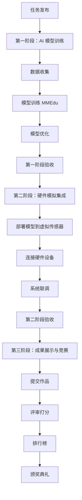

# O3.1 AI 实验 - 硬件模拟联动任务设计方案

**版本**: v1.0  
**创建时间**: 2026-03-04  
**状态**: 设计中  

---

## 📋 概述

### 任务目标
开发跨平台的综合学习任务，实现 OpenHydra AI 实训环境与 iMato 虚拟实验室的软硬结合创新闭环。

### 战略价值
- ✅ 实现"软硬结合"的完整学习闭环
- ✅ 极具创新性的教学模式
- ✅ 培养学生系统工程思维
- ✅ 展示项目独特竞争优势

---

## 🎯 示范任务案例：智能温室监控系统

### 任务背景
学生需要设计一套智能温室监控系统，实时监测植物生长环境并自动调节。

### 任务流程图


---

## 📚 第一阶段：AI 模型训练（OpenHydra + XEdu）

### 环境要求
- **平台**: OpenHydra Jupyter 实验室
- **工具链**: XEdu MMEdu
- **时长**: 4-6 小时

### 子任务设计

#### 1. 数据收集
**任务描述**: 收集温室传感器数据集或植物照片

**数据来源**:
- 提供的温室传感器数据集（温度、湿度、光照、CO₂浓度）
- 手机拍摄植物生长照片
- 公开数据集（PlantVillage 等）

**积分奖励**: +50 XP

#### 2. 模型训练（MMEdu）
**任务描述**: 使用 MMEdu 训练植物健康状态分类模型

**代码模板**:
```python
from mmedu import ImageClassifier

# 加载植物健康状态数据集
dataset = PlantHealthDataset('path/to/data')

# 构建分类模型
model = ImageClassifier(backbone='resnet18', num_classes=3)
# 类别：健康、缺水、病害

# 训练模型
trainer = Trainer(model, epochs=20)
history = trainer.fit(dataset)

# 保存模型
model.save('plant_health_classifier.pth')
```

**技术要求**:
- 准确率 >= 85%
- 训练时间 <= 30 分钟
- 模型文件 <= 50MB

**积分奖励**: 
- 完成训练：+300 XP
- 准确率达到 90%: +200 XP
- 进入班级排行榜前 3: +500 XP

#### 3. 模型优化
**任务描述**: 通过数据增强、超参数调优提升模型性能

**优化方向**:
- 数据增强（旋转、缩放、裁剪）
- 学习率调整
- 正则化技术（Dropout、L2）
- 迁移学习（预训练权重）

**积分奖励**:
- 准确率每提升 1%: +50 XP
- 最优模型额外奖励：+200 XP

### 第一阶段验收标准
- ✅ 成功训练植物健康分类模型
- ✅ 测试集准确率 >= 85%
- ✅ 提交模型文件和训练报告
- ✅ 获得至少 300 XP

---

## 🔧 第二阶段：硬件模拟集成（Vircadia + 3D 模型库）

### 环境要求
- **平台**: iMato 虚拟实验室
- **设备**: 虚拟摄像头、传感器 Hub、执行器
- **时长**: 4-6 小时

### 子任务设计

#### 1. 部署模型到虚拟传感器
**任务描述**: 将训练好的模型部署到 Vircadia 虚拟环境

**代码示例**:
```python
# 在虚拟实验室中加载训练好的模型
from imato_hardware import VirtualCamera, SensorHub

camera = VirtualCamera(scene='greenhouse')
sensor_hub = SensorHub()

# 实时监测
while True:
    # 拍摄虚拟温室照片
    image = camera.capture()
    
    # 调用 AI 模型分析
    health_status = ai_model.predict(image)
    
    # 根据分析结果控制硬件
    if health_status == '缺水':
        sensor_hub.activate_irrigation()
    elif health_status == '病害':
        alert_teacher()
```

**技术要求**:
- 模型加载成功
- 推理延迟 <= 500ms
- 与虚拟相机正常通信

**积分奖励**: +200 XP

#### 2. 搭建自动化控制系统
**任务描述**: 连接温湿度传感器、自动灌溉系统、补光灯

**硬件清单**:
- 虚拟温湿度传感器 x2
- 虚拟土壤湿度传感器 x3
- 自动灌溉系统 x1
- LED 补光灯 x2
- 通风风扇 x1

**控制逻辑**:
```python
if temperature > 30°C:
    activate_fan()
    
if soil_moisture < 30%:
    activate_irrigation()
    
if light_intensity < 5000 lux:
    turn_on_grow_lights()
```

**积分奖励**: +300 XP

#### 3. 系统联调
**任务描述**: 观察 24 小时虚拟时间内的植物生长情况，优化控制策略

**监控指标**:
- 植物生长速度
- 叶片健康度
- 资源消耗（水、电）
- 系统响应时间

**优化目标**:
- 植物生长状态优秀
- 资源利用率最大化
- 系统稳定性高

**积分奖励**:
- 成功部署模型：+200 XP
- 实现自动控制：+300 XP
- 植物生长状态优秀：+400 XP

### 第二阶段验收标准
- ✅ AI 模型成功部署到虚拟环境
- ✅ 硬件设备正常通信
- ✅ 自动化控制系统运行稳定
- ✅ 24 小时观察记录完整
- ✅ 获得至少 500 XP

---

## 🏆 第三阶段：成果展示与竞赛

### 提交内容
1. **训练好的 AI 模型文件** (.pth 或 .onnx)
2. **硬件控制代码** (Python 脚本)
3. **项目报告**（含准确率曲线、系统架构图）
4. **演示视频**（3 分钟）

### 评价维度
| 维度 | 权重 | 评分标准 |
|------|------|---------|
| 模型准确率 | 40% | >95%: 100 分，>90%: 80 分，>85%: 60 分 |
| 系统稳定性 | 30% | 无故障运行时间、响应速度 |
| 创新性 | 20% | 独特功能、优化算法 |
| 文档质量 | 10% | 完整性、清晰度、规范性 |

### 排行榜奖励
| 名次 | 积分奖励 | 勋章 |
|------|---------|------|
| 第 1 名 | +2000 XP | 🥇 金牌勋章 |
| 第 2-3 名 | +1500 XP | 🥈 银牌勋章 |
| 第 4-10 名 | +1000 XP | 🥉 铜牌勋章 |
| 参与奖 | +500 XP | 🎖️ 参与勋章 |

### 颁奖典礼
- **线上直播**: 展示 Top 10 作品
- **专家点评**: 邀请 AI 教育专家评审
- **证书颁发**: 电子证书 + 实体奖牌
- **社区展示**: 优秀作品收录到课程库

---

## 🛠️ 技术实现要点

### 任务编排服务
```python
class TaskOrchestrationService:
    """联动任务编排服务"""
    
    async def submit_stage1_result(self, user_id: str, model_file: UploadFile):
        """提交第一阶段 AI 模型"""
        # 1. 保存模型到对象存储
        model_path = await self.storage.save(model_file, f'models/{user_id}/')
        
        # 2. 自动评测准确率
        metrics = await self.evaluate_model(model_path)
        
        # 3. 发放积分
        if metrics.accuracy >= 0.9:
            await self.xp_service.award_xp(user_id, 500, 'AI 模型达标')
        
        # 4. 将模型部署到虚拟实验室
        await self.deploy_to_virtual_lab(user_id, model_path)
        
        return {'accuracy': metrics.accuracy, 'xp_earned': 500}
    
    async def deploy_to_virtual_lab(self, user_id: str, model_path: str):
        """将模型部署到 Vircadia 虚拟环境"""
        # 调用 Vircadia API
        await self.vircadia_service.update_object_script(
            scene_id='greenhouse_lab',
            object_id='ai_controller',
            script=f'''
                // 加载学生的 AI 模型
                const modelPath = "{model_path}";
                const model = await loadAIModel(modelPath);
                
                // 绑定到传感器
                camera.onCapture(async (image) => {{
                    const prediction = await model.predict(image);
                    controlSystem.actuate(prediction);
                }});
            '''
        );
```

### 数据流架构


---

## 📊 预期成效

### 学习成果
- **AI 技能**: 掌握图像分类、模型训练全流程
- **工程能力**: 系统集成、软硬件协同
- **创新思维**: 解决真实世界问题
- **团队合作**: 小组协作、同伴学习

### 量化指标
| 指标 | 基线值 | 目标值 | 测量方式 |
|------|--------|--------|---------|
| 学生参与度 | 60% | 90% | 任务完成率 |
| 平均准确率 | 80% | 90% | 模型测试 |
| 系统稳定性 | - | 95% | 无故障运行 |
| 学生满意度 | 3.8/5 | 4.5/5 | 问卷调查 |
| 作品质量 | - | Top 10 展示 | 专家评审 |

---

## ⏭️ 扩展任务规划

### 任务 2: 智能垃圾分类系统
- **AI 模型**: YOLOv5 目标检测
- **硬件**: 机械臂、传送带、摄像头
- **场景**: 家庭/学校垃圾分类

### 任务 3: 人脸识别门禁系统
- **AI 模型**: FaceNet 人脸识别
- **硬件**: 摄像头、电磁锁、显示屏
- **场景**: 智能家居、校园安全

### 任务 4: 手势识别钢琴
- **AI 模型**: MediaPipe 手势识别
- **硬件**: 虚拟钢琴键盘、音响
- **场景**: 音乐教育、创意互动

---

## 📝 下一步行动

### 本周内（2026-03-04 ~ 2026-03-11）
- [ ] 完成详细技术方案设计
- [ ] 准备示范任务数据集
- [ ] 搭建开发测试环境

### 下周启动（2026-03-11 ~ 2026-03-18）
- [ ] 开发任务编排服务
- [ ] 实现第一阶段 AI 训练流程
- [ ] 集成第二阶段硬件模拟

### 三周内完成（2026-03-18 ~ 2026-03-25）
- [ ] 系统联调测试
- [ ] 编写教学指导材料
- [ ] 组织试点班级测试

---

## 📞 联系方式

如有问题或建议，请通过以下方式联系：

- 📧 Email: support@imato.edu
- 💬 GitHub Issues: https://github.com/imato/issues
- 🌐 文档中心：https://docs.imato.edu

---

**文档作者**: iMato AI Assistant  
**审核状态**: 待审核  
**下一任务**: 实现智能温室监控系统示范任务
