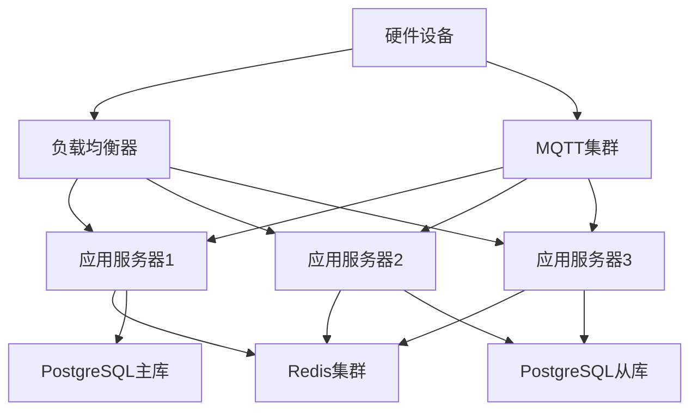

# 硬件设备异常上报通道技术文档

## 概述

本文档详细描述了iMato项目的硬件设备异常上报通道功能，该功能通过MQTT协议将硬件设备的异常信息实时发送至日志中心，实现对硬件设备状态的集中监控和管理。

## 系统架构

### 整体架构图

```
┌─────────────────┐    MQTT    ┌─────────────────┐    HTTP/REST    ┌─────────────────┐
│   硬件设备      │ ────────→ │   MQTT Broker   │ ──────────────→ │  告警管理系统   │
│  (传感器/控制器)│           │   (Mosquitto)   │                 │   (FastAPI)     │
└─────────────────┘           └─────────────────┘                 └─────────────────┘
       │                              │                                   │
       │                              │                                   │
       ▼                              ▼                                   ▼
┌─────────────────┐           ┌─────────────────┐                 ┌─────────────────┐
│ 异常检测器      │           │ 消息队列        │                 │ 数据存储        │
│ (本地/云端)     │           │ (Redis/Kafka)   │                 │ (PostgreSQL)    │
└─────────────────┘           └─────────────────┘                 └─────────────────┘
```

### 核心组件

1. **硬件设备层** - 各种物理硬件设备（传感器、控制器、嵌入式设备等）
2. **MQTT通信层** - 基于MQTT协议的消息传输
3. **异常检测层** - 实时分析设备状态和性能指标
4. **告警管理层** - 告警的生成、处理和分发
5. **数据存储层** - 告警历史和设备状态持久化

## 数据模型设计

### 告警类型枚举 (AlertType)

```python
class AlertType(str, Enum):
    DEVICE_OFFLINE = "device_offline"           # 设备离线
    PERFORMANCE_DEGRADATION = "performance_degradation"  # 性能下降
    TEMPERATURE_WARNING = "temperature_warning"  # 温度警告
    MEMORY_LEAK = "memory_leak"                 # 内存泄漏
    CONNECTION_LOST = "connection_lost"         # 连接丢失
    AUTHENTICATION_FAILED = "authentication_failed"  # 认证失败
    HARDWARE_FAULT = "hardware_fault"           # 硬件故障
    FIRMWARE_ERROR = "firmware_error"           # 固件错误
    RESOURCE_EXHAUSTED = "resource_exhausted"   # 资源耗尽
    UNKNOWN_ERROR = "unknown_error"             # 未知错误
```

### 告警严重程度 (AlertSeverity)

```python
class AlertSeverity(str, Enum):
    INFO = "info"           # 信息级别
    WARNING = "warning"     # 警告级别
    ERROR = "error"         # 错误级别
    CRITICAL = "critical"   # 严重级别
```

### 核心数据模型

#### 硬件告警模型 (HardwareAlert)

```python
class HardwareAlert(BaseModel):
    alert_id: str                           # 告警唯一标识
    device_id: str                          # 设备ID
    device_name: Optional[str] = None       # 设备名称
    alert_type: AlertType                   # 告警类型
    severity: AlertSeverity                 # 告警严重程度
    message: str                            # 告警消息
    source: AlertSource                     # 告警来源
    timestamp: datetime                     # 告警时间戳
    resolved: bool = False                  # 是否已解决
    details: Optional[Dict[str, Any]] = None  # 详细信息
    metrics: Optional[Dict[str, float]] = None  # 相关指标数据
```

#### 设备状态模型 (HardwareDeviceStatus)

```python
class HardwareDeviceStatus(BaseModel):
    device_id: str                          # 设备ID
    device_name: Optional[str] = None       # 设备名称
    status: str                             # 设备状态
    last_seen: datetime                     # 最后在线时间
    cpu_usage: Optional[float] = None       # CPU使用率 (%)
    memory_usage: Optional[float] = None    # 内存使用率 (%)
    temperature: Optional[float] = None     # 温度 (°C)
    connection_status: str = "disconnected"  # 连接状态
    alert_count: int = 0                    # 当前活跃告警数
```

## 服务架构

### MQTT服务封装 (HardwareAlertMQTTService)

#### 核心功能
- MQTT客户端连接管理
- 消息发布和订阅
- 自动重连机制
- TLS安全连接支持
- 主题管理

#### 配置参数
```python
class MQTTConfig:
    broker_host: str = "localhost"          # MQTT代理主机
    broker_port: int = 1883                 # MQTT代理端口
    username: Optional[str] = None          # 用户名
    password: Optional[str] = None          # 密码
    client_id: Optional[str] = None         # 客户端ID
    qos: int = 1                            # 服务质量等级
    tls_enabled: bool = False               # 是否启用TLS
```

### 异常检测服务 (HardwareAlertDetectionService)

#### 检测器类型

1. **设备离线检测器 (DeviceOfflineDetector)**
   - 检测标准：超过120秒无心跳信号
   - 告警类型：`DEVICE_OFFLINE`
   - 严重程度：`ERROR`

2. **性能下降检测器 (PerformanceDegradationDetector)**
   - CPU阈值：85%
   - 内存阈值：85%
   - 检测窗口：10个数据点
   - 告警类型：`PERFORMANCE_DEGRADATION`
   - 严重程度：`WARNING`

3. **温度异常检测器 (TemperatureAnomalyDetector)**
   - 高温阈值：75°C
   - 临界温度：85°C
   - 告警类型：`TEMPERATURE_WARNING`
   - 严重程度：`WARNING` 或 `CRITICAL`

4. **内存泄漏检测器 (MemoryLeakDetector)**
   - 泄漏阈值：2%/分钟增长
   - 检测窗口：20个数据点
   - 告警类型：`MEMORY_LEAK`
   - 严重程度：`ERROR`

5. **连接稳定性检测器 (ConnectionStabilityDetector)**
   - 断连阈值：3次/5分钟
   - 告警类型：`CONNECTION_LOST`
   - 严重程度：`WARNING`

### 告警管理器 (HardwareAlertManager)

#### 主要职责
- 协调各个检测器的工作
- 告警的统一处理和分发
- 告警抑制和去重
- 设备状态维护
- 定时监控任务调度

## API接口设计

### RESTful API端点

#### 1. 创建告警
```
POST /api/v1/hardware-alerts/alerts
```

**请求体：**
```json
{
    "device_id": "sensor_001",
    "alert_type": "device_offline",
    "severity": "error",
    "message": "设备离线超过阈值时间",
    "details": {
        "offline_duration": 150,
        "last_seen": "2026-03-01T10:00:00Z"
    }
}
```

#### 2. 查询告警列表
```
GET /api/v1/hardware-alerts/alerts
```

**查询参数：**
- `device_id` (可选) - 设备ID过滤
- `alert_type` (可选) - 告警类型过滤
- `severity` (可选) - 严重程度过滤
- `resolved` (可选) - 解决状态过滤
- `limit` (默认50) - 返回数量限制

#### 3. 获取设备状态
```
GET /api/v1/hardware-alerts/devices/{device_id}/status
```

#### 4. 上报设备指标
```
POST /api/v1/hardware-alerts/devices/{device_id}/metrics
```

**请求体：**
```json
{
    "cpu_usage": 85.5,
    "memory_usage": 72.3,
    "temperature": 78.2,
    "connection_status": "connected"
}
```

#### 5. 发送测试告警
```
POST /api/v1/hardware-alerts/test-alert
```

## 配置管理

### 环境变量配置

```bash
# MQTT配置
HARDWARE_ALERT_MQTT_ENABLED=true
HARDWARE_ALERT_MQTT_BROKER=localhost
HARDWARE_ALERT_MQTT_PORT=1883
HARDWARE_ALERT_MQTT_USERNAME=admin
HARDWARE_ALERT_MQTT_PASSWORD=password
HARDWARE_ALERT_MQTT_TOPIC_PREFIX=hardware/alerts
HARDWARE_ALERT_MQTT_QOS=1
HARDWARE_ALERT_MQTT_TLS_ENABLED=false

# 检测阈值配置
HARDWARE_ALERT_DETECTION_ENABLED=true
HARDWARE_ALERT_MONITORING_INTERVAL=30
HARDWARE_ALERT_CPU_THRESHOLD=85.0
HARDWARE_ALERT_MEMORY_THRESHOLD=85.0
HARDWARE_ALERT_TEMP_THRESHOLD=75.0
HARDWARE_ALERT_CRITICAL_TEMP=85.0
HARDWARE_ALERT_OFFLINE_THRESHOLD=120
```

### 配置优先级
1. 环境变量
2. `.env`文件
3. 默认值

## 部署架构

### 开发环境部署

```yaml
# docker-compose.yml
version: '3.8'
services:
  mqtt-broker:
    image: eclipse-mosquitto:2.0
    ports:
      - "1883:1883"
      - "9001:9001"
    volumes:
      - ./mosquitto/config:/mosquitto/config
      - ./mosquitto/data:/mosquitto/data
      - ./mosquitto/log:/mosquitto/log
  
  hardware-alert-service:
    build: .
    ports:
      - "8000:8000"
    environment:
      - HARDWARE_ALERT_MQTT_BROKER=mqtt-broker
      - HARDWARE_ALERT_MQTT_PORT=1883
    depends_on:
      - mqtt-broker
```

### 生产环境部署



## 监控与运维

### 健康检查端点

```
GET /api/v1/hardware-alerts/service/info
```

**响应示例：**
```json
{
    "mqtt_service": {
        "connected": true,
        "broker": "mqtt-server:1883",
        "client_id": "hardware_alert_a1b2c3d4",
        "subscriptions": ["hardware/alerts/+"]
    },
    "settings": {
        "mqtt_enabled": true,
        "detection_enabled": true,
        "monitoring_interval": 30
    }
}
```

### 日志级别配置

```python
# 支持的日志级别
LOG_LEVEL = "INFO"  # DEBUG, INFO, WARNING, ERROR, CRITICAL
```

### 性能指标

- **告警处理延迟**：< 100ms
- **MQTT消息吞吐量**：> 1000 msg/sec
- **系统可用性**：99.9%
- **告警准确率**：> 95%

## 安全考虑

### 认证与授权
- MQTT客户端认证（用户名/密码）
- TLS加密传输
- API接口JWT令牌验证
- 设备身份验证

### 数据保护
- 敏感信息加密存储
- 访问日志审计
- 数据备份策略
- GDPR合规性

## 故障排除

### 常见问题

1. **MQTT连接失败**
   ```
   检查：
   - MQTT代理是否运行
   - 网络连接是否正常
   - 认证凭据是否正确
   - 端口是否开放
   ```

2. **告警未触发**
   ```
   检查：
   - 检测阈值设置是否合理
   - 设备指标数据是否正常上报
   - 检测器是否启用
   - 告警抑制规则
   ```

3. **性能问题**
   ```
   优化建议：
   - 调整监控间隔
   - 优化数据库查询
   - 增加缓存层
   - 水平扩展服务实例
   ```

## 扩展性设计

### 插件化检测器
```python
class CustomDetector(BaseAnomalyDetector):
    def detect(self, device_id: str, metrics: Dict[str, Any], 
               device_status: Dict[str, HardwareDeviceStatus]) -> List[HardwareAlert]:
        # 自定义检测逻辑
        pass

# 注册自定义检测器
alert_detector.register_detector(CustomDetector())
```

### 多种通知渠道
- 邮件通知
- 短信告警
- Webhook集成
- Slack/Discord机器人
- 电话呼叫

## 版本历史

### v1.0.0 (2026-03-01)
- ✅ 基础硬件告警功能
- ✅ MQTT通信支持
- ✅ 五种异常检测器
- ✅ RESTful API接口
- ✅ 配置管理
- ✅ 回测验证

## 贡献指南

### 开发环境搭建
```bash
# 克隆仓库
git clone <repository-url>
cd imato-hardware-alert

# 安装依赖
pip install -r requirements.txt

# 运行回测
python scripts/hardware_alert_backtest.py

# 启动开发服务器
uvicorn main:app --reload
```

### 代码规范
- 遵循PEP 8编码规范
- 使用类型提示
- 编写单元测试
- 保持代码文档同步更新

---

*本文档最后更新时间：2026年3月1日*