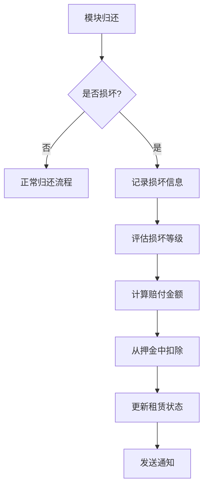

# 模块化硬件租赁系统架构文档

## 系统概述

模块化硬件租赁系统是一个基于微服务架构的硬件设备租赁管理平台，支持1元/个的替换件租赁模式，提供完整的租赁生命周期管理、库存控制、并发处理和损坏赔付功能。

## 架构设计

### 整体架构图

```
┌─────────────────┐    ┌─────────────────┐    ┌─────────────────┐
│   前端应用层    │    │   API网关层     │    │   业务服务层    │
│  (Web/Mobile)   │◄──►│   (FastAPI)     │◄──►│  (微服务集群)   │
└─────────────────┘    └─────────────────┘    └─────────────────┘
                              │                        │
                              ▼                        ▼
                    ┌─────────────────┐    ┌─────────────────┐
                    │   数据存储层    │    │   消息队列层    │
                    │  (PostgreSQL)   │    │   (Redis/RabbitMQ)│
                    └─────────────────┘    └─────────────────┘
```

## 核心组件

### 1. 数据模型层

#### HardwareModule (硬件模块)
```python
class HardwareModule(Base):
    __tablename__ = "hardware_modules"
    
    id = Column(Integer, primary_key=True)
    name = Column(String, nullable=False)
    module_type = Column(String, nullable=False)
    serial_number = Column(String, unique=True, nullable=False)
    price_per_day = Column(Numeric(precision=10, scale=2), nullable=False)
    deposit_amount = Column(Numeric(precision=10, scale=2), nullable=False)
    total_quantity = Column(Integer, nullable=False)
    quantity_available = Column(Integer, nullable=False)
    status = Column(Enum(HardwareModuleStatus), default=HardwareModuleStatus.AVAILABLE)
    is_active = Column(Boolean, default=True)
```

#### ModuleRentalRecord (租赁记录)
```python
class ModuleRentalRecord(Base):
    __tablename__ = "module_rental_records"
    
    id = Column(Integer, primary_key=True)
    module_id = Column(Integer, ForeignKey("hardware_modules.id"), nullable=False)
    user_license_id = Column(Integer, ForeignKey("user_licenses.id"), nullable=False)
    rental_start_date = Column(DateTime, nullable=False)
    rental_end_date = Column(DateTime, nullable=False)
    actual_return_date = Column(DateTime)
    daily_rate = Column(Numeric(precision=10, scale=2), nullable=False)
    total_amount = Column(Numeric(precision=10, scale=2), nullable=False)
    deposit_paid = Column(Numeric(precision=10, scale=2), nullable=False)
    deposit_refunded = Column(Numeric(precision=10, scale=2), default=0)
    status = Column(Enum(ModuleRentalStatus), default=ModuleRentalStatus.ACTIVE)
    is_damaged = Column(Boolean, default=False)
    damage_level = Column(Enum(DamageLevel))
    damage_description = Column(Text)
    compensation_amount = Column(Numeric(precision=10, scale=2), default=0)
```

### 2. 服务层

#### HardwareInventoryService (库存服务)
```python
class HardwareInventoryService:
    async def check_availability(self, module_id: int, quantity: int, db: AsyncSession) -> bool:
        """检查模块库存是否充足"""
        pass
    
    async def reserve_module(self, module_id: int, quantity: int, db: AsyncSession) -> bool:
        """预留指定数量的模块"""
        pass
    
    async def release_reservation(self, module_id: int, quantity: int, db: AsyncSession) -> bool:
        """释放预留的模块"""
        pass
    
    async def get_module_stock_info(self, module_id: int, db: AsyncSession) -> Optional[dict]:
        """获取模块库存信息"""
        pass
```

### 3. API层

#### 路由设计
```
/api/v1/hardware/modules/
├── GET    /                      # 获取模块列表
├── POST   /                      # 创建新模块
├── GET    /{module_id}          # 获取模块详情
├── PUT    /{module_id}          # 更新模块信息
├── DELETE /{module_id}          # 删除模块
├── POST   /{module_id}/rent     # 租赁模块
├── POST   /{module_id}/return   # 归还模块
├── GET    /user/{license_id}/rentals  # 用户租赁历史
└── GET    /user/{license_id}/summary  # 用户租赁摘要
```

## 并发控制机制

### 1. 数据库锁策略

```python
# 悲观锁实现
async def reserve_module_with_lock(module_id: int, quantity: int, db: AsyncSession):
    # 使用SELECT FOR UPDATE锁定记录
    query = select(HardwareModule).filter(
        HardwareModule.id == module_id
    ).with_for_update()
    
    result = await db.execute(query)
    module = result.scalar_one_or_none()
    
    if module and module.quantity_available >= quantity:
        module.quantity_available -= quantity
        if module.quantity_available == 0:
            module.status = HardwareModuleStatus.RENTED
        await db.commit()
        return True
    return False
```

### 2. 乐观锁实现

```python
# 版本号控制
class HardwareModule(Base):
    __tablename__ = "hardware_modules"
    
    id = Column(Integer, primary_key=True)
    version = Column(Integer, default=1)  # 版本号字段
    quantity_available = Column(Integer, nullable=False)
    
    async def update_with_version_check(self, new_quantity: int, expected_version: int, db: AsyncSession):
        """带版本检查的更新"""
        stmt = update(HardwareModule).where(
            and_(
                HardwareModule.id == self.id,
                HardwareModule.version == expected_version
            )
        ).values(
            quantity_available=new_quantity,
            version=HardwareModule.version + 1
        )
        
        result = await db.execute(stmt)
        if result.rowcount == 0:
            raise ConcurrentModificationError("数据已被其他用户修改")
```

## 损坏赔付系统

### 赔付计算规则

```python
class ModuleRentalRecord(Base):
    def calculate_compensation(self) -> Decimal:
        """根据损坏等级计算赔付金额"""
        if not self.is_damaged or not self.damage_level:
            return Decimal('0.00')
        
        compensation_rates = {
            DamageLevel.LIGHT: Decimal('0.2'),    # 20%
            DamageLevel.MODERATE: Decimal('0.5'), # 50%
            DamageLevel.SEVERE: Decimal('1.0')    # 100%
        }
        
        rate = compensation_rates.get(self.damage_level, Decimal('0.0'))
        return self.deposit_paid * rate
```

### 赔付处理流程



## 库存管理策略

### 1. 实时库存同步

```python
class InventoryManager:
    def __init__(self):
        self.redis_client = redis.Redis()
        self.lock_timeout = 30  # 锁超时时间
    
    async def atomic_inventory_operation(self, module_id: int, operation: str, quantity: int):
        """原子库存操作"""
        lock_key = f"inventory_lock:{module_id}"
        
        # 获取分布式锁
        if await self.redis_client.set(lock_key, "locked", nx=True, ex=self.lock_timeout):
            try:
                # 执行库存操作
                if operation == "reserve":
                    return await self._reserve_inventory(module_id, quantity)
                elif operation == "release":
                    return await self._release_inventory(module_id, quantity)
            finally:
                # 释放锁
                await self.redis_client.delete(lock_key)
        else:
            raise InventoryLockTimeoutError("库存操作超时")
```

### 2. 库存预警机制

```python
class InventoryAlertService:
    def __init__(self):
        self.threshold_percent = 0.2  # 20%阈值
    
    async def check_low_stock_alerts(self):
        """检查低库存预警"""
        low_stock_modules = await self.get_low_stock_modules()
        
        for module in low_stock_modules:
            if module.quantity_available / module.total_quantity <= self.threshold_percent:
                await self.send_low_stock_alert(module)
    
    async def send_low_stock_alert(self, module: HardwareModule):
        """发送低库存警报"""
        alert_message = {
            "module_id": module.id,
            "module_name": module.name,
            "current_stock": module.quantity_available,
            "total_stock": module.total_quantity,
            "alert_time": datetime.utcnow()
        }
        
        # 发送到消息队列
        await self.message_queue.publish("low_stock_alert", alert_message)
```

## 性能优化策略

### 1. 数据库优化

```sql
-- 创建复合索引优化查询性能
CREATE INDEX idx_hardware_modules_status_active ON hardware_modules(status, is_active);
CREATE INDEX idx_rental_records_module_status ON module_rental_records(module_id, status);
CREATE INDEX idx_rental_records_user_license ON module_rental_records(user_license_id);

-- 分区表优化大表查询
CREATE TABLE module_rental_records_2024 PARTITION OF module_rental_records
FOR VALUES FROM ('2024-01-01') TO ('2025-01-01');
```

### 2. 缓存策略

```python
class CacheService:
    def __init__(self):
        self.redis_client = redis.Redis()
        self.cache_ttl = 300  # 5分钟缓存
    
    async def get_cached_module_info(self, module_id: int) -> Optional[dict]:
        """获取缓存的模块信息"""
        cache_key = f"module_info:{module_id}"
        cached_data = await self.redis_client.get(cache_key)
        
        if cached_data:
            return json.loads(cached_data)
        
        # 从数据库获取并缓存
        module_info = await self._get_module_from_db(module_id)
        if module_info:
            await self.redis_client.setex(
                cache_key, 
                self.cache_ttl, 
                json.dumps(module_info)
            )
        return module_info
```

## 安全设计

### 1. 访问控制

```python
class HardwareModulePermission:
    @staticmethod
    async def can_rent_module(user: User, module: HardwareModule) -> bool:
        """检查用户是否有权租赁模块"""
        # 检查用户许可证状态
        if not user.license or not user.license.is_active:
            return False
        
        # 检查租赁限制
        if user.license.hardware_rented_count >= user.license.hardware_rental_limit:
            return False
        
        # 检查模块可用性
        if not module.is_active or module.status != HardwareModuleStatus.AVAILABLE:
            return False
        
        return True
```

### 2. 数据验证

```python
class HardwareModuleValidator:
    @staticmethod
    def validate_module_data(data: dict) -> List[str]:
        """验证模块数据"""
        errors = []
        
        # 价格验证
        if data.get('price_per_day', 0) <= 0:
            errors.append("日租金必须大于0")
        
        # 押金验证
        if data.get('deposit_amount', 0) <= 0:
            errors.append("押金金额必须大于0")
        
        # 库存验证
        if data.get('total_quantity', 0) <= 0:
            errors.append("总库存必须大于0")
        
        # 序列号唯一性验证
        if await HardwareModule.exists(serial_number=data.get('serial_number')):
            errors.append("序列号已存在")
        
        return errors
```

## 监控与日志

### 1. 关键指标监控

```python
class MetricsCollector:
    def __init__(self):
        self.metrics = {
            'total_modules': 0,
            'available_modules': 0,
            'active_rentals': 0,
            'overdue_rentals': 0,
            'total_revenue': Decimal('0.00'),
            'damage_rate': 0.0
        }
    
    async def collect_metrics(self):
        """收集系统指标"""
        # 统计各类模块数量
        self.metrics['total_modules'] = await HardwareModule.count()
        self.metrics['available_modules'] = await HardwareModule.count_by_status('available')
        
        # 统计租赁情况
        self.metrics['active_rentals'] = await ModuleRentalRecord.count_by_status('active')
        self.metrics['overdue_rentals'] = await ModuleRentalRecord.count_by_status('overdue')
        
        # 计算收入
        self.metrics['total_revenue'] = await ModuleRentalRecord.sum_total_amount()
        
        # 计算损坏率
        total_returns = await ModuleRentalRecord.count_completed()
        damaged_returns = await ModuleRentalRecord.count_damaged()
        self.metrics['damage_rate'] = damaged_returns / total_returns if total_returns > 0 else 0
```

### 2. 日志追踪

```python
import structlog

logger = structlog.get_logger()

class RentalLogger:
    @staticmethod
    async def log_rental_activity(activity_type: str, rental_record: ModuleRentalRecord, user: User):
        """记录租赁活动日志"""
        log_data = {
            'activity_type': activity_type,
            'user_id': user.id,
            'module_id': rental_record.module_id,
            'rental_id': rental_record.id,
            'timestamp': datetime.utcnow().isoformat()
        }
        
        if activity_type == 'rent':
            log_data.update({
                'rental_start': rental_record.rental_start_date.isoformat(),
                'rental_end': rental_record.rental_end_date.isoformat(),
                'total_amount': float(rental_record.total_amount)
            })
        elif activity_type == 'return':
            log_data.update({
                'actual_return': rental_record.actual_return_date.isoformat() if rental_record.actual_return_date else None,
                'is_damaged': rental_record.is_damaged,
                'damage_level': rental_record.damage_level.value if rental_record.damage_level else None
            })
        
        logger.info("rental_activity", **log_data)
```

## 部署架构

### 1. 容器化部署

```dockerfile
# Dockerfile
FROM python:3.11-slim

WORKDIR /app
COPY requirements.txt .
RUN pip install -r requirements.txt

COPY . .
EXPOSE 8000

CMD ["uvicorn", "main:app", "--host", "0.0.0.0", "--port", "8000"]
```

### 2. Kubernetes部署配置

```yaml
# deployment.yaml
apiVersion: apps/v1
kind: Deployment
metadata:
  name: hardware-rental-api
spec:
  replicas: 3
  selector:
    matchLabels:
      app: hardware-rental-api
  template:
    metadata:
      labels:
        app: hardware-rental-api
    spec:
      containers:
      - name: api
        image: hardware-rental-api:latest
        ports:
        - containerPort: 8000
        env:
        - name: DATABASE_URL
          valueFrom:
            secretKeyRef:
              name: db-secret
              key: url
        resources:
          requests:
            memory: "256Mi"
            cpu: "250m"
          limits:
            memory: "512Mi"
            cpu: "500m"
```

## 测试策略

### 1. 单元测试覆盖

```python
class TestHardwareModule:
    def test_module_creation(self):
        """测试模块创建"""
        module = HardwareModule(
            name="Test Module",
            module_type="sensor",
            serial_number="TEST-001",
            price_per_day=Decimal('1.00'),
            deposit_amount=Decimal('50.00'),
            total_quantity=10,
            quantity_available=10
        )
        assert module.is_valid()
    
    def test_inventory_operations(self):
        """测试库存操作"""
        service = HardwareInventoryService()
        # 测试预留功能
        assert service.reserve_module(1, 2) is True
        # 测试释放功能
        assert service.release_reservation(1, 2) is True
```

### 2. 集成测试场景

```python
class TestRentalFlow:
    async def test_complete_rental_cycle(self):
        """测试完整租赁周期"""
        # 1. 创建模块
        module = await self.create_test_module()
        
        # 2. 租赁模块
        rental = await self.rent_module(module.id, user_license.id)
        assert rental.status == ModuleRentalStatus.ACTIVE
        
        # 3. 归还模块
        await self.return_module(module.id, rental.id)
        assert rental.status == ModuleRentalStatus.RETURNED
        
        # 4. 验证库存恢复
        updated_module = await self.get_module(module.id)
        assert updated_module.quantity_available == module.total_quantity
```

## 故障处理与恢复

### 1. 异常处理机制

```python
class HardwareRentalExceptionHandler:
    async def handle_inventory_exception(self, exception: Exception, module_id: int):
        """处理库存相关异常"""
        if isinstance(exception, InsufficientInventoryError):
            # 库存不足，记录日志并通知管理员
            logger.warning(f"模块 {module_id} 库存不足", extra={
                'module_id': module_id,
                'error': str(exception)
            })
            await self.notify_admin_insufficient_stock(module_id)
        
        elif isinstance(exception, DatabaseConnectionError):
            # 数据库连接异常，启用降级模式
            logger.error("数据库连接异常，启用缓存模式", extra={
                'error': str(exception)
            })
            await self.enable_degraded_mode()
```

### 2. 数据备份策略

```python
class BackupService:
    def __init__(self):
        self.backup_schedule = "0 2 * * *"  # 每天凌晨2点备份
    
    async def perform_backup(self):
        """执行数据备份"""
        backup_file = f"backup_{datetime.utcnow().strftime('%Y%m%d_%H%M%S')}.sql"
        
        # 执行PostgreSQL备份
        backup_command = [
            "pg_dump",
            "-h", self.db_host,
            "-U", self.db_user,
            "-d", self.db_name,
            "-f", backup_file
        ]
        
        process = await asyncio.create_subprocess_exec(*backup_command)
        await process.wait()
        
        # 上传到云存储
        await self.upload_to_cloud_storage(backup_file)
```

## 未来扩展方向

### 1. 功能扩展
- 支持模块组合套餐租赁
- 添加租赁保险服务
- 集成物流配送系统
- 支持预约租赁功能

### 2. 技术升级
- 引入GraphQL API
- 实现实时库存推送
- 添加AI预测库存需求
- 集成区块链防伪溯源

### 3. 业务拓展
- 支持B2B企业租赁
- 添加租赁数据分析仪表板
- 集成第三方支付平台
- 支持国际化多语言