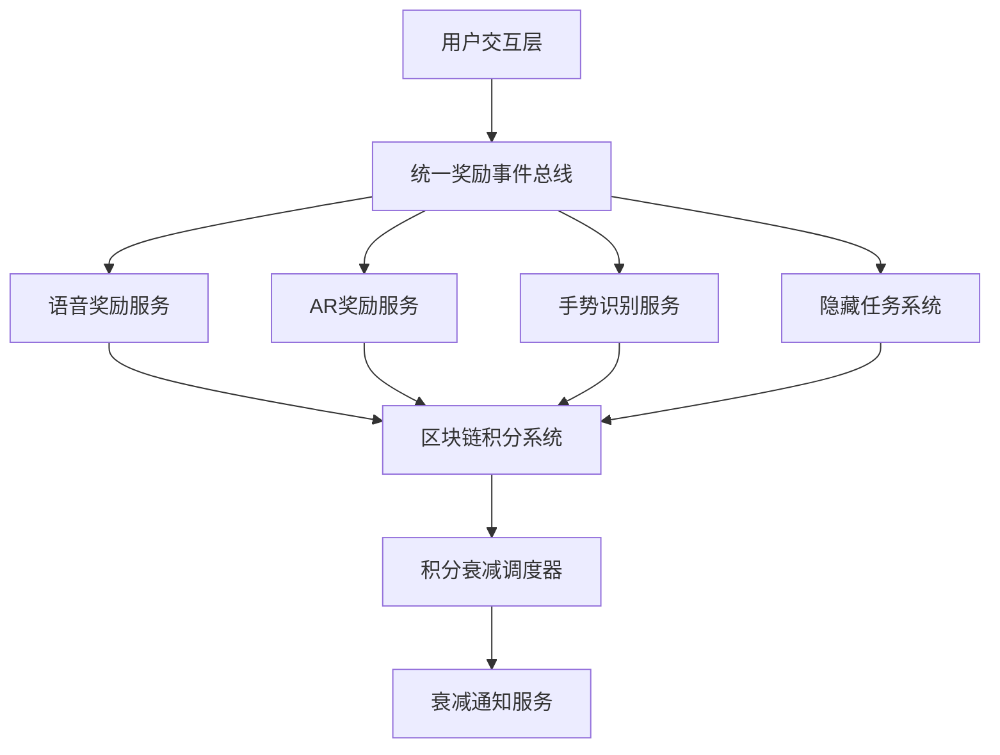

# 多模态激励联动系统技术文档

## 系统概述

多模态激励联动系统是一个集成了语音、AR、手势等多种交互方式的智能奖励系统，旨在通过多样化的激励机制提升用户参与度和学习效果。

## 系统架构

### 核心组件



### 主要模块

#### 1. 游戏化规则引擎 (`backend/gamification/models/rule_engine.py`)

**功能特性:**
- 支持多模态奖励条件类型
- 可扩展的动作执行框架
- 预定义奖励规则模板

**新增规则类型:**
```python
class RuleConditionType(Enum):
    VOICE_CORRECTION = "voice_correction"        # 语音纠错
    AR_COMPONENT_PLACEMENT = "ar_component_placement"  # AR元件放置
    GESTURE_SEQUENCE = "gesture_sequence"        # 手势序列
    HIDDEN_TASK_COMPLETION = "hidden_task_completion"  # 隐藏任务
```

#### 2. 区块链积分链码扩展 (`blockchain/chaincode/integral/`)

**新增功能:**
- 积分衰减机制
- 多模态奖励发放
- 任务状态管理
- 成就徽章记录

**核心数据结构:**
```go
type DecayConfig struct {
    DecayRate    float64 `json:"decay_rate"`     // 衰减率
    MinThreshold int     `json:"min_threshold"`  // 最小阈值
    GracePeriod  int     `json:"grace_period"`   // 宽限期
    IsActive     bool    `json:"is_active"`      // 是否启用
}

type MultimodalReward struct {
    RewardType   string            `json:"reward_type"`
    Points       int               `json:"points"`
    Metadata     map[string]string `json:"metadata"`
    Timestamp    int64             `json:"timestamp"`
}
```

#### 3. 统一奖励事件总线 (`backend/services/reward_event_bus.py`)

**核心功能:**
- 跨模块事件通信
- 异步事件处理
- 事件订阅/发布机制
- 事件持久化支持

**使用示例:**
```python
# 发布事件
event = RewardEvent(
    event_type='voice_correction',
    user_id=123,
    data={'correction_type': 'pin_connection', 'confidence': 0.95},
    timestamp=datetime.now()
)
await reward_event_bus.publish(event)

# 订阅事件
def voice_handler(event: RewardEvent):
    # 处理语音纠错事件
    pass

reward_event_bus.subscribe('voice_correction', voice_handler)
```

## 功能详解

### T7.1 语音指令纠错积分奖励

#### 实现组件:
- `VoiceCorrectionDetector` - 语音纠错检测器
- `VoiceRewardService` - 语音奖励服务
- `VoiceRewardTemplates` - 奖励规则模板

#### 核心算法:
```python
def detect_corrections(self, voice_transcript: str) -> VoiceCorrectionResult:
    """
    语音纠错检测算法
    支持引脚连接纠错、电路配置纠错、语法纠错等
    """
    # 1. 文本预处理和标准化
    normalized_text = self._normalize_text(voice_transcript)
    
    # 2. 硬件状态分析
    connection_status = self.hardware_connector.get_connection_status()
    
    # 3. 纠错类型识别
    correction_type = self._identify_correction_type(normalized_text, connection_status)
    
    # 4. 置信度和准确度计算
    confidence, accuracy = self._calculate_scores(normalized_text, correction_type)
    
    return VoiceCorrectionResult(
        is_correction=True,
        correction_type=correction_type,
        confidence=confidence,
        accuracy=accuracy,
        corrected_pins=self._extract_corrected_pins(normalized_text)
    )
```

#### 奖励规则:
```python
VOICE_REWARD_TEMPLATES = {
    "correct_pin_connection": {
        "condition": "voice_correction",
        "pattern": r"(连接|接到).*([Dd]\d+)",
        "reward": 50,
        "description": "正确连接D9引脚奖励50积分"
    },
    "circuit_configuration": {
        "condition": "voice_correction",
        "pattern": r"(设置|配置).*(电压|电流|频率)",
        "reward": 30,
        "description": "电路参数配置奖励30积分"
    }
}
```

### T7.2 AR场景完成奖励机制

#### 实现组件:
- `ARInteractionManager` - Unity AR交互管理器
- `ARPlacementValidator` - 元件放置验证器
- `ARSceneProgressTracker` - 场景进度跟踪器
- `ARElementPositionDetector` - 3D位置检测器

#### 核心功能:

**元件放置验证:**
```csharp
public ValidationReport ValidateComponentPlacement(GameObject component)
{
    string componentType = GetComponentType(component);
    ComponentTargetPosition target = targetPositions[componentType];
    
    // 计算位置、旋转、缩放误差
    Vector3 posError = component.transform.position - target.idealPosition;
    float rotError = Quaternion.Angle(component.transform.rotation, target.idealRotation);
    Vector3 scaleError = component.transform.localScale - target.idealScale;
    
    // 综合准确度计算 (权重: 位置50%, 旋转30%, 缩放20%)
    float accuracy = 100f - (normalizedPosError * 50f + normalizedRotError * 30f + normalizedScaleError * 20f);
    
    return new ValidationReport
    {
        isValid = accuracy >= 70f,
        componentType = target.componentName,
        accuracy = accuracy,
        feedbackMessage = GenerateFeedback(accuracy, normalizedPosError, normalizedRotError, normalizedScaleError)
    };
}
```

**场景完成奖励计算:**
```csharp
private int CalculateBonusPoints(SceneCompletionStatus status)
{
    int bonus = 0;
    
    // 准确度奖励
    if (status.overallAccuracy >= 95f) bonus += 50;
    else if (status.overallAccuracy >= 90f) bonus += 30;
    else if (status.overallAccuracy >= 85f) bonus += 10;
    
    // 速度奖励
    if (status.completionTime <= 120f) bonus += 20; // 2分钟内完成
    else if (status.completionTime <= 180f) bonus += 10; // 3分钟内完成
    
    // 完整性奖励
    if (status.componentsPlaced >= status.totalComponents) bonus += 30;
    
    return bonus;
}
```

### T7.3 MediaPipe手势识别

#### 实现组件:
- `MediaPipeGestureRecognizer` - MediaPipe手势识别器
- `ComplexGestureSequenceRecognizer` - 复杂手势序列识别器
- `UnityGestureRecognition` - Unity端集成脚本

#### 支持的手势类型:
```python
class GestureType(Enum):
    TAP = "tap"                    # 点击
    SWIPE_LEFT = "swipe_left"      # 左滑
    SWIPE_RIGHT = "swipe_right"    # 右滑
    SWIPE_UP = "swipe_up"          # 上滑
    SWIPE_DOWN = "swipe_down"      # 下滑
    V_SHAPE = "v_shape"            # V字手势
    OK_SIGN = "ok_sign"            # OK手势
    THUMBS_UP = "thumbs_up"        # 竖大拇指
    CIRCLE = "circle"              # 圆形手势
    SECRET_GESTURE_1 = "secret_gesture_1"  # 隐藏任务手势1
    SECRET_GESTURE_2 = "secret_gesture_2"  # 隐藏任务手势2
```

#### 复杂手势序列检测:
```python
def detect_complex_sequences(self) -> List[Tuple[str, float]]:
    """检测复杂手势序列"""
    detected_sequences = []
    
    for sequence_name, pattern in self.sequence_patterns.items():
        confidence = self._match_sequence_pattern(pattern)
        if confidence >= self.min_sequence_confidence:
            detected_sequences.append((sequence_name, confidence))
    
    return detected_sequences

# 预定义的隐藏任务手势序列
sequence_patterns = {
    "secret_task_1": [GestureType.CIRCLE, GestureType.V_SHAPE, GestureType.TAP],
    "secret_task_2": [GestureType.SWIPE_LEFT, GestureType.SWIPE_RIGHT, 
                      GestureType.SWIPE_UP, GestureType.SWIPE_DOWN],
    "secret_task_3": [GestureType.PINCH_IN, GestureType.PINCH_OUT, 
                      GestureType.ROTATE_CLOCKWISE]
}
```

### T7.4 积分奖励衰减机制

#### 实现组件:
- `IntegralDecayCalculator` - 积分衰减计算器
- `IntegralDecayScheduler` - 定时任务调度器
- `DecayNotificationService` - 衰减通知服务

#### 衰减算法:

**指数衰减模型:**
```python
def _calculate_base_decay(self, rule: DecayRule, points: int, days_inactive: int) -> int:
    if rule.decay_type == DecayType.EXPONENTIAL:
        # 指数衰减: points * (1 - rate)^days
        decay_factor = math.pow(1 - rule.decay_rate, days_inactive)
        decay_amount = points * (1 - decay_factor)
        return int(decay_amount)
```

**阶梯式衰减模型:**
```python
elif rule.decay_type == DecayType.STEP:
    # 阶梯式衰减: 达到一定天数后开始衰减
    if days_inactive <= rule.grace_period_days:
        return 0
    step_days = days_inactive - rule.grace_period_days
    steps = step_days // 3  # 每3天一个阶梯
    return int(points * rule.decay_rate * steps)
```

#### 衰减规则配置:
```python
# 标准用户衰减规则
DecayRule(
    rule_id="standard",
    name="标准衰减规则",
    decay_type=DecayType.EXPONENTIAL,
    decay_rate=0.02,          # 每日2%衰减
    grace_period_days=7,      # 7天宽限期
    min_threshold=100,        # 最低保留100积分
    max_daily_decay=50,       # 每日最多衰减50积分
    active_hours=[8,9,10,11,12,13,14,15,16,17,18,19,20,21]  # 活跃时间段
)

# VIP用户衰减规则
DecayRule(
    rule_id="vip",
    name="VIP用户衰减规则",
    decay_type=DecayType.LINEAR,
    decay_rate=0.01,          # 每日1%衰减
    grace_period_days=14,     # 14天宽限期
    min_threshold=200,        # 最低保留200积分
    max_daily_decay=30,       # 每日最多衰减30积分
    active_hours=list(range(6, 24))  # 6:00-24:00活跃
)
```

## API接口文档

### AR奖励接口

```http
POST /api/v1/ar/rewards/scene-completed
Content-Type: application/json

{
    "event_type": "ar_scene_completed",
    "accuracy": 92.5,
    "components_placed": 4,
    "total_time": 156.0,
    "bonus_points": 50,
    "scene_id": "circuit_assembly_001",
    "timestamp": "2026-03-01T15:30:00Z"
}
```

### 手势识别接口

```http
POST /api/v1/gesture/recognize
Content-Type: multipart/form-data

image: [图像文件]
timestamp: "2026-03-01T15:30:00Z"
```

### 积分衰减查询接口

```http
GET /api/v1/decay/user-summary?user_id=123
Accept: application/json

Response:
{
    "success": true,
    "data": {
        "user_id": 123,
        "current_points": 850,
        "decayed_points": 150,
        "days_since_last_activity": 5,
        "decay_projection": [
            {"date": "2026-03-02", "projected_points": 833},
            {"date": "2026-03-03", "projected_points": 817}
        ]
    }
}
```

## 部署配置

### 环境要求

```yaml
# requirements.txt
fastapi>=0.68.0
uvicorn>=0.15.0
mediapipe>=0.8.9
opencv-python>=4.5.0
apscheduler>=3.8.0
websockets>=10.0
```

### Docker配置

```dockerfile
FROM python:3.9-slim

WORKDIR /app
COPY requirements.txt .
RUN pip install -r requirements.txt

COPY . .
EXPOSE 8000

CMD ["uvicorn", "backend.main:app", "--host", "0.0.0.0", "--port", "8000"]
```

### Kubernetes部署

```yaml
apiVersion: apps/v1
kind: Deployment
metadata:
  name: multimodal-incentive-system
spec:
  replicas: 3
  selector:
    matchLabels:
      app: multimodal-incentive
  template:
    metadata:
      labels:
        app: multimodal-incentive
    spec:
      containers:
      - name: api-server
        image: multimodal-incentive:latest
        ports:
        - containerPort: 8000
        env:
        - name: REDIS_URL
          value: "redis://redis-service:6379"
        - name: BLOCKCHAIN_PEER
          value: "peer0.org1.example.com:7051"
---
apiVersion: v1
kind: Service
metadata:
  name: multimodal-incentive-service
spec:
  selector:
    app: multimodal-incentive
  ports:
  - port: 8000
    targetPort: 8000
  type: LoadBalancer
```

## 监控与运维

### 性能指标

```python
# 关键性能指标(KPIs)
METRICS = {
    "event_processing_latency": "事件处理延迟(ms)",
    "reward_distribution_success_rate": "奖励发放成功率(%)",
    "concurrent_user_support": "并发用户支持数",
    "system_uptime": "系统可用性(%)",
    "average_response_time": "平均响应时间(ms)"
}
```

### 日志配置

```python
LOGGING_CONFIG = {
    "version": 1,
    "formatters": {
        "detailed": {
            "format": "%(asctime)s - %(name)s - %(levelname)s - %(message)s"
        }
    },
    "handlers": {
        "file": {
            "class": "logging.handlers.RotatingFileHandler",
            "filename": "multimodal_system.log",
            "maxBytes": 10485760,  # 10MB
            "backupCount": 5,
            "formatter": "detailed"
        }
    },
    "root": {
        "level": "INFO",
        "handlers": ["file"]
    }
}
```

## 故障排除

### 常见问题

1. **语音识别准确率低**
   - 检查麦克风权限和音质
   - 验证网络连接稳定性
   - 调整语音纠错检测阈值

2. **AR元件放置验证失败**
   - 确认AR平面检测正常
   - 检查光照条件和摄像头质量
   - 调整放置容差参数

3. **手势识别响应慢**
   - 优化图像处理流程
   - 减少不必要的手势检测
   - 考虑边缘计算部署

4. **积分衰减异常**
   - 验证用户活动时间戳
   - 检查衰减规则配置
   - 确认区块链同步状态

## 版本历史

- **v1.0.0** (2026-03-01): 初始版本发布
  - 实现基础多模态激励功能
  - 集成语音、AR、手势三种交互方式
  - 完成积分衰减机制

## 联系方式

如有问题或建议，请联系:
- 技术支持: tech-support@imato.com
- 产品反馈: product-feedback@imato.com
