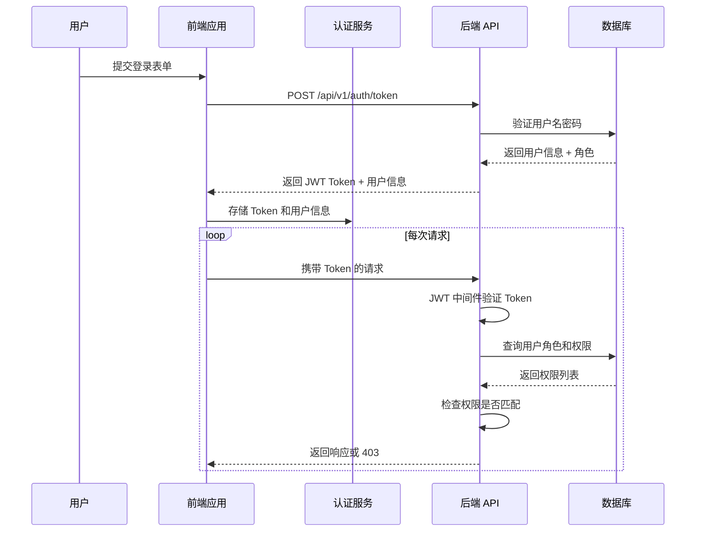

# 权限系统设计文档

## 1. 概述

### 1.1 设计目标
建立统一的多租户 RBAC（基于角色的访问控制）权限体系，清晰区分平台管理端和租户管理端的权限边界。

### 1.2 适用范围
- Platform Admin Portal (`/admin/*`): 平台超级管理员使用
- Tenant Management Portal (`/management/*`): 机构/学校/教育局管理员使用
- Public Portal (`/marketing/*`, `/user/*`): 普通用户和学生/教师使用

---

## 2. 角色体系定义

### 2.1 角色层级结构

```
┌─────────────────┐
│   super_admin   │  ← 平台超级管理员（最高权限）
└────────┬────────┘
         │
    ┌────▼────┐
    │  admin  │  ← 平台普通管理员
    └────┬────┘
         │
    ┌────▼────────────────────┐
    │      org_admin          │  ← 机构管理员（企业/培训机构）
    │      school_admin       │  ← 学校管理员
    │      education_bureau   │  ← 教育局管理员
    └────┬────────────────────┘
         │
    ┌────▼────┐
    │ teacher │  ← 教师角色
    └────┬────┘
         │
    ┌────▼────┐
    │ student │  ← 学生角色
    └─────────┘
```

### 2.2 角色详细定义

| 角色代码 | 角色名称 | 描述 | 数据范围 | 典型用户 |
|---------|---------|------|---------|---------|
| `super_admin` | 超级管理员 | 平台最高管理者 | 全平台所有数据 | 系统创始人、CTO |
| `admin` | 平台管理员 | 平台运营人员 | 全平台数据（部分敏感操作受限） | 运营团队、客服主管 |
| `org_admin` | 机构管理员 | 企业/培训机构管理员 | 仅本机构数据 | 企业培训负责人 |
| `school_admin` | 学校管理员 | 学校管理员 | 仅本校数据 | 教务处主任 |
| `education_bureau` | 教育局管理员 | 教育局监管员 | 辖区内所有学校数据 | 教育局信息科 |
| `teacher` | 教师 | 教学人员 | 所教课程和学生数据 | 一线教师 |
| `student` | 学生 | 学习人员 | 个人学习数据 | 学员 |

### 2.3 角色与许可证类型的映射

| 许可证类型 | 允许的角色 | 说明 |
|-----------|-----------|------|
| `CLOUD_HOSTED` (云托管版) | org_admin, teacher, student | 企业级 SaaS 服务 |
| `SCHOOL_EDITION` (校本课程版) | school_admin, teacher, student | 学校私有化部署 |
| `REGION_SUPERVISION` (区域监管版) | education_bureau | 教育局监管平台 |
| `ENTERPRISE` (企业定制版) | org_admin, teacher, student | 大型企业定制 |

---

## 3. 权限矩阵

### 3.1 功能权限表

#### 3.1.1 平台管理端权限 (`/admin/*`)

| 功能模块 | super_admin | admin | org_admin | 说明 |
|---------|:-----------:|:-----:|:---------:|------|
| **机构审批** | ✅ | ✅ | ❌ | 审批机构入驻申请 |
| **全局配置** | ✅ | ⚠️ | ❌ | ⚠️ 仅限查看 |
| **许可证管理** | ✅ | ✅ | ❌ | 创建、分配、回收许可证 |
| **用户管理** | ✅ | ✅ | ❌ | 全平台用户管理 |
| **数据监控** | ✅ | ✅ | ❌ | 查看全平台统计数据 |
| **财务总览** | ✅ | ⚠️ | ❌ | ⚠️ 仅限查看 |
| **API 密钥管理** | ✅ | ❌ | ❌ | 管理第三方 API 密钥 |
| **系统日志** | ✅ | ✅ | ❌ | 查看审计日志 |

#### 3.1.2 租户管理端权限 (`/management/*`)

| 功能模块 | org_admin | school_admin | education_bureau | teacher | student |
|---------|:---------:|:------------:|:----------------:|:-------:|:-------:|
| **组织概览** | ✅ | ✅ | ✅ | ❌ | ❌ |
| **财务管理** | ✅ | ✅ | ⚠️ | ❌ | ❌ |
| **教室管理** | ✅ | ✅ | ❌ | ⚠️ | ❌ |
| **教师管理** | ✅ | ✅ | ❌ | ❌ | ❌ |
| **学生管理** | ✅ | ✅ | ❌ | ✅ | ❌ |
| **课程排期** | ✅ | ✅ | ❌ | ✅ | ❌ |
| **课程内容** | ⚠️ | ⚠️ | ❌ | ✅ | ✅ |
| **学习进度** | ⚠️ | ⚠️ | ❌ | ✅ | ✅ |
| **客服工单** | ✅ | ✅ | ❌ | ❌ | ❌ |

**图例**:
- ✅ = 完全访问
- ⚠️ = 受限访问（仅查看或部分功能）
- ❌ = 无权限

### 3.2 数据权限规则

#### 3.2.1 数据可见性矩阵

| 数据类型 | super_admin | admin | org_admin | school_admin | teacher | student |
|---------|:-----------:|:-----:|:---------:|:------------:|:-------:|:-------:|
| **用户信息** | 全部 | 全部 | 本机构 | 本校 | 本人 + 学生 | 本人 |
| **课程数据** | 全部 | 全部 | 本机构 | 本校 | 所教课程 | 所选课程 |
| **订单记录** | 全部 | 全部 | 本机构 | 本校 | ❌ | ❌ |
| **统计数据** | 全部 | 全部 | 本机构 | 本校 | 所教班级 | 个人 |
| **系统日志** | 全部 | 全部 | 本机构操作 | 本校操作 | ❌ | ❌ |

#### 3.2.2 数据隔离策略

**平台管理端视角** (`/admin/institutions`):
```typescript
// 查询所有机构列表（用于审批和监管）
GET /api/v1/admin/institutions
Response: InstitutionAdminView[]  // 包含审批状态、许可证信息等

interface InstitutionAdminView {
  id: number;
  name: string;
  type: OrganizationType;
  is_approved: boolean;
  license_status: 'active' | 'expired' | 'suspended';
  total_users: number;
  created_at: string;
}
```

**租户管理端视角** (`/management/organization/:id`):
```typescript
// 查询本机构信息（用于自主运营）
GET /api/v1/tenant/my-org
Response: OrganizationTenantView  // 包含订阅计划、用量统计等

interface OrganizationTenantView {
  id: number;
  name: string;
  type: OrganizationType;
  subscription_plan: string;
  seats_used: number;
  seats_total: number;
  expiry_date: string;
  features: string[];
}
```

---

## 4. 认证与授权流程

### 4.1 统一认证流程



### 4.2 登录分流逻辑

```typescript
// src/app/core/services/login-redirect.service.ts

redirectAfterLogin(user: User): void {
  const role = user.role;
  
  switch (role) {
    case 'super_admin':
    case 'admin':
      // 平台管理员 → 行政管理后台
      this.router.navigate(['/admin/dashboard']);
      break;
      
    case 'org_admin':
      // 机构管理员 → 机构管理后台
      const orgId = this.extractOrgId(user);
      this.router.navigate(['/management/organization', orgId, 'dashboard']);
      break;
      
    case 'school_admin':
      // 学校管理员 → 学校管理后台
      const schoolId = this.extractSchoolId(user);
      this.router.navigate(['/management/school', schoolId, 'dashboard']);
      break;
      
    case 'education_bureau':
      // 教育局管理员 → 教育局管理后台
      const regionId = this.extractRegionId(user);
      this.router.navigate(['/management/education-bureau', regionId, 'dashboard']);
      break;
      
    case 'teacher':
    case 'student':
      // 教师/学生 → 用户中心
      this.router.navigate(['/user/dashboard']);
      break;
      
    default:
      // 未知角色 → 默认首页
      this.router.navigate(['/marketing']);
  }
}
```

### 4.3 权限守卫实现

#### 4.3.1 统一角色守卫

```typescript
// src/app/core/guards/role.guard.ts

@Injectable({ providedIn: 'root' })
export class RoleGuard implements CanActivate {
  constructor(
    private authService: AuthService,
    private router: Router
  ) {}

  canActivate(
    route: ActivatedRouteSnapshot,
    state: RouterStateSnapshot
  ): boolean {
    // 1. 检查是否已认证
    if (!this.authService.isAuthenticated()) {
      this.router.navigate(['/auth/login'], {
        queryParams: { returnUrl: state.url }
      });
      return false;
    }

    // 2. 获取所需角色和权限
    const requiredRoles = route.data['requiredRoles'] as string[];
    const requiredPermissions = route.data['requiredPermissions'] as string[];
    const requiredModule = route.data['requiredModule'] as 'platform-admin' | 'tenant-management';

    const user = this.authService.getCurrentUser();

    // 3. 检查模块访问权限
    if (requiredModule === 'platform-admin' && !this.isPlatformAdmin(user)) {
      this.router.navigate(['/unauthorized'], {
        queryParams: { message: '需要平台管理员权限' }
      });
      return false;
    }

    if (requiredModule === 'tenant-management' && !this.isTenantUser(user)) {
      this.router.navigate(['/unauthorized'], {
        queryParams: { message: '需要租户管理员权限' }
      });
      return false;
    }

    // 4. 检查角色
    if (requiredRoles && !requiredRoles.includes(user.role)) {
      this.router.navigate(['/unauthorized']);
      return false;
    }

    // 5. 检查具体权限
    if (requiredPermissions && !this.hasAllPermissions(user, requiredPermissions)) {
      this.router.navigate(['/unauthorized']);
      return false;
    }

    return true;
  }

  private isPlatformAdmin(user: User): boolean {
    return user.role === 'super_admin' || user.role === 'admin';
  }

  private isTenantUser(user: User): boolean {
    return ['org_admin', 'school_admin', 'education_bureau'].includes(user.role);
  }

  private hasAllPermissions(user: User, permissions: string[]): boolean {
    // 超级管理员拥有所有权限
    if (user.role === 'super_admin') return true;
    
    // 检查用户权限列表
    return permissions.every(perm => user.permissions?.includes(perm));
  }
}
```

#### 4.3.2 路由配置示例

```typescript
// src/app/admin/admin-routing.module.ts

const routes: Routes = [
  {
    path: '',
    loadComponent: () => import('./admin-layout.component').then(m => m.AdminLayoutComponent),
    canActivate: [RoleGuard],
    data: { 
      requiredRoles: ['super_admin', 'admin'],
      requiredModule: 'platform-admin'
    },
    children: [
      {
        path: 'institutions',
        loadComponent: () => import('../shared/admin-components/institution-list/institution-list.component').then(m => m.InstitutionListComponent),
        canActivate: [RoleGuard],
        data: { 
          requiredRoles: ['super_admin', 'admin'],
          requiredPermissions: ['institution.read']
        }
      },
      {
        path: 'licenses',
        loadComponent: () => import('../shared/admin-components/license-management/license-management.component').then(m => m.LicenseManagementComponent),
        canActivate: [RoleGuard],
        data: { 
          requiredRoles: ['super_admin', 'admin'],
          requiredPermissions: ['license.read', 'license.assign']
        }
      }
    ]
  }
];
```

```typescript
// src/app/management/management-portals.module.ts

const routes: Routes = [
  {
    path: 'organization',
    loadChildren: () => import('./organization-portal/organizations.module').then(m => m.OrganizationsModule),
    canActivate: [RoleGuard],
    data: { 
      requiredRoles: ['org_admin', 'school_admin', 'super_admin'],
      requiredModule: 'tenant-management'
    }
  },
  {
    path: 'school',
    loadChildren: () => import('./school-portal/school-portal.module').then(m => m.SchoolPortalModule),
    canActivate: [RoleGuard],
    data: { 
      requiredRoles: ['school_admin', 'super_admin'],
      requiredModule: 'tenant-management'
    }
  }
];
```

---

## 5. 权限元数据定义

### 5.1 权限代码清单

| 权限代码 | 描述 | 适用角色 |
|---------|------|---------|
| **机构管理权限** | | |
| `institution.read` | 查看机构列表 | super_admin, admin |
| `institution.create` | 创建新机构 | super_admin |
| `institution.update` | 修改机构信息 | super_admin, admin |
| `institution.delete` | 删除机构 | super_admin |
| `institution.approve` | 审批机构入驻 | super_admin, admin |
| **许可证权限** | | |
| `license.read` | 查看许可证 | super_admin, admin, org_admin |
| `license.create` | 创建许可证套餐 | super_admin |
| `license.assign` | 分配许可证给用户 | super_admin, admin, org_admin |
| `license.revoke` | 回收许可证 | super_admin, admin |
| **用户管理权限** | | |
| `user.read` | 查看用户列表 | super_admin, admin, org_admin |
| `user.create` | 创建用户 | super_admin, admin, org_admin |
| `user.update` | 修改用户信息 | super_admin, admin, org_admin |
| `user.delete` | 删除用户 | super_admin, admin |
| `user.impersonate` | 模拟用户登录 | super_admin |
| **组织运营权限** | | |
| `org.finance.read` | 查看财务数据 | org_admin, school_admin |
| `org.classroom.manage` | 管理教室 | org_admin, school_admin |
| `org.teacher.manage` | 管理教师 | org_admin, school_admin |
| `org.student.manage` | 管理学生 | org_admin, school_admin |
| `org.schedule.manage` | 管理排期 | org_admin, school_admin, teacher |
| **教学相关权限** | | |
| `course.read` | 查看课程 | all roles |
| `course.create` | 创建课程 | org_admin, school_admin, teacher |
| `course.edit` | 编辑课程内容 | org_admin, school_admin, teacher |
| `course.delete` | 删除课程 | org_admin, school_admin |
| `course.enroll` | 选课/加入课程 | teacher, student |
| **AI 功能权限** | | |
| `ai.use` | 使用 AI 功能 | org_admin, school_admin, teacher, student |
| `ai.generate_code` | AI 生成代码 | teacher, student |
| `ai.analyze` | AI 学情分析 | org_admin, school_admin, teacher |

### 5.2 角色 - 权限映射表

```typescript
// 后端定义：backend/models/permission.py

ROLE_PERMISSIONS = {
  'super_admin': ['*'],  # 所有权限
  
  'admin': [
    'institution.read', 'institution.update',
    'license.read', 'license.assign',
    'user.read', 'user.create', 'user.update',
    'org.finance.read',
    'ai.analyze'
  ],
  
  'org_admin': [
    'license.read', 'license.assign',
    'user.read', 'user.create', 'user.update',
    'org.finance.read', 'org.classroom.manage',
    'org.teacher.manage', 'org.student.manage',
    'org.schedule.manage',
    'course.read', 'course.create', 'course.edit',
    'ai.use', 'ai.analyze'
  ],
  
  'school_admin': [
    'user.read', 'user.create', 'user.update',
    'org.finance.read', 'org.classroom.manage',
    'org.teacher.manage', 'org.student.manage',
    'org.schedule.manage',
    'course.read', 'course.create', 'course.edit',
    'ai.use', 'ai.analyze'
  ],
  
  'teacher': [
    'user.read',  // 仅查看自己的学生
    'org.schedule.manage',  // 仅查看自己的课表
    'course.read', 'course.create', 'course.edit',
    'course.enroll',
    'ai.use', 'ai.generate_code'
  ],
  
  'student': [
    'course.read',
    'course.enroll',
    'ai.use'
  ]
}
```

---

## 6. 旧守卫迁移方案

### 6.1 现有守卫列表

| 守卫名称 | 文件路径 | 状态 | 迁移策略 |
|---------|---------|------|---------|
| `AdminAuthGuard` | `src/app/admin/auth/admin.guard.ts` | Deprecated | 保留兼容，内部委托给 RoleGuard |
| `OrganizationGuard` | `src/app/management/organization.guard.ts` | Deprecated | 保留兼容，内部委托给 RoleGuard |
| `OrgAdminGuard` | `src/app/core/guards/org-admin.guard.ts` | Deprecated | 保留兼容，内部委托给 RoleGuard |

### 6.2 迁移步骤

**Step 1: 创建新的 RoleGuard** (已在 4.3.1 完成)

**Step 2: 标记旧守卫为 Deprecated**
```typescript
// src/app/admin/auth/admin.guard.ts

/**
 * @deprecated 请使用 RoleGuard 替代
 * 
 * 此守卫将在 v2.0 版本中移除
 */
@Injectable({ providedIn: 'root' })
export class AdminAuthGuard implements CanActivate {
  constructor(private roleGuard: RoleGuard) {}

  canActivate(route: ActivatedRouteSnapshot, state: RouterStateSnapshot): boolean {
    // 委托给新的 RoleGuard
    return this.roleGuard.canActivate(route, state);
  }
}
```

**Step 3: 逐步更新路由配置**
- 优先在新开发的功能中使用 `RoleGuard`
- 现有功能在重构时逐步替换
- 保持向后兼容直到 v2.0

---

## 7. 安全考虑

### 7.1 权限提升防护

**风险**: 普通用户尝试访问管理员功能

**防护措施**:
1. **前端**: 路由守卫 + 按钮级权限控制
```typescript
// 指令方式
<div *ngIf="authService.hasPermission('institution.delete')">
  <button mat-button color="warn">删除机构</button>
</div>
```

2. **后端**: API 中间件强制检查
```python
# FastAPI 依赖注入
@router.get("/admin/institutions")
async def list_institutions(
    current_user: User = Depends(require_role(['super_admin', 'admin'])),
    db: AsyncSession = Depends(get_db)
):
    # 自动验证角色
    pass
```

3. **数据库**: 行级权限过滤
```python
# SQLAlchemy 事件监听
@listens_for(User, "load")
def filter_by_organization(target, context):
    if context.identity == 'standard_user':
        # 自动添加 WHERE organization_id = ?
        pass
```

### 7.2 会话管理

- **Token 有效期**: Access Token 2 小时，Refresh Token 7 天
- **并发会话限制**: 同一账号最多 3 个活跃会话
- **异常检测**: 异地登录触发二次验证

### 7.3 审计日志

所有敏感操作必须记录日志：
```python
class AuditLog(Base):
    __tablename__ = "audit_logs"
    
    id = Column(Integer, primary_key=True)
    user_id = Column(Integer, ForeignKey("users.id"))
    action = Column(String)  # CREATE, UPDATE, DELETE, APPROVE
    resource_type = Column(String)  # INSTITUTION, LICENSE, USER
    resource_id = Column(Integer)
    old_value = Column(JSON)  # 修改前的值
    new_value = Column(JSON)  # 修改后的值
    ip_address = Column(String)
    user_agent = Column(String)
    created_at = Column(DateTime, default=datetime.utcnow)
```

---

## 8. 测试策略

### 8.1 单元测试用例

```typescript
// src/app/core/guards/role.guard.spec.ts

describe('RoleGuard', () => {
  let guard: RoleGuard;
  let mockAuthService: jasmine.SpyObj<AuthService>;
  let mockRouter: jasmine.SpyObj<Router>;

  beforeEach(() => {
    mockAuthService = jasmine.createSpyObj('AuthService', ['isAuthenticated', 'getCurrentUser']);
    mockRouter = jasmine.createSpyObj('Router', ['navigate']);
    
    TestBed.configureTestingModule({
      providers: [
        RoleGuard,
        { provide: AuthService, useValue: mockAuthService },
        { provide: Router, useValue: mockRouter }
      ]
    });
    
    guard = TestBed.inject(RoleGuard);
  });

  it('应该允许超级管理员访问平台管理端', () => {
    mockAuthService.isAuthenticated.and.returnValue(true);
    mockAuthService.getCurrentUser.and.returnValue({ role: 'super_admin' });
    
    const route = new ActivatedRouteSnapshot();
    route.data = { requiredRoles: ['super_admin', 'admin'], requiredModule: 'platform-admin' };
    
    expect(guard.canActivate(route, {} as RouterStateSnapshot)).toBe(true);
  });

  it('应该拒绝机构管理员访问平台管理端', () => {
    mockAuthService.isAuthenticated.and.returnValue(true);
    mockAuthService.getCurrentUser.and.returnValue({ role: 'org_admin' });
    
    const route = new ActivatedRouteSnapshot();
    route.data = { requiredRoles: ['super_admin', 'admin'], requiredModule: 'platform-admin' };
    
    expect(guard.canActivate(route, {} as RouterStateSnapshot)).toBe(false);
    expect(mockRouter.navigate).toHaveBeenCalledWith(['/unauthorized']);
  });
});
```

### 8.2 E2E 测试场景

```typescript
// e2e/tests/permission-system.spec.ts

test.describe('权限系统 E2E 测试', () => {
  test('超级管理员可以访问所有页面', async ({ page }) => {
    await loginAs(page, 'super_admin');
    
    // 访问平台管理端
    await page.goto('/admin/institutions');
    await expect(page.locator('h1')).toContainText('机构管理');
    
    // 访问租户管理端
    await page.goto('/management/organization/1/dashboard');
    await expect(page.locator('h1')).toContainText('机构概览');
  });

  test('机构管理员无法访问平台管理端', async ({ page }) => {
    await loginAs(page, 'org_admin');
    
    // 尝试访问平台管理端
    await page.goto('/admin/institutions');
    
    // 应该被重定向到未授权页面
    await expect(page.locator('h1')).toContainText('未授权访问');
  });
});
```

---

## 9. 性能优化

### 9.1 权限缓存策略

```typescript
// 前端：内存缓存
private permissionCache = new Map<string, boolean>();

hasPermission(permission: string): boolean {
  // 检查缓存
  if (this.permissionCache.has(permission)) {
    return this.permissionCache.get(permission)!;
  }
  
  // 计算并缓存
  const result = this.calculatePermission(permission);
  this.permissionCache.set(permission, result);
  return result;
}

// 后端：Redis 缓存
@cache(ttl=300)  # 5 分钟
async def get_user_permissions(user_id: int) -> List[str]:
    # 从数据库查询并缓存
    pass
```

### 9.2 懒加载权限数据

对于大型组织，按需加载权限数据：
```typescript
// 初始只加载基本角色信息
// 当用户访问特定模块时再加载详细权限

loadPermissionsForModule(module: string): void {
  this.http.get(`/api/v1/permissions/${module}`)
    .subscribe(perms => {
      this.currentUser.permissions.push(...perms);
    });
}
```

---

## 10. 扩展点

### 10.1 自定义角色

系统支持创建自定义角色（继承自基础角色）：
```python
class CustomRole(Base):
    __tablename__ = "custom_roles"
    
    id = Column(Integer, primary_key=True)
    name = Column(String)
    base_role = Column(String)  # 继承自哪个系统角色
    additional_permissions = Column(JSON)  # 额外权限
    removed_permissions = Column(JSON)  # 移除的权限
    organization_id = Column(Integer, ForeignKey("organizations.id"))
```

### 10.2 临时权限授予

支持临时权限提升（Time-bound Permission Grant）：
```python
class TemporaryPermissionGrant(Base):
    __tablename__ = "temp_permission_grants"
    
    id = Column(Integer, primary_key=True)
    user_id = Column(Integer, ForeignKey("users.id"))
    permission = Column(String)
    granted_by = Column(Integer, ForeignKey("users.id"))
    expires_at = Column(DateTime)
    
    # 自动过期机制
    @property
    def is_active(self):
        return datetime.utcnow() < self.expires_at
```

---

## 11. 参考资料

### 11.1 相关文件
- `documentation/shared/architecture/MULTI_TENANT_ARCHITECTURE.md` - 多租户架构设计
- `documentation/shared/api-specs/permission-api.md` - 权限 API 规范
- `backend/middleware/permission_middleware.py` - 权限中间件实现
- `backend/models/permission.py` - 权限模型定义

### 11.2 外部资源
- [RBAC 模型维基百科](https://en.wikipedia.org/wiki/Role-based_access_control)
- [FastAPI 依赖注入系统](https://fastapi.tiangolo.com/tutorial/dependencies/)
- [Angular 路由守卫官方文档](https://angular.io/guide/router#milestone-5-route-guards)

---

*文档版本：v1.0  
创建日期：2026-04-03  
最后更新：2026-04-03  
维护者：iMatu Development Team*
