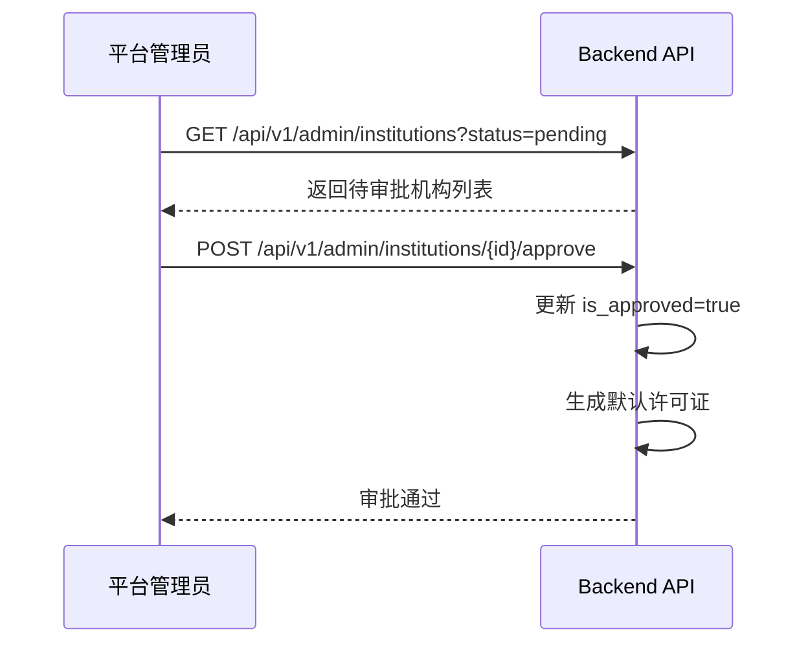
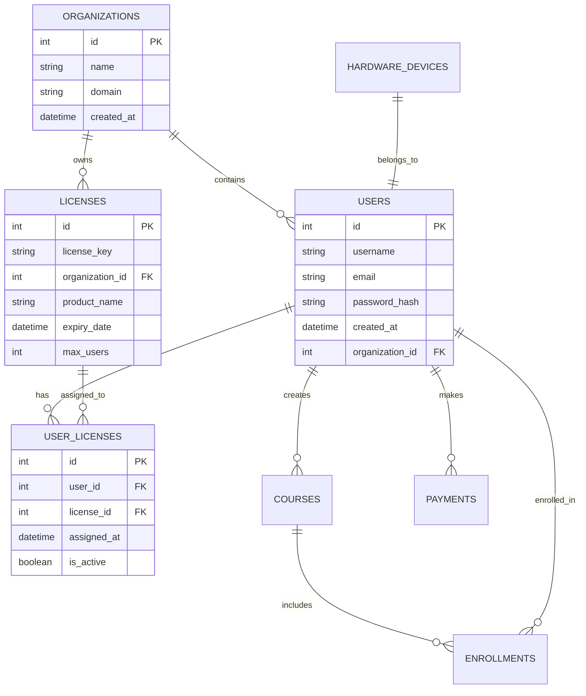

# iMatu 系统架构文档

## 1. 整体架构设计

### 1.1 架构模式
iMatu 采用**微服务架构**结合**前后端分离**的设计模式：

```
┌─────────────────────────────────────────────────────────────┐
│                        客户端层                              │
├─────────────────┬─────────────────┬─────────────────────────┤
│   Web浏览器     │   移动APP       │   桌面客户端            │
│  (Angular 16)   │  (Flutter)      │  (Electron/Tauri)       │
└─────────────────┴─────────────────┴─────────────────────────┘
                                │
                                ▼
┌─────────────────────────────────────────────────────────────┐
│                      API网关层                               │
├─────────────────────────────────────────────────────────────┤
│                    Nginx + FastAPI                          │
│            负载均衡 | SSL终止 | 请求路由                     │
└─────────────────────────────────────────────────────────────┘
                                │
                                ▼
┌─────────────────────────────────────────────────────────────┐
│                      服务层                                  │
├─────────┬─────────┬─────────┬─────────┬─────────┬───────────┤
│   认证   │   AI    │ 支付    │ 硬件    │ 许可证  │ 推荐      │
│ 服务     │ 服务    │ 服务    │ 认证    │ 管理    │ 系统      │
└─────────┴─────────┴─────────┴─────────┴─────────┴───────────┘
                                │
                                ▼
┌─────────────────────────────────────────────────────────────┐
│                      中间件层                                │
├─────────────────────────────────────────────────────────────┤
│   权限验证 | 许可证检查 | 日志记录 | 缓存 | 监控              │
└─────────────────────────────────────────────────────────────┘
                                │
                                ▼
┌─────────────────────────────────────────────────────────────┐
│                      基础设施层                              │
├─────────────────┬─────────────────┬─────────────────────────┤
│   PostgreSQL    │   Redis         │   消息队列(RabbitMQ)    │
│   (主数据库)    │   (缓存/会话)   │   (异步任务)            │
└─────────────────┴─────────────────┴─────────────────────────┘
```

### 1.2 技术选型原则

**前端选择依据：**
- Angular 16：企业级应用，TypeScript强类型支持
- Material Design：统一的UI规范和组件库
- RxJS：响应式编程处理异步数据流

**后端选择依据：**
- FastAPI：高性能，自动生成API文档，类型提示
- Python生态：丰富的AI/ML库支持
- SQLAlchemy：成熟的ORM框架

**基础设施选择：**
- PostgreSQL：支持复杂查询和事务
- Redis：高速缓存和会话存储
- Docker：容器化部署和环境一致性

## 2. 前端架构详解

### 2.1 Angular应用结构

```
src/app/
├── app.module.ts           # 根模块
├── app-routing.module.ts   # 路由配置
├── app.component.ts        # 根组件
├── core/                   # 核心模块
│   ├── services/          # 核心服务
│   │   ├── auth.service.ts
│   │   ├── http.service.ts
│   │   └── storage.service.ts
│   └── interceptors/      # HTTP拦截器
│       └── auth.interceptor.ts
├── shared/                # 共享模块
│   ├── components/       # 共享组件
│   ├── pipes/           # 管道
│   └── directives/      # 指令
├── features/             # 功能模块
│   ├── auth/            # 认证模块
│   ├── dashboard/       # 仪表板模块
│   ├── admin/           # 管理模块
│   └── learning/        # 学习模块
└── assets/              # 静态资源
```

### 2.2 状态管理模式

```typescript
// 状态管理策略
@Injectable({
  providedIn: 'root'
})
export class AppStateService {
  private userSubject = new BehaviorSubject<User | null>(null);
  private loadingSubject = new BehaviorSubject<boolean>(false);
  
  public user$ = this.userSubject.asObservable();
  public loading$ = this.loadingSubject.asObservable();
  
  setUser(user: User) {
    this.userSubject.next(user);
  }
  
  setLoading(loading: boolean) {
    this.loadingSubject.next(loading);
  }
}
```

### 2.3 组件通信机制

```
父子组件通信:
Parent Component ──Input()──► Child Component
Child Component ──Output()──► Parent Component

兄弟组件通信:
Component A ──Service──► Component B

跨层级通信:
Root Component ──State Management──► Any Component
```

### 2.4 多后台管理架构 ⭐ NEW

iMatu 平台采用**多租户管理架构**,清晰区分三个独立的管理门户:

```
┌─────────────────────────────────────────────────────────────┐
│                    iMatu Management Architecture            │
├─────────────────┬─────────────────┬─────────────────────────┤
│ Platform Admin  │ Tenant Mgmt     │ Public Portal           │
│ Portal          │ Portal          │                         │
│ /admin/*        │ /management/*   │ /marketing, /user/*     │
├─────────────────┼─────────────────┼─────────────────────────┤
│ 平台行政管理    │ 机构自主运营    │ 营销展示 + 用户中心      │
│ 超级管理员使用  │ 机构管理员使用  │ 所有用户使用            │
└─────────────────┴─────────────────┴─────────────────────────┘
```

#### 2.4.1 Platform Admin Portal (`/admin/*`)

**定位**: 平台运营方使用的**行政管理后台**,负责审批和监管入驻机构。

**核心功能模块**:
- `/admin/dashboard`: 平台数据总览
- `/admin/institutions`: 机构审批与监管 (原 `organizations`,已重命名)
  - InstitutionListComponent: 所有机构列表
  - InstitutionDetailComponent: 机构详情 (行政视角)
  - InstitutionApprovalComponent: 待审批列表
- `/admin/licenses`: 许可证管理
  - LicenseManagementComponent: 创建、分配、回收许可证
  - LicenseUsageStatsComponent: 使用统计
- `/admin/users`: 全平台用户管理
- `/admin/analytics`: 平台数据分析
- `/admin/settings`: 全局配置

**技术特点**:
- **认证方式**: `AuthService` + `RoleGuard` (requiredRoles: ['super_admin', 'admin'])
- **数据范围**: 全平台所有数据
- **UI 主题**: 深蓝色系 (`#1976d2`),体现权威性
- **典型用户**: CTO、运营总监、客服主管

**关键业务流程**:


#### 2.4.2 Tenant Management Portal (`/management/*`)

**定位**: 入驻机构内部使用的**自主运营后台**,管理人、财、物。

**子门户分类**:
| 子门户 | URL 路径 | 适用场景 | 特点 |
|-------|---------|---------|------|
| Organization Portal | `/management/organization/:id/*` | 企业/培训机构 | 强调培训管理、员工发展 |
| School Portal | `/management/school/:id/*` | 中小学/高校 | 强调班级管理、课程体系 |
| Education Bureau Portal | `/management/education-bureau/:regionId/*` | 教育局/教委 | 强调数据汇总、监管分析 |

**Organization Portal 核心功能**:
- `/management/organization/:id/dashboard`: 机构概览
- `/management/organization/:id/finance`: 财务管理
- `/management/organization/:id/classrooms`: 教室管理
- `/management/organization/:id/teachers`: 教师管理
- `/management/organization/:id/students`: 学生管理
- `/management/organization/:id/schedule`: 课程排期
- `/management/organization/:id/courses`: 课程内容
- `/management/organization/:id/settings`: 机构设置

**技术特点**:
- **认证方式**: `AuthService` + `RoleGuard` (requiredModule: 'tenant-management')
- **数据范围**: 仅本机构数据 (自动过滤)
- **UI 主题**: 绿色系 (`#4caf50`),体现活力
- **典型用户**: 机构负责人、教务主任、班主任

**数据隔离机制**:
```python
# 后端中间件自动注入租户 ID
@router.get("/my-org/stats")
async def get_organization_stats(
    current_user: User = Depends(require_org_role),
    db: AsyncSession = Depends(get_db)
):
    # 自动从 user.organization_id 获取租户 ID
    org_id = current_user.organization_id
    
    # 查询时自动添加 WHERE organization_id = :org_id
    stats = await db.execute(
        select(Course).where(Course.organization_id == org_id)
    )
    return stats
```

#### 2.4.3 Public Portal (`/marketing/*`, `/user/*`)

**定位**: 对外营销展示 + 用户学习中心的**公共服务门户**。

**功能模块**:
- `/marketing/*`: 营销网站 (首页、功能、价格、关于、联系)
- `/user/*`: 用户中心 (仪表板、我的课程、成就、钱包、设置)

**技术特点**:
- **认证方式**: 可选 (未登录可浏览 marketing,访问 user/* 需登录)
- **数据范围**: 公开数据 + 个人数据
- **UI 主题**: 多彩色系，吸引眼球
- **典型用户**: 潜在客户、注册用户、学生/教师

#### 2.4.4 代码组织结构对比

**当前结构 **(存在问题) ❌:
```
src/app/
├── admin/
│   └── organizations/              # ❌ 语义混淆：是"行政管理"还是"自主运营"?
│       ├── organization-list.component.ts  # ❌ 与 management 重复!
│       └── organization-dashboard.component.ts  # ❌ 重复!
└── management/
    └── organization-portal/
        ├── organization-list.component.ts  # ❌ 重复!
        └── organization-dashboard.component.ts  # ❌ 重复!
```

**目标结构 **(重构后) ✅:
```
src/app/
├── platform-admin/                 # ✅ 明确：平台管理端
│   └── institutions/               # ✅ 语义清晰：行政管理机构
│       ├── institution-list/
│       ├── institution-detail/
│       └── institution-approval/
├── tenant-management/              # ✅ 明确：租户管理端
│   ├── organization-portal/
│   ├── school-portal/
│   └── education-bureau-portal/
├── public-portal/                  # ✅ 统一：公共服务
│   ├── marketing/
│   └── user-center/
└── shared/                         # ✅ 共享组件下沉
    ├── admin-components/           # 行政管理端复用组件
    ├── tenant-components/          # 租户端复用组件
    └── common-components/          # 通用业务组件
```

#### 2.4.5 路由映射表

完整路由清单请参考：[`MULTI_TENANT_ARCHITECTURE.md`](./MULTI_TENANT_ARCHITECTURE.md#51-完整路由清单)

| URL 路径 | 归属门户 | 所需角色 | 说明 |
|---------|---------|---------|------|
| `/admin/*` | Platform Admin | super_admin, admin | 平台管理端 |
| `/admin/institutions` | Platform Admin | super_admin, admin | 机构列表 (行政视角) |
| `/management/organization/*` | Tenant Management | org_admin, school_admin | 机构运营后台 |
| `/marketing/*` | Public Portal | 匿名/已登录 | 营销网站 |
| `/user/*` | Public Portal | 已登录 | 用户中心 |

#### 2.4.6 权限控制矩阵

详细权限定义请参考：[`PERMISSION_SYSTEM_DESIGN.md`](./PERMISSION_SYSTEM_DESIGN.md#3-权限矩阵)

| 功能模块 | super_admin | admin | org_admin | student |
|---------|:-----------:|:-----:|:---------:|:-------:|
| 机构审批 | ✅ | ✅ | ❌ | ❌ |
| 许可证管理 | ✅ | ✅ | ❌ | ❌ |
| 本机构运营 | ✅ | ❌ | ✅ | ❌ |
| 查看财务数据 | ✅ | ⚠️ | ✅ | ❌ |
| 管理课程内容 | ✅ | ❌ | ✅ | ✅ |

**图例**: ✅ = 完全访问 | ⚠️ = 受限访问 | ❌ = 无权限

#### 2.4.7 登录分流逻辑

```typescript
// src/app/core/services/login-redirect.service.ts

redirectAfterLogin(user: User): void {
  switch (user.role) {
    case 'super_admin':
    case 'admin':
      // 平台管理员 → 行政管理后台
      this.router.navigate(['/admin/dashboard']);
      break;
      
    case 'org_admin':
      // 机构管理员 → 机构管理后台
      const orgId = this.extractOrgId(user);
      this.router.navigate(['/management/organization', orgId, 'dashboard']);
      break;
      
    case 'school_admin':
      // 学校管理员 → 学校管理后台
      const schoolId = this.extractSchoolId(user);
      this.router.navigate(['/management/school', schoolId, 'dashboard']);
      break;
      
    case 'teacher':
    case 'student':
      // 教师/学生 → 用户中心
      this.router.navigate(['/user/dashboard']);
      break;
      
    default:
      // 未知角色 → 默认首页
      this.router.navigate(['/marketing']);
  }
}
```

#### 2.4.8 UI/UX 差异化设计

**主题色对比**:
```scss
// Platform Admin Theme (深蓝色 - 权威专业)
$admin-primary: #1976d2;
.admin-theme { .mat-toolbar { background: $admin-primary; } }

// Tenant Management Theme (绿色 - 活力成长)
$tenant-primary: #4caf50;
.tenant-theme { .mat-toolbar { background: $tenant-primary; } }
```

**Logo 和 Branding**:
- **Admin Portal**: iMatu Platform 官方标识
- **Tenant Portal**: 支持机构自定义 Logo(可选)
- **Public Portal**: 统一品牌标识

---

## 3. 后端架构详解

### 3.1 FastAPI应用结构

```
backend/
├── main.py                 # 应用入口
├── config/                # 配置管理
│   ├── settings.py        # 应用配置
│   └── database.py        # 数据库配置
├── models/                # 数据模型
│   ├── user.py           # 用户模型
│   ├── course.py         # 课程模型
│   └── payment.py        # 支付模型
├── schemas/               # Pydantic模型
│   ├── user_schema.py
│   └── course_schema.py
├── routes/                # 路由定义
│   ├── auth_routes.py
│   ├── course_routes.py
│   └── payment_routes.py
├── services/              # 业务逻辑层
│   ├── auth_service.py
│   ├── course_service.py
│   └── payment_service.py
├── middleware/            # 中间件
│   ├── auth_middleware.py
│   └── logging_middleware.py
└── utils/                 # 工具函数
    ├── security.py
    └── helpers.py
```

### 3.2 数据库设计

#### 核心实体关系图



### 3.3 缓存策略

```
Redis缓存层次:
├── 会话缓存 (Session Cache)
│   - 用户登录状态
│   - 权限信息
│   - TTL: 2小时
├── 数据缓存 (Data Cache)
│   - 用户信息
│   - 课程详情
│   - 配置参数
│   - TTL: 1小时
└── 计算结果缓存 (Result Cache)
    - AI生成结果
    - 推荐算法输出
    - 统计报表数据
    - TTL: 30分钟
```

## 4. 安全架构

### 4.1 认证授权体系

```
认证流程:
1. 用户提交凭据
2. 服务验证身份
3. 生成JWT Token
4. 返回Token给客户端
5. 客户端存储Token
6. 后续请求携带Token

授权检查:
请求到达 → JWT验证 → 权限检查 → 业务处理 → 响应返回
```

### 4.2 安全防护措施

```python
# 安全中间件配置
class SecurityMiddleware:
    def __init__(self):
        self.rate_limiter = RateLimiter(max_requests=100, window=60)
        self.ip_whitelist = load_ip_whitelist()
        
    async def __call__(self, request: Request, call_next):
        # IP白名单检查
        if request.client.host not in self.ip_whitelist:
            # 请求频率限制
            if not self.rate_limiter.is_allowed(request.client.host):
                raise HTTPException(status_code=429, detail="Too Many Requests")
        
        # XSS防护
        response = await call_next(request)
        response.headers["X-XSS-Protection"] = "1; mode=block"
        response.headers["X-Content-Type-Options"] = "nosniff"
        return response
```

### 4.3 数据加密

```
数据保护策略:
├── 传输加密
│   - HTTPS/TLS 1.3
│   - HSTS头部设置
├── 存储加密
│   - 密码使用bcrypt哈希
│   - 敏感字段AES加密
│   - 数据库透明加密(TDE)
└── 应用层加密
    - JWT签名密钥轮换
    - API密钥加密存储
    - 敏感配置文件加密
```

## 5. 部署架构

### 5.1 Docker容器化

```dockerfile
# 后端Dockerfile
FROM python:3.9-slim

WORKDIR /app
COPY requirements.txt .
RUN pip install --no-cache-dir -r requirements.txt

COPY . .
EXPOSE 8000
CMD ["uvicorn", "main:app", "--host", "0.0.0.0", "--port", "8000"]

# 前端Dockerfile
FROM node:16-alpine as builder
WORKDIR /app
COPY package*.json ./
RUN npm ci --silent
COPY . .
RUN npm run build

FROM nginx:alpine
COPY --from=builder /app/dist /usr/share/nginx/html
COPY nginx.conf /etc/nginx/nginx.conf
EXPOSE 80
CMD ["nginx", "-g", "daemon off;"]
```

### 5.2 Kubernetes部署

```yaml
# deployment.yaml
apiVersion: apps/v1
kind: Deployment
metadata:
  name: imatu-backend
spec:
  replicas: 3
  selector:
    matchLabels:
      app: imatu-backend
  template:
    metadata:
      labels:
        app: imatu-backend
    spec:
      containers:
      - name: backend
        image: imatu/backend:latest
        ports:
        - containerPort: 8000
        envFrom:
        - configMapRef:
            name: backend-config
        - secretRef:
            name: backend-secrets
        resources:
          requests:
            memory: "256Mi"
            cpu: "250m"
          limits:
            memory: "512Mi"
            cpu: "500m"
```

### 5.3 CI/CD流水线

```
GitHub Actions流水线:
├── 代码推送触发
├── 静态代码分析
├── 单元测试运行
├── 构建Docker镜像
├── 安全扫描
├── 部署到测试环境
├── 集成测试
├── 部署到生产环境
└── 通知和回滚机制
```

## 6. 监控与运维

### 6.1 监控体系

```
监控维度:
├── 应用性能监控(APM)
│   - 响应时间
│   - 错误率
│   - 吞吐量
├── 基础设施监控
│   - CPU使用率
│   - 内存使用
│   - 磁盘空间
│   - 网络流量
├── 业务指标监控
│   - 用户活跃度
│   - 支付转化率
│     - AI服务使用统计
└── 日志监控
    - 应用日志收集
    - 错误日志分析
    - 安全日志审计
```

### 6.2 告警策略

```yaml
# alert-rules.yaml
groups:
- name: backend-alerts
  rules:
  - alert: HighErrorRate
    expr: rate(http_requests_total{status=~"5.."}[5m]) > 0.05
    for: 2m
    labels:
      severity: critical
    annotations:
      summary: "High error rate detected"
      
  - alert: HighLatency
    expr: histogram_quantile(0.95, http_request_duration_seconds_bucket) > 2
    for: 5m
    labels:
      severity: warning
    annotations:
      summary: "High latency detected"
```

## 7. 扩展性设计

### 7.1 水平扩展

```
无状态服务扩展:
Load Balancer → [App Server 1] [App Server 2] [App Server 3]
                     │              │              │
                     ▼              ▼              ▼
                Shared Database & Cache

有状态服务扩展:
Master DB ← Read Replica 1
           ← Read Replica 2
           ← Read Replica 3
```

### 7.2 微服务拆分策略

```
服务边界划分原则:
├── 业务领域驱动设计(DDD)
├── 高内聚低耦合
├── 独立部署单元
├── 数据库独立
└── 团队自治

当前服务拆分:
├── 用户服务 (User Service)
├── 课程服务 (Course Service)
├── 支付服务 (Payment Service)
├── AI服务 (AI Service)
├── 认证服务 (Auth Service)
└── 通知服务 (Notification Service)
```

---
*架构文档版本：v1.0 | 最后更新：2026年2月*
