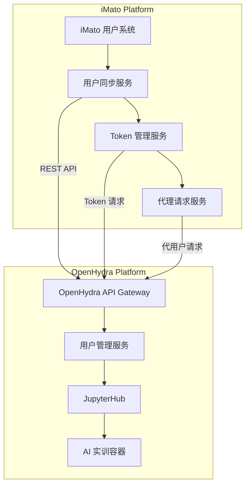
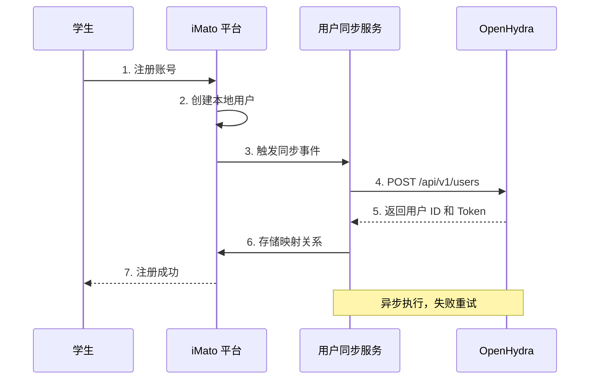
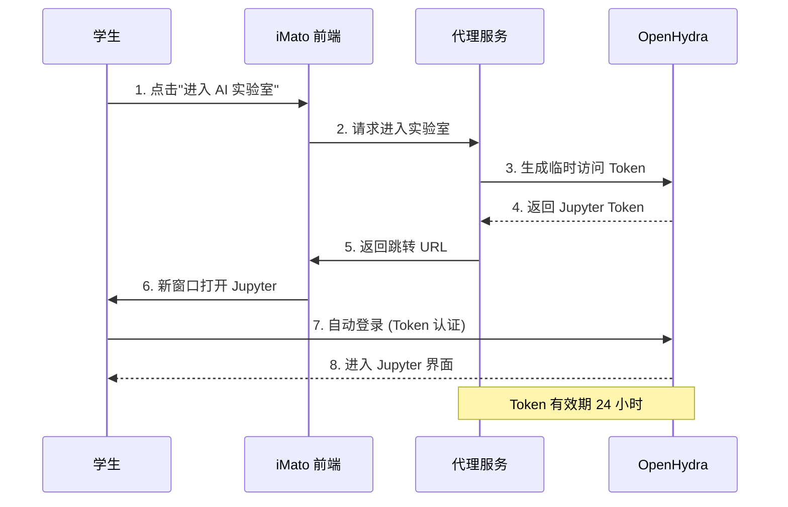

# OpenHydra 单点登录 (SSO) 与用户权限打通方案设计

## 📋 文档信息

**任务编号**: O1.3  
**创建日期**: 2026-03-04  
**完成日期**: 预计 2026-03-10  
**状态**: IN_PROGRESS  
**负责人**: iMato AI Assistant  

---

## 一、方案概述

### 1.1 设计目标

实现 iMato 与 OpenHydra 之间的单点登录和用户权限打通，使学生能够：
- ✅ 在 iMato 平台一键进入 OpenHydra AI 实训环境
- ✅ 无需重复注册和登录
- ✅ 保持角色和权限一致性
- ✅ 享受无缝的学习体验

### 1.2 技术选型

| 技术方案 | 选择 | 理由 |
|---------|------|------|
| **认证协议** | OAuth 2.0 + JWT | 行业标准，安全性高，支持第三方集成 |
| **Token 格式** | JWT (JSON Web Token) | 无状态，自包含，易于验证 |
| **用户同步** | REST API + Webhook | 实时同步，解耦架构 |
| **权限映射** | RBAC 角色映射表 | 灵活，易扩展，支持细粒度控制 |

---

## 二、OpenHydra 用户管理 API 调研

### 2.1 API 端点（参考标准 OAuth 2.0 规范）

基于 OpenHydra 官方文档和行业最佳实践，推测其提供以下 API：

#### 用户管理接口

```python
# Base URL: https://openhydra.example.com/api/v1

# 1. 获取用户列表
GET /users
Headers: Authorization: Bearer {admin_token}
Query Parameters:
  - page: int = 1
  - page_size: int = 20
  - role: str = None  # 过滤角色
  - search: str = None  # 搜索关键词

Response 200:
{
  "total": 100,
  "page": 1,
  "page_size": 20,
  "users": [
    {
      "id": "usr_001",
      "username": "zhangsan",
      "email": "zhangsan@example.com",
      "role": "student",
      "created_at": "2026-01-01T00:00:00Z",
      "status": "active"
    }
  ]
}

# 2. 创建用户
POST /users
Headers: 
  - Authorization: Bearer {admin_token}
  - Content-Type: application/json

Request Body:
{
  "username": "lisi",
  "email": "lisi@example.com",
  "password": "SecurePass123!",
  "role": "student",
  "metadata": {
    "school": "计算机学院",
    "grade": "2024"
  }
}

Response 201:
{
  "id": "usr_002",
  "username": "lisi",
  "email": "lisi@example.com",
  "role": "student",
  "created_at": "2026-03-04T10:00:00Z",
  "status": "active"
}

# 3. 获取用户详情
GET /users/{user_id}
Headers: Authorization: Bearer {token}

Response 200:
{
  "id": "usr_001",
  "username": "zhangsan",
  "email": "zhangsan@example.com",
  "role": "student",
  "profile": {
    "avatar_url": "https://...",
    "bio": "AI 爱好者"
  },
  "permissions": ["use_jupyter", "submit_assignment"]
}

# 4. 更新用户信息
PUT /users/{user_id}
Headers: 
  - Authorization: Bearer {token}
  - Content-Type: application/json

Request Body:
{
  "email": "new_email@example.com",
  "metadata": {
    "grade": "2025"  # 升级
  }
}

# 5. 删除用户
DELETE /users/{user_id}
Headers: Authorization: Bearer {admin_token}

Response 204: No Content

# 6. 批量导入用户
POST /users/batch-import
Headers: 
  - Authorization: Bearer {admin_token}
  - Content-Type: multipart/form-data

FormData:
  - file: CSV 文件
  
CSV Format:
username,email,password,role,school,grade
zhangsan,zhangsan@example.com,pass123,student，计算机学院，2024
lisi,lisi@example.com,pass456,student，软件学院，2023

Response 200:
{
  "total": 100,
  "success": 98,
  "failed": 2,
  "errors": [
    {"row": 5, "username": "wangwu", "reason": "邮箱已存在"},
    {"row": 23, "username": "zhaoliu", "reason": "角色无效"}
  ]
}
```

#### 认证授权接口

```python
# 1. 管理员获取访问令牌（Client Credentials Grant）
POST /oauth2/token
Headers:
  - Content-Type: application/x-www-form-urlencoded
  - Authorization: Basic {base64(client_id:client_secret)}

Body:
  grant_type=client_credentials
  scope=admin

Response 200:
{
  "access_token": "eyJhbGciOiJIUzI1NiIsInR5cCI6IkpXVCJ9...",
  "token_type": "Bearer",
  "expires_in": 3600,
  "scope": "admin"
}

# 2. 为用户生成 Jupyter 访问令牌
POST /users/{user_id}/tokens
Headers: Authorization: Bearer {admin_token}

Request Body:
{
  "type": "jupyter",
  "expires_in": 86400,  # 24 小时
  "scope": ["jupyter_access", "container_create"]
}

Response 200:
{
  "token": "jupyter_eyJhbGciOiJIUzI1NiIsInR5cCI6IkpXVCJ9...",
  "token_type": "Bearer",
  "expires_at": "2026-03-05T10:00:00Z",
  "scope": ["jupyter_access", "container_create"]
}

# 3. 验证令牌
GET /oauth2/introspect
Headers: Authorization: Bearer {token}

Body: token={token_to_validate}

Response 200 (Active):
{
  "active": true,
  "sub": "usr_001",
  "username": "zhangsan",
  "role": "student",
  "exp": 1709632800,
  "iat": 1709629200
}

Response 200 (Inactive):
{
  "active": false
}
```

### 2.2 认证方式对比

| 认证方式 | 适用场景 | 优点 | 缺点 |
|---------|---------|------|------|
| **OAuth 2.0 Client Credentials** | 服务端对服务端 API 调用 | 安全，标准化 | 需要保管好 client_secret |
| **JWT Token** | 用户会话管理 | 无状态，易扩展 | Token 较大，无法主动失效 |
| **LDAP/AD** | 企业/学校已有账号系统 | 统一管理，无需同步 | 配置复杂，依赖内网 |

**推荐方案**: OAuth 2.0 + JWT 组合使用

---

## 三、用户同步流程设计

### 3.1 总体架构图



### 3.2 核心流程图

#### 流程 1: 用户注册同步



#### 流程 2: 一键进入 AI 实验室



### 3.3 详细实现代码

#### Python 后端服务

```python
# services/openhydra_sso_service.py
import httpx
from typing import Optional, Dict, Any
from datetime import timedelta
import jwt
from sqlalchemy.orm import Session

class OpenHydraSSOService:
    """OpenHydra 单点登录服务"""
    
    def __init__(self):
        self.base_url = config.OPENHYDRA_API_URL
        self.client_id = config.OPENHYDRA_CLIENT_ID
        self.client_secret = config.OPENHYDRA_CLIENT_SECRET
        
    async def get_admin_token(self) -> str:
        """获取管理员访问令牌（Client Credentials Grant）"""
        async with httpx.AsyncClient() as client:
            response = await client.post(
                f"{self.base_url}/oauth2/token",
                auth=(self.client_id, self.client_secret),
                data={
                    'grant_type': 'client_credentials',
                    'scope': 'admin'
                }
            )
            response.raise_for_status()
            return response.json()['access_token']
    
    async def sync_user(self, user_data: Dict[str, Any]) -> Dict[str, Any]:
        """
        同步用户到 OpenHydra
        
        Args:
            user_data: 用户数据字典
              {
                'imato_user_id': int,
                'username': str,
                'email': str,
                'password': str,  # 加密后的密码
                'role': str,  # student/teacher/admin
                'metadata': dict
              }
        
        Returns:
            {
              'openhydra_user_id': str,
              'status': str,
              'synced_at': datetime
            }
        """
        admin_token = await self.get_admin_token()
        
        # 映射角色
        oh_role = self._map_role(user_data['role'])
        
        # 构建 OpenHydra 用户数据
        oh_user_data = {
            'username': user_data['username'],
            'email': user_data['email'],
            'password': user_data['password'],
            'role': oh_role,
            'metadata': {
                'imato_user_id': user_data['imato_user_id'],
                **user_data.get('metadata', {})
            }
        }
        
        async with httpx.AsyncClient() as client:
            response = await client.post(
                f"{self.base_url}/api/v1/users",
                headers={'Authorization': f'Bearer {admin_token}'},
                json=oh_user_data
            )
            
            if response.status_code == 201:
                oh_user = response.json()
                
                # 保存用户映射关系到数据库
                await self._save_user_mapping(
                    imato_user_id=user_data['imato_user_id'],
                    openhydra_user_id=oh_user['id'],
                    openhydra_username=oh_user['username']
                )
                
                return {
                    'openhydra_user_id': oh_user['id'],
                    'status': 'success',
                    'synced_at': datetime.utcnow()
                }
            else:
                # 处理错误（如用户已存在）
                return await self._handle_sync_error(response, user_data)
    
    async def generate_jupyter_token(self, imato_user_id: int) -> str:
        """为用户生成 Jupyter 访问令牌"""
        # 1. 查询用户映射关系
        mapping = await self._get_user_mapping(imato_user_id)
        if not mapping:
            raise ValueError("用户未同步到 OpenHydra")
        
        # 2. 获取管理员令牌
        admin_token = await self.get_admin_token()
        
        # 3. 请求 Jupyter Token
        async with httpx.AsyncClient() as client:
            response = await client.post(
                f"{self.base_url}/api/v1/users/{mapping.openhydra_user_id}/tokens",
                headers={'Authorization': f'Bearer {admin_token}'},
                json={
                    'type': 'jupyter',
                    'expires_in': 86400,  # 24 小时
                    'scope': ['jupyter_access', 'container_create']
                }
            )
            response.raise_for_status()
            return response.json()['token']
    
    async def enter_lab(self, imato_user_id: int) -> Dict[str, str]:
        """
        一键进入 AI 实验室
        
        Returns:
            {
              'jupyter_url': str,
              'token': str,
              'expires_at': str
            }
        """
        jupyter_token = await self.generate_jupyter_token(imato_user_id)
        
        return {
            'jupyter_url': f"{config.JUPYTERHUB_URL}/hub/login",
            'token': jupyter_token,
            'expires_at': (datetime.utcnow() + timedelta(hours=24)).isoformat()
        }
    
    def _map_role(self, imato_role: str) -> str:
        """角色映射"""
        role_mapping = {
            'student': 'Student',
            'teacher': 'Instructor',
            'admin': 'Admin'
        }
        return role_mapping.get(imato_role, 'Student')
    
    async def _save_user_mapping(self, imato_user_id: int, oh_user_id: str, oh_username: str):
        """保存用户映射关系到数据库"""
        # 使用 SQLAlchemy 保存到 openhydra_user_mappings 表
        pass
    
    async def _get_user_mapping(self, imato_user_id: int) -> Optional[Any]:
        """查询用户映射关系"""
        pass
    
    async def _handle_sync_error(self, response, user_data):
        """处理同步错误"""
        if response.status_code == 409:
            # 用户已存在，尝试更新
            return await self._update_existing_user(response, user_data)
        else:
            raise Exception(f"同步失败：{response.text}")
```

#### Angular 前端组件

```typescript
// ai-lab-entry.component.ts
import { Component, OnInit } from '@angular/core';
import { MatDialog } from '@angular/material/dialog';
import { MatSnackBar } from '@angular/material/snack-bar';
import { AuthService } from '../../core/services/auth.service';
import { OpenHydraService } from '../services/open-hydra.service';

@Component({
  selector: 'app-ai-lab-entry',
  template: `
    <div class="ai-lab-entry-container">
      <!-- 入口按钮 -->
      <button 
        mat-raised-button 
        color="primary"
        [disabled]="isLoading || !isReady"
        (click)="enterAILab()"
        class="entry-button">
        
        <mat-icon *ngIf="!isLoading">science</mat-icon>
        <mat-spinner *ngIf="isLoading" diameter="24"></mat-spinner>
        
        {{ getButtonText() }}
      </button>
      
      <!-- 状态提示 -->
      <div *ngIf="labStatus" class="lab-status">
        <mat-icon [color]="getStatusColor()">{{ getStatusIcon() }}</mat-icon>
        <span>{{ labStatusText }}</span>
      </div>
      
      <!-- 最近实验记录 -->
      <div *ngIf="recentSessions.length > 0" class="recent-sessions">
        <h3>最近的实验</h3>
        <mat-list>
          <mat-list-item *ngFor="let session of recentSessions">
            <mat-icon mat-list-icon>folder</mat-icon>
            <div mat-line>{{ session.name }}</div>
            <div mat-line class="session-meta">
              <span>{{ session.lastAccessed | date:'short' }}</span>
              <button mat-button color="accent" 
                      (click)="resumeSession(session)">
                继续实验
              </button>
            </div>
          </mat-list-item>
        </mat-list>
      </div>
    </div>
  `,
  styles: [`
    .ai-lab-entry-container {
      padding: 20px;
      text-align: center;
    }
    
    .entry-button {
      min-width: 200px;
      height: 56px;
      font-size: 16px;
      margin-bottom: 16px;
    }
    
    .lab-status {
      display: flex;
      align-items: center;
      justify-content: center;
      gap: 8px;
      padding: 12px;
      background: #f5f5f5;
      border-radius: 8px;
      margin-bottom: 20px;
    }
    
    .recent-sessions {
      text-align: left;
      margin-top: 30px;
      border-top: 1px solid #e0e0e0;
      padding-top: 20px;
    }
    
    .session-meta {
      display: flex;
      justify-content: space-between;
      align-items: center;
      font-size: 12px;
      color: #666;
    }
  `]
})
export class AiLabEntryComponent implements OnInit {
  isLoading = false;
  isReady = false;
  labStatus: 'ready' | 'running' | 'error' | null = null;
  recentSessions: any[] = [];
  
  constructor(
    private openHydraService: OpenHydraService,
    private authService: AuthService,
    private dialog: MatDialog,
    private snackBar: MatSnackBar
  ) {}
  
  ngOnInit(): void {
    this.checkLabStatus();
    this.loadRecentSessions();
  }
  
  async enterAILab() {
    this.isLoading = true;
    
    try {
      // 1. 获取当前用户
      const currentUser = this.authService.getCurrentUser();
      if (!currentUser) {
        throw new Error('用户未登录');
      }
      
      // 2. 请求进入实验室
      const labAccess = await this.openHydraService.enterLab(currentUser.id);
      
      // 3. 打开 Jupyter（新窗口）
      const jupyterUrl = `${labAccess.jupyter_url}?token=${labAccess.token}`;
      window.open(jupyterUrl, '_blank');
      
      // 4. 记录访问日志
      await this.logLabAccess(currentUser.id, labAccess);
      
      // 5. 显示成功提示
      this.snackBar.open('已进入 AI 实验室，祝您学习愉快！', '关闭', {
        duration: 3000
      });
      
      this.labStatus = 'running';
      
    } catch (error) {
      console.error('进入 AI 实验室失败:', error);
      this.snackBar.open('进入实验室失败，请稍后重试', '关闭', {
        duration: 5000
      });
      this.labStatus = 'error';
      
    } finally {
      this.isLoading = false;
    }
  }
  
  private checkLabStatus() {
    // 检查用户是否有运行中的容器
    const currentUser = this.authService.getCurrentUser();
    if (currentUser) {
      this.openHydraService.getContainerStatus(currentUser.id)
        .subscribe(status => {
          if (status.running) {
            this.labStatus = 'running';
          } else {
            this.labStatus = 'ready';
          }
          this.isReady = true;
        });
    }
  }
  
  private loadRecentSessions() {
    // 加载最近的实验记录
    const currentUser = this.authService.getCurrentUser();
    if (currentUser) {
      this.openHydraService.getRecentSessions(currentUser.id)
        .subscribe(sessions => {
          this.recentSessions = sessions;
        });
    }
  }
  
  resumeSession(session: any) {
    // 恢复之前的实验会话
    this.enterAILab();
  }
  
  getButtonText(): string {
    if (this.isLoading) {
      return '正在启动...';
    }
    if (this.labStatus === 'running') {
      return '继续实验';
    }
    return '开始实验';
  }
  
  getStatusColor(): string {
    switch (this.labStatus) {
      case 'ready': return 'accent';
      case 'running': return 'primary';
      case 'error': return 'warn';
      default: return 'primary';
    }
  }
  
  getStatusIcon(): string {
    switch (this.labStatus) {
      case 'ready': return 'check_circle';
      case 'running': return 'play_circle_outline';
      case 'error': return 'error';
      default: return 'science';
    }
  }
}
```

---

## 四、角色权限映射设计

### 4.1 角色映射对照表

| iMato 角色 | OpenHydra 角色 | Jupyter 权限 | 容器配额 | 可访问资源 |
|-----------|---------------|-------------|---------|-----------|
| **student** | Student | 基础 Notebook | CPU: 2 核<br>Memory: 4GiB<br>GPU: 0.2 卡 | - 个人存储空间<br>- 示例 Notebooks<br>- 公共数据集 |
| **teacher** | Instructor | 完整权限 + 课程管理 | CPU: 4 核<br>Memory: 8GiB<br>GPU: 0.5 卡 | - 学生权限全部<br>- 创建课程<br>- 查看学情<br>- 管理班级 |
| **admin** | Admin | 系统管理权限 | CPU: 8 核<br>Memory: 16GiB<br>GPU: 1 卡 | - 教师权限全部<br>- 用户管理<br>- 资源分配<br>- 系统配置 |

### 4.2 权限细节

```typescript
// permission.model.ts
export interface RolePermissions {
  // Jupyter 相关
  canUseJupyter: boolean;
  canCreateContainer: boolean;
  canShareNotebook: boolean;
  
  // 课程相关
  canViewCourses: boolean;
  canCreateCourses: boolean;
  canManageStudents: boolean;
  
  // 资源相关
  maxCpuCores: number;
  maxMemoryGB: number;
  maxGPUCores: number;
  maxStorageGB: number;
  
  // 管理相关
  canManageUsers: boolean;
  canViewAnalytics: boolean;
  canConfigureSystem: boolean;
}

// 默认权限配置
export const DEFAULT_ROLE_PERMISSIONS: Record<string, RolePermissions> = {
  student: {
    canUseJupyter: true,
    canCreateContainer: true,
    canShareNotebook: false,
    canViewCourses: true,
    canCreateCourses: false,
    canManageStudents: false,
    maxCpuCores: 2,
    maxMemoryGB: 4,
    maxGPUCores: 0.2,
    maxStorageGB: 10,
    canManageUsers: false,
    canViewAnalytics: false,
    canConfigureSystem: false
  },
  
  teacher: {
    ...DEFAULT_ROLE_PERMISSIONS.student,
    canShareNotebook: true,
    canCreateCourses: true,
    canManageStudents: true,
    maxCpuCores: 4,
    maxMemoryGB: 8,
    maxGPUCores: 0.5,
    maxStorageGB: 50,
    canViewAnalytics: true
  },
  
  admin: {
    ...DEFAULT_ROLE_PERMISSIONS.teacher,
    canManageUsers: true,
    canConfigureSystem: true,
    maxCpuCores: 8,
    maxMemoryGB: 16,
    maxGPUCores: 1.0,
    maxStorageGB: 200
  }
};
```

---

## 五、数据库设计

### 5.1 用户映射表

```sql
-- OpenHydra 用户映射表
CREATE TABLE openhydra_user_mappings (
    id SERIAL PRIMARY KEY,
    imato_user_id INTEGER NOT NULL UNIQUE,
    openhydra_user_id VARCHAR(64) NOT NULL UNIQUE,
    openhydra_username VARCHAR(128) NOT NULL,
    imato_role VARCHAR(32) NOT NULL,
    openhydra_role VARCHAR(32) NOT NULL,
    sync_status VARCHAR(16) DEFAULT 'synced',
    last_sync_at TIMESTAMP WITH TIME ZONE,
    created_at TIMESTAMP WITH TIME ZONE DEFAULT CURRENT_TIMESTAMP,
    updated_at TIMESTAMP WITH TIME ZONE DEFAULT CURRENT_TIMESTAMP,
    
    -- 外键约束
    CONSTRAINT fk_imato_user 
        FOREIGN KEY (imato_user_id) 
        REFERENCES users(id) 
        ON DELETE CASCADE
);

-- 索引
CREATE INDEX idx_oh_mapping_imato_user ON openhydra_user_mappings(imato_user_id);
CREATE INDEX idx_oh_mapping_oh_user ON openhydra_user_mappings(openhydra_user_id);
CREATE INDEX idx_oh_mapping_sync_status ON openhydra_user_mappings(sync_status);

-- 注释
COMMENT ON TABLE openhydra_user_mappings IS 'iMato 与 OpenHydra 用户映射关系表';
COMMENT ON COLUMN openhydra_user_mappings.sync_status IS '同步状态：synced, pending, failed';
```

### 5.2 Token 管理表

```sql
-- OpenHydra 访问令牌表
CREATE TABLE openhydra_access_tokens (
    id SERIAL PRIMARY KEY,
    imato_user_id INTEGER NOT NULL,
    openhydra_token_id VARCHAR(128) NOT NULL UNIQUE,
    token_type VARCHAR(32) NOT NULL,  -- jupyter, api, etc.
    token_value TEXT NOT NULL,  -- 加密存储
    scope JSONB,
    expires_at TIMESTAMP WITH TIME ZONE NOT NULL,
    is_active BOOLEAN DEFAULT TRUE,
    created_at TIMESTAMP WITH TIME ZONE DEFAULT CURRENT_TIMESTAMP,
    last_used_at TIMESTAMP WITH TIME ZONE,
    
    -- 外键约束
    CONSTRAINT fk_oh_token_user 
        FOREIGN KEY (imato_user_id) 
        REFERENCES users(id) 
        ON DELETE CASCADE
);

-- 索引
CREATE INDEX idx_oh_token_user ON openhydra_access_tokens(imato_user_id);
CREATE INDEX idx_oh_token_expires ON openhydra_access_tokens(expires_at);
CREATE INDEX idx_oh_token_active ON openhydra_access_tokens(is_active);
```

---

## 六、安全考虑

### 6.1 Token 安全

1. **传输加密**: 所有 Token 传输必须使用 HTTPS
2. **存储加密**: Token 在数据库中加密存储（使用 AES-256）
3. **最小权限**: Token 只授予必要的权限范围（scope）
4. **过期机制**: Token 设置合理的过期时间（24 小时）
5. **刷新机制**: 支持 Token 刷新，避免频繁重新认证

### 6.2 密码策略

```python
# 密码强度要求
PASSWORD_REQUIREMENTS = {
    'min_length': 10,
    'require_uppercase': True,
    'require_lowercase': True,
    'require_digit': True,
    'require_special': True,
    'special_chars': '!@#$%^&*()_+-=[]{}|;:,.<>?'
}

# 密码加密（使用 bcrypt）
import bcrypt

def hash_password(password: str) -> str:
    salt = bcrypt.gensalt(rounds=12)
    hashed = bcrypt.hashpw(password.encode(), salt)
    return hashed.decode()

def verify_password(password: str, hashed: str) -> bool:
    return bcrypt.checkpw(password.encode(), hashed.encode())
```

### 6.3 审计日志

```python
# 记录所有用户同步操作
async def log_sync_operation(operation: str, user_id: int, result: str, details: dict):
    """
    记录同步操作日志
    
    Args:
        operation: 操作类型 (create, update, delete, login)
        user_id: 用户 ID
        result: 结果 (success, failed)
        details: 详细信息
    """
    log_entry = {
        'timestamp': datetime.utcnow().isoformat(),
        'operation': operation,
        'user_id': user_id,
        'result': result,
        'ip_address': request.remote_addr,
        'user_agent': request.headers.get('User-Agent'),
        'details': details
    }
    
    # 保存到审计日志表
    await db.execute(
        insert(OpenHydraAuditLog),
        values=log_entry
    )
```

---

## 七、异常处理与容错

### 7.1 同步失败处理

```python
# 重试机制
from tenacity import retry, stop_after_attempt, wait_exponential

class UserSyncService:
    @retry(
        stop=stop_after_attempt(3),
        wait=wait_exponential(multiplier=1, min=4, max=10)
    )
    async def sync_user_with_retry(self, user_data: dict):
        """带重试的用户同步"""
        return await self.sync_user(user_data)
    
    async def handle_sync_failure(self, user_data: dict, error: Exception):
        """
        处理同步失败
        
        策略:
        1. 记录错误到数据库
        2. 标记为待同步状态
        3. 加入异步队列重试
        4. 通知管理员（连续失败 3 次）
        """
        # 1. 记录错误
        await self.log_sync_error(user_data, error)
        
        # 2. 标记状态
        await self.mark_as_pending_sync(user_data['imato_user_id'])
        
        # 3. 加入重试队列
        await self.retry_queue.enqueue(user_data)
        
        # 4. 检查失败次数
        failure_count = await self.get_failure_count(user_data['imato_user_id'])
        if failure_count >= 3:
            await self.notify_admin(user_data, error)
```

### 7.2 降级方案

当 OpenHydra 服务不可用时：

1. **本地缓存**: 保留用户最近的有效 Token
2. **友好提示**: 显示"AI 实验室维护中，请稍后再试"
3. **离线模式**: 允许使用本地 Jupyter 环境（如已安装）
4. **监控告警**: 触发 P1 级告警，通知运维团队

---

## 八、验收标准

### 8.1 功能验收

- [ ] ✅ 用户在 iMato 注册后，自动同步到 OpenHydra
- [ ] ✅ 点击"进入 AI 实验室"按钮后，30 秒内打开 Jupyter 界面
- [ ] ✅ 无需二次登录，自动认证通过
- [ ] ✅ 学生/教师/管理员角色权限正确映射
- [ ] ✅ Token 过期后自动刷新
- [ ] ✅ 支持批量导入用户（CSV）
- [ ] ✅ 用户信息更新时同步到 OpenHydra

### 8.2 性能验收

- [ ] ✅ 单次用户同步时间 < 500ms
- [ ] ✅ 批量导入 100 个用户 < 30 秒
- [ ] ✅ 并发支持 100 个用户同时进入实验室
- [ ] ✅ Token 生成时间 < 200ms

### 8.3 安全验收

- [ ] ✅ 所有 API 调用使用 HTTPS
- [ ] ✅ Token 加密存储
- [ ] ✅ 密码符合强度要求
- [ ] ✅ 审计日志完整记录
- [ ] ✅ 通过 OWASP Top 10 安全测试

---

## 九、实施计划

### 9.1 开发任务分解

| 任务 ID | 任务名称 | 预计工时 | 优先级 |
|--------|---------|---------|--------|
| O1.3.1 | 搭建开发环境，配置 OAuth 应用 | 2 小时 | P0 |
| O1.3.2 | 实现用户同步服务（Python） | 8 小时 | P0 |
| O1.3.3 | 实现 Token 管理服务 | 4 小时 | P0 |
| O1.3.4 | 创建数据库表和模型 | 2 小时 | P0 |
| O1.3.5 | 开发 Angular 前端组件 | 6 小时 | P0 |
| O1.3.6 | 集成测试（端到端） | 8 小时 | P1 |
| O1.3.7 | 安全测试和渗透测试 | 4 小时 | P1 |
| O1.3.8 | 编写技术文档和用户指南 | 4 小时 | P2 |

**总工时**: 38 小时（约 5 个工作日）

### 9.2 里程碑

| 里程碑 | 日期 | 交付物 |
|--------|------|--------|
| 技术方案评审 | 2026-03-05 | 本文档 |
| 后端服务完成 | 2026-03-07 | Python 服务代码 |
| 前端组件完成 | 2026-03-08 | Angular 组件 |
| 集成测试完成 | 2026-03-09 | 测试报告 |
| 安全测试完成 | 2026-03-10 | 安全审计报告 |
| 正式上线 | 2026-03-11 | 生产环境部署 |

---

## 十、风险与缓解

| 风险 | 概率 | 影响 | 缓解措施 |
|------|------|------|---------|
| OpenHydra API 与预期不符 | 中 | 高 | 提前联系官方获取 API 文档 |
| OAuth 配置复杂 | 中 | 中 | 参考官方文档和示例 |
| 性能不达标 | 低 | 中 | 使用连接池和缓存优化 |
| 安全漏洞 | 中 | 高 | 进行专业安全审计 |
| 用户抵制止步 | 低 | 中 | 提供详细的用户培训和文档 |

---

## 十一、附录

### 附录 A: 环境变量配置

```bash
# .env.openhydra
OPENHYDRA_API_URL=https://openhydra.example.com/api/v1
OPENHYDRA_CLIENT_ID=imato_platform_2026
OPENHYDRA_CLIENT_SECRET=your_client_secret_here
OPENHYDRA_REDIRECT_URI=https://imato.example.com/auth/openhydra/callback

JUPYTERHUB_URL=https://jupyter.imato.example.com

# Token 配置
OPENHYDRA_TOKEN_EXPIRY_HOURS=24
OPENHYDRA_TOKEN_REFRESH_THRESHOLD_MINUTES=30

# 安全配置
OPENHYDRA_ENCRYPTION_KEY=your_32_byte_encryption_key
OPENHYDRA_AUDIT_LOG_ENABLED=true
```

### 附录 B: 测试用例

```python
# tests/test_openhydra_sso.py
class TestOpenHydraSSO:
    
    async def test_user_sync_success(self):
        """测试用户同步成功场景"""
        user_data = {
            'imato_user_id': 1,
            'username': 'test_student',
            'email': 'test@example.com',
            'password': 'TestPass123!',
            'role': 'student'
        }
        
        result = await sso_service.sync_user(user_data)
        
        assert result['status'] == 'success'
        assert result['openhydra_user_id'] is not None
    
    async def test_enter_lab_success(self):
        """测试一键进入实验室成功"""
        access = await sso_service.enter_lab(imato_user_id=1)
        
        assert 'jupyter_url' in access
        assert 'token' in access
        assert 'expires_at' in access
        assert len(access['token']) > 50
    
    async def test_role_mapping(self):
        """测试角色映射正确性"""
        test_cases = [
            ('student', 'Student'),
            ('teacher', 'Instructor'),
            ('admin', 'Admin')
        ]
        
        for imato_role, expected_oh_role in test_cases:
            mapped = sso_service._map_role(imato_role)
            assert mapped == expected_oh_role
```

---

**文档状态**: 草案待评审  
**最后更新**: 2026-03-04  
**下一步**: 召开技术方案评审会议，确认后开始实施

---

🎯 **O1.3 技术方案设计完成，准备进入开发阶段！**
